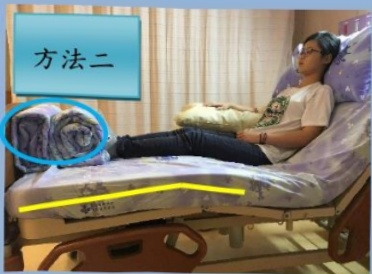
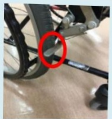
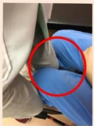
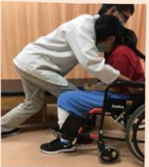
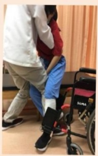
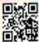
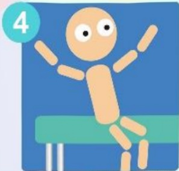
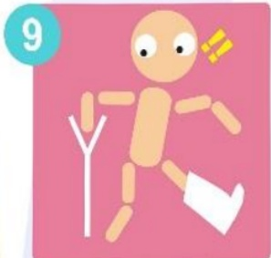
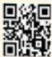
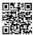

## 創傷性腦損傷 衛教手冊

🌸🌸🌸## 目錄

一、定義..... 1  
二、分級..... 2  
三、分類..... 3  
四、檢查..... 7  
五、評估..... 9  
六、治療..... 11  
七、症狀..... 15  
八、抗癲癇藥物指導..... 18  
九、照護..... 21  
十、復健運動治療..... 25  
十一、返家照護注意事項..... 30  
十二、須立即就醫情況..... 32## 一、 定義

創傷性腦損傷是指外傷所造成之腦組織傷害，依腦組織受損情況，分為廣泛性腦損傷及局部性腦損傷。

## ◆常見因素

車禍

跌倒

高處跌落

暴力鬥毆

重物砸落## 二、 分級

頭部外傷根據昏迷指數的不同，可以用來明瞭疾病的發展與嚴重程度：

## 輕度頭部外傷：昏迷指數14~15分

- 常見於輕微顱內出血或單純腦震盪的病人，會出現意識不清、視力障礙或平衡障礙，有時會有持續性頭痛、頭暈、記憶力變差、情緒不穩等症狀，多半會隨時間慢慢減輕與消失。

## 中度頭部外傷：昏迷指數 9～13 分

• 需住院治療，部分可能需手術治療。

## 嚴重頭部外傷：昏迷指數 ≤8 分

• 病況嚴重，必須透過手術治療，且有死亡風險，手術後出現後遺症機率也比較高。## 三、 分類

## 可能造成之腦部傷害

## (一) 廣泛性腦損傷

## 一、 腦震盪

• 出現暫時性生理功能缺失，腦部電腦斷層攝影正常無實質或結構損害，為可逆性之神經功能性外傷性麻痺。

- 症狀：創傷後健忘、頭痛頭暈、噁心嘔吐、步態不穩、記憶力減退、人格及情緒改變。

## 二、 廣泛性神經軸損傷

- 為腦軸突大範圍斷裂，以致於神經訊息無法傳遞，造成嚴重的腦神經功能損害。

- 症狀：深度昏迷、自主神經功能紊亂（體溫過高、高血壓及盜汗等）。## (二) 局部性腦損傷

## 一、 腦挫傷

• 撞擊處鄰近的腦有實質損傷，撞擊區域出現多個點狀出血及腦水腫，會隨時間久而逐漸吸收。

- 症狀：除腦震盪的症狀外，依腦挫傷嚴重程度也可能導致昏睡、昏迷不醒、抽搐、肢體無力、行為或性格異常、呼吸急促等症狀。

## 二、 硬腦膜上血腫

- 血液聚集在顱骨與硬腦膜間，多為顱骨骨折導致血管裂傷，使硬腦膜剝離壓迫腦組織。

- 症狀：約有1/3病人無症狀或症狀輕微，可能在損傷後數小時內出現意識改變的情形。## (二) 局部性腦損傷(續)

## 三、 外傷性腦內出血

- 腦組織因創傷使得血管破裂導致出血產生血腫。若初期檢查沒有看到腦內出血，但經數小時~2週經電腦斷層檢查發現腦內出血，稱之為延遲性之腦內出血。

• 症狀：血腫周圍會引起腦水腫導致顱內壓上升，出現嚴重頭痛、嗜睡或混亂不安、噁心嘔吐、抽搐症狀。

## 四、 硬腦膜下出血

- 血液聚集在硬腦膜與蜘蛛膜間空腔，常合併腦內出血。## ◆硬腦膜下出血

血液聚集在硬腦膜與蜘蛛膜間空腔，

常合併腦內出血。

依據症狀出現時間可分為：

## 急性硬腦膜下血腫

- 為外傷 2 天內發生症狀。

- 常見於嚴重頭部外傷病人合併顱骨骨折，血腫會造成急速顱內壓上升。

## 亞急性硬腦膜下血腫

· 指外傷 2天至 2 週內出現症狀。

- 症狀初期較輕，但因血腫壓迫造成顱內壓上升，出現頭痛、嘔吐、意識不清、癲癇症狀。

## 慢性硬腦膜下血腫

- 好發於嬰兒及老年人，外傷後 2 週以上才產生症狀。

- 出現頭痛、精神障礙、步態不穩、語言障礙、意識不清、嗜睡等症狀。## 四、 檢查

顱骨X光攝影：可判讀顱骨之完整性

腦部電腦斷層：可檢查腦內出血部位是否水腫或再出血

腦部核磁共振攝影：可檢查腦內血管狀況，做為手術治療之重要參考

## 四、 檢查(續)

臨床神經學檢查：可評估病人中樞神經、周邊神經及肌肉等生理功能

血管攝影檢查：可檢查體內血管有無異常(如狹窄、阻塞、破裂等)，顯示病灶與血管的相關位置

腦波檢查：藉以判斷大腦功能是否有問題及有無異常放電對於癲癇的診斷亦是重要的依據## 五、 評估

## (一) 格拉斯哥昏迷指数(Glasgow Coma Scale, GCS)

利用觀察病人對不同刺激引起睜眼反應、語言反應及運動反應的程度，給予評分，總分為15分。

<table border=1 style='margin: auto; width: max-content;'><tr><td style='text-align: center;'></td><td style='text-align: center;'>4分</td><td style='text-align: center;'>3分</td><td style='text-align: center;'>2分</td><td style='text-align: center;'>1分</td><td style='text-align: center;'></td><td style='text-align: center;'></td></tr><tr><td style='text-align: center;'>睜眼反應(Eye)</td><td style='text-align: center;'>自動睜眼看外界</td><td style='text-align: center;'>聽到聲音睜眼</td><td style='text-align: center;'>痛時會睜眼</td><td style='text-align: center;'>完全沒有睜眼</td><td style='text-align: center;'></td><td style='text-align: center;'></td></tr><tr><td colspan="5"></td><td style='text-align: center;'></td><td style='text-align: center;'></td></tr><tr><td style='text-align: center;'></td><td style='text-align: center;'>5分</td><td style='text-align: center;'>4分</td><td style='text-align: center;'>3分</td><td style='text-align: center;'>2分</td><td style='text-align: center;'>1分</td><td style='text-align: center;'></td></tr><tr><td style='text-align: center;'>語言反應(Verbal)</td><td style='text-align: center;'>講話有條理</td><td style='text-align: center;'>答非所問</td><td style='text-align: center;'>僅能說出單字</td><td style='text-align: center;'>僅能發出聲音</td><td style='text-align: center;'>無言語反應</td><td style='text-align: center;'></td></tr><tr><td colspan="6"></td><td style='text-align: center;'></td></tr><tr><td style='text-align: center;'></td><td style='text-align: center;'>6分</td><td style='text-align: center;'>5分</td><td style='text-align: center;'>4分</td><td style='text-align: center;'>3分</td><td style='text-align: center;'>2分</td><td style='text-align: center;'>1分</td></tr><tr><td style='text-align: center;'>運動反應(Motor)</td><td style='text-align: center;'>可以依照指令動作</td><td style='text-align: center;'>能清楚痛覺位置並去除刺激</td><td style='text-align: center;'>疼痛刺激時肢體自然彎曲但無法去除</td><td style='text-align: center;'>肢體屈曲</td><td style='text-align: center;'>肢體伸直</td><td style='text-align: center;'>完全無動作</td></tr></table>## 五、 評估(續)

## (二) 光反射

瞳孔一般是評估形狀、大小、反應性，當眼睛在強光下瞳孔會呈收縮反應。但當燈光照一眼時，另一眼正常也會有瞳孔收縮反應。

照光反射試驗是檢查視神經和動眼神經，因頭部外傷常會造成視功能障礙，另一個重點是測試動眼神經，一旦顱內有擴張的病灶，動眼神經的功能是很有用的指標。## 六、 治療

腦損傷治療的目的在避免續發性腦傷害，續發性腦傷害大多來自於顱內血腫、腦缺血、顱內壓增加、腦脫出和腦感染等。治療方式如下：

## (一) 手術治療

急性顱內血腫移除手術

以取出血腫、迅速減壓為原則。

顱骨切除術

• 改善腦組織血流，有效降低腦壓。

顱內壓監視系統留置與腦室引流手術

- 建立顱內壓監視系統，依需要進行腦室引流，以降低或維持正常腦壓。

## 手術前準備(緊急手術例外)

剃頭

術前 8 小時禁食

練習深呼

吸咳嗽

放鬆心情## 六、 治療(續)

## 手術後注意事項

- 遵照醫師指示後再開始進食，進食前先喝少量開水確定無嘔吐情形。

- 應兩小時協助病人翻身拍痰以利病人痰液咳出，及預防皮膚受壓導致壓瘡。

- 勿用力咳嗽、排便，依照醫師處方服用軟便劑，減少顱內壓上升及腦水腫。

- 不要用手抓傷口或摸傷口敷料，以免感染。

- 注意傷口引流管，避免拉扯

- 手術後須等病況穩定，醫師准許下床時才可下床，並且須有人在旁協助，避免跌倒。

- 若是顱骨移除病人須注意避免壓迫患側，通常於術後3個月內，經醫師評估病況穩定會安排放回顱骨。## 六、 治療(續)

## (二) 非手術治療

- 密切監測意識狀態、生命徵象、觀察病人有無顱內壓升高徵象。

- 保持呼吸道通畅，维持適當氧合防止腦部缺氧，必要時予以插管治療。

• 限制水分及營養提供：水分限制有助於降低腦水腫，營養不良會促使腦組織持續水腫。

- 提供安全安靜的環境，減少刺激，必要時依病情給予止痛劑、鎮靜劑及肌肉鬆弛劑。

• 監測體溫控制，文獻指出體溫每上升1℃會增加腦部10-13%代謝量。

• 矯正電解質及凝血功能異常。

• 預防癲癇與感染等併發症產生## 六、 治療(續)

## (三) 藥物治療

## 降腦壓藥物：

• 高滲性利尿劑：注意排尿及血壓變化。

- 鎮靜止痛劑：減少腦部代謝，舒緩頭痛及頭脹，降低引發顱內壓升高之機率。

## 抗癲癇藥物：

預防及治療外傷性引起之癲癇症。常見藥物如phenytoin、phenobarbital、carbamazepine與valproate、levetiracetam。## 七、 症状

『顱內壓』俗稱腦壓(ICP)，指頭顱腔內的壓力。頭部的重症常引起腦壓上升，顱內壓力上升後，身體的血流擠不進腦袋，腦組織很快就會因缺血而受傷死亡。

## 顱內壓升高徵象

頭痛、眩晕

噁心嘔吐

意識改變

煩躁不安

血壓上升

脈搏降低

不規則呼吸

瞳孔變大

抽搐

## 誘發顱內壓增高因素

• 胸腹內壓增高：如用力咳嗽或排便

- 臥姿改變：平躺時顱內壓較高、頭部擺位不當影響腦部血流循環

環境刺激：光線太亮、環境吵雜均可能誘發顱內壓增高## 七、 症狀(續)

癲癇發作是中度至重度顱腦外傷的常見併發症。是因腦部的不正常放電所產生的不自主運動，可以分為兩大類：全身性發作和部份性發作。

## (一) 全身性發作

## ◆全身性僵直陣攣型發作

全身性僵直陣攣型發作：是較嚴重較大的發作，亦即全身四肢均會有僵直或陣攣型的發作。

## 失神性發作

是一種較輕微較小的發作，亦即會有短暫喪失神智的發作，肇因於整個腦子突然不正常的放電所致。

## ☑失張力性發作

是身體突然間會喪失所有肌肉的力氣，整個人會碰一聲摔下去，時常導致摔傷甚至摔斷骨頭。

## ◆ 肌抽躍性發作：

身體或四肢短暫快速之抖動，就好像被嚇到一般。## 七、 症狀(續)

## (二) 部分性發作

從大腦的一個部份先放電，此時神智仍清楚，稱為『單純型部份性發作』；而後漸漸擴大而影響到腦子其他部份至整個腦部此時神智已喪失，則稱為“複雜型部份性發作”。若放電繼續擴大，則可引至大發作。

在複雜型部份性發作的階段，病人常呈迷糊狀態約1-2分鐘左右，此時常會有一些奇怪的、漫無目的之動作，包括紮嘴、舔嘴唇、手指東抓希抓，東摸西摸，有的會脫衣服、有的會講話、有的會繞圈子走路、有的會哭、有的會笑。## 八、 抗癲癇藥物指導

## 常見藥物有兩種

1. 優閒 (Levetiracetam)

☑臨床用途：控制癲癇或痙攣

## ☑ 可能的副作用及禁忌

(1)可能有嗜睡作用，服藥期間建議不要從事開車或操作機器等須高警覺性之工作。

(2)懷孕、計畫懷孕、哺乳、腎臟疾病、正在服用其他藥品或曾有藥品不良反應，請事先告知您的醫師。## 八、 抗癲癇藥物指導(續)

2. 帝拔癫 (Valproic acid)

☑臨床用途：控制癲癇或痙攣

☑ 可能的副作用及禁忌

(1) 可能有嗜睡作用，服藥期間建議不要從事開車或操作機器等須高警覺性之工作。

(2) 可能懷孕年齡或是計畫懷孕女性，因此藥物具有致畸胎性，請先告知醫師並討論是否有其他替代藥物。

(3) 帝拔癲經肝臟代謝，若有肝臟疾病，或是使用其他癲癇藥及抗生素等藥物，請先告知醫師，避免帝拔癲藥物濃度改變導致藥物濃度過量或是過低，影響癲癇控制。

(4) 此藥可能使出血時間延長，手術前（包括牙科手術）請告訴醫師您正在服用此藥品，以評估是否需做血液檢驗。## 八、 抗癲癇藥物指導(續)

## 用法用量

- 請遵照醫師之處方服用，勿擅自停藥或更改服用方式。

## 忘記服藥怎麼辦

• 想起時儘快服用

- 若已接近下次服藥時間則不用補服，請按原來時間服用下一次的劑量。不可一次服用雙倍劑量。

## 注意事项

• 若服藥後癲癇仍控制不佳請盡快回診

- 需按時服藥。突然停藥可能會引起癲癇發作或增加癲癇發作頻率。

• 服藥期間避免併用酒精性飲料## 九、 照護

## 受傷初期照護注意事項

(1) 臥床休息，床頭抬高30～45度。

(2) 3天之內應密切觀察意識變化，避免過度用腦或看電視手機螢幕，1週內避免劇烈運動。

(3) 禁止刺激性食物，如辛辣飲食、咖啡、酒等，禁止抽菸。

(4) 預防便祕，遵照醫師醫囑使用軟便劑，以預防因排便用力使顱內壓上升，若病人3天未排便，應告知醫師。

(5) 勿自行服用安眠藥、鎮靜劑等藥物，以免誤判病情；若有服用抗凝血劑，如阿斯匹靈須告知醫師評估是否暫停使用。## 九、 照護(續)

(6) 頭部若有撕裂傷口須包紮加壓止血，並緊急就醫；縫合後須觀察傷口有無發炎感染的紅腫熱痛現象。

(7) 若有從耳內或鼻子流出澄清或血性液體時，不可用力擤鼻涕或使用棉花棒挖耳朵，立即臥床休息，並通知醫護人員。

(8) 受傷後如有行動不便或頭暈情形，行走需要使用行動輔具或由他人攙扶，避免暈眩而再度摔倒。並觀察局部神經學症狀。## 九、 照護(續)

## 癲癇發作處置

## ✓避免病人受傷：

(1) 保持冷靜留在病人身邊，保護病人不受意外傷害。

(2) 將附近尖銳物品移開，若有軟墊或衣物可墊在病人頭下，移動身體時，記得不要拉手臂，要推動身軀，以免肩關節脫臼。

(3) 剛開始發作時，口中若有食物或假牙將之掏出，若已發作一段時間，則不應強制扳開嘴巴。

✓勿強壓病人：不可移動或強制約束病人肢體以免肌肉拉傷，骨折或脫臼；勿捏打或搖晃刺激病人，等抽搐過後自己會醒來。

守護病人：不要為了找人幫忙，而離開病人，病人恢復之際，發現有人在身邊，心理上會安定許多。## 九、 照護(續)

✓絕對不可強塞東西任何東西進入病患嘴巴：若病人處於僵直狀況嘴巴無法張開，或牙關緊閉，切勿把手伸入病人口腔內，或硬塞物品讓病人咬。

√協助病人呼吸：發作結束後，如病人仰臥，可將病人側臥，因舌頭可能向前可能落向喉頭，堵住呼吸道，將頭轉向一側可避免因唾液嘔吐物嗆到，造成呼吸道阻塞。

台灣癲癇醫學會攜手「伊比鴨鴨」宣導推廣透過簡易口訣可幫助癲癇患者做最佳處置

癲癇發作處置簡易口訣

將患者附近尖銳物品移開，若有軟墊或衣物可墊在患者頭下。勿強行壓制患者肢體，勿將異物如筆、毛巾等放入患者口中防止咬舌。

將患者臉側放，讓口水及分泌物流出，以免堵塞呼吸道。

陪伴患者至神智清醒，並告知發作的情況。

連續抽搐五分鐘以上，或連續發作神智仍沒有回復，須將患者送醫治療。## 十、 復健運動治療

# ◆單側無力病人的擺位注意事項

### 目的：1. 避免形成壓瘡、關節攣縮等不良姿勢。

## 側躺 ~ 患側在上~

<table border=1 style='margin: auto; width: max-content;'><tr><td style='text-align: center;'>1. 頭頸部：用枕頭墊高2. 患側手：放在身體前方    下方用枕頭或棉被墊高    手肘微彎，手腕伸直，手心向下3. 患側腳：向前彎曲    髋、膝、踝下方放置棉被等支撐物</td><td style='text-align: center;'></td></tr><tr><td colspan="2">側躺 ~ 患側在下~</td></tr><tr><td style='text-align: center;'>1. 頭頸部：用枕頭墊高2. 軀 幹：背、臀後方有支撐，身體微向後3. 患 側：手放在身體前方    肩胛骨稍微往前拉，手心向上    腳微彎4. 健側腳：向前彎曲    髋、膝、踝下方放置棉被等支撐物</td><td style='text-align: center;'></td></tr></table>

## 注意事项：

(1) 每兩個小時變換姿勢，並檢查受壓側的皮膚是否出現壓瘡。

(2) 若有水腦、頭部開刀或骨折處，需依醫師指示調整姿勢。

(3) 使用呼吸器、尿管者，請留意勿拉扯。## 十、 復健運動治療(續)

◆單側無力病人的擺位注意事項～床上坐姿坐姿的好處：減少壓瘡、感覺刺激、肺活量影響

善用健側肢體，

協助身體的移動！

好手抓床頭或欄杆，好腳踩床後，

手腳同時用力，將身體往上移動到頭碰到床頭板。

O：患側手肘及前臂下方墊枕頭，手心朝下。

☐：雙腳和床尾板之間放棉被等

☐：雙腳頂住床尾的棉被捲

雙膝保持伸直，床尾保持直線，

可防止臀部往下滑。

方法二：

☐：雙腳頂住床尾的棉被捲，再調高床尾，以防止臀部往下滑。## 十、 復健運動治療(續)

腦損傷病人經常因為半側肢體動作不便而影響從事日常生活的能力，進而影響病人的自信、自尊心；藉由家屬陪伴一起復健治療並實際運用，來提高日常生活參與度，減少依賴他人，重拾自主權與信心。

## ◆ 偏癱患者穿衣活動訓練

## 基礎原則

(1) 坐得穩，才能穿得好。

(堅固且安全的座椅，雙腳置於穩定平面)

(2) 先穿患側，再穿好側；先脫好側，再脫患側。（口訣：穿壞邊，脫好邊）

(3) 從大一號的衣服開始練習起；前扣式衣服較容易。

## 前扣式衣服穿衣法

(1) 衣服置於雙腿上，裡面朝外領口靠近身體，以好手將壞手套入衣袖並拉高袖子。

(2) 身體稍前傾，以好手抓住將好手穿入衣袖中，衣領將衣服繞過背後，帶到好側。

(3) 將好手穿入衣袖中，高舉手臂，伸出袖口，最後調整衣服扣上扣子。## 十、復健運動治療(續)  ◆單側無力病人的轉位技巧

## 轉位前的準備

步驟一：輪椅和床的角度約30度。

口訣：有力的肢體靠近目的地

步驟二：輪椅剎車、點滴不拉扯

雙側踏板上掀或外旋、

尿袋鎖起並掛在病人身上，。

步驟三：病人屁股向前移，

雙膝彎曲約90度，

雙足平放地板。

## 安全第一，必要時先尋求協助喔！

<table border=1 style='margin: auto; width: max-content;'><tr><td style='text-align: center;'>步驟四： 轉位方法1</td><td style='text-align: center;'>轉位方法2</td></tr><tr><td style='text-align: center;'>病人單腳無力者，家屬一腳放病人雙膝間（前弓後箭）。</td><td style='text-align: center;'>病人單腳或雙腳無力者都適用，家屬雙腳夾(頂)住病人無力側的膝蓋最前緣。</td></tr><tr><td style='text-align: center;'> 口訣： 病人右腳有力，家屬右腳在中間</td><td style='text-align: center;'> </td></tr></table>## 十、 復健運動治療(續)

## ◆單側無力病人的轉位技巧

步驟五：讓病人有力的手抱家屬。

步驟六：家屬手抓病人褲頭，或用雙手環抱病人腋下。

步驟七：家屬利用重心向後移，將病人帶起（病人前傾/家屬微蹲，腰挺直）。

(方法1)

(方法 2)

家屬雙腳一定要

持續夾住病人的膝蓋喔

步驟八：坐穩前，病人保持身體稍微前傾，避免往後倒。## 十一、 返家照護注意事項

• 出院後仍可能有頭痛、注意力不集中、頭暈、耳鳴、全身無力等症狀，且可能出現數個月之久，建議定期回門診追蹤。

- 外傷後癲癇為常見合併症，需注意有無四肢抽搐情形。

- 若病情尚未明顯好轉、不能夠完全集中精力，建議不要開車或操作機器。

- 針對步態不穩或肢體乏力病人，出院後建議執行平衡訓練、阻力運動、走路以及重心轉移的綜合性運動，並改善家中環境安全性，有助於降低再跌倒的風險。# 預防跌倒須知

永保安康防跌倒

依循用藥不昏腦

跌倒藥物介紹

兩輪操作技術好

一般輪椅使用

3M行走測幾秒跌倒風險評估

四肢動作不可少

床邊復健運動

五體投地人不老

床上復健運動

六字口訣要知曉

使用輔具方法

八面見光不跌倒

防跌環境介紹

氣力足夠移動巧

上下床的轉位

九樣做好不煩惱

跌倒導致危險

## 十二、 須立即就醫情況

受傷後72小時內是最重要的觀察時期在受傷當時及出院後出現以下局部神經學症狀應緊急就醫：

- 昏睡甚至叫不醒、意識改變，行為舉止跟出院時不同

劇烈頭痛頭暈，並持續出現嘔吐情形

出現四肢抽搐、癲癇發作

，肢體突然一側無力、感覺異常，口齒不清

耳朵或鼻子出現分泌物或流血情形

視力變模糊、複視（看東西有疊影）## 參考資料

1. Carney, N., Totten, A. M., O'Reilly, C., Ullman, J. S., Hawryluk, G. W., Bell, M. J., Bratton, S. L., Chesnut, R., Harris, O. A., Kissoon, N., Rubiano, A. M., Shutter, L., Tasker, R. C., Vavilala, M. S., Wilberger, J., Wright, D. W., & Ghajar, J. (2017). Guidelines for the Management of Severe Traumatic Brain Injury, Fourth Edition. Neurosurgery, 80(1), 6–15. https://doi.org/10.1227/NEU.0000000000001432

2. 台灣神經外科醫學會·台灣版－嚴重頭部外傷治療準則：急診處置。

https://www.neurosurgery.org.tw/nsr/tbi/main.htm

3. 馮容芬（2021）·神經系統疾病之護理·於劉雪娥總校閱，成人內外科護理學下冊（八版，62-93頁）·華杏。

4. 孔家姬、童蔘美、潘怡欣、蔡昕彤、施國正（2016）。提升護理人員執行腦室外引流管護理指導完整性。台灣專科護理師學刊，2（1），46-56。

5. 陳麗琴（2017）·外傷病人的醫療處置與護理·於吳孟凌總校閱，急重症護理學（一版，602-626頁）·華杏。

6. 衛生福利部中央健康保險署・頭部外傷。

https://www.nhi.gov.tw/Content_List.aspx?n=375003E91D8BCA66&topn=5FE8C9FEAE863B46

7. 台灣癲癇醫學會 | 台灣癲癇醫學會 (epilepsy.org.tw)

8. Pedretti's Occupational Therapy: Practice Skills for Physical Dysfunction (7 th edition)## 聯絡資訊

義大醫院

地址:高雄市燕巢區角宿里義大路1號

電話:07-6150011

義大癌治療醫院

地址:高雄市燕巢區角宿里義大路21號

電話:07-6150022

義大大昌醫院

地址:高雄市三民區大昌一路305號

電話:07-5599123

本著作權人非經著作權人同意不得轉載翻印或轉售

著作權人：義大醫療財團法人

