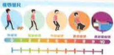
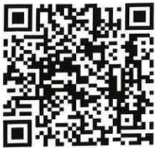

## 我的「完疲」手册

~擊退癌疲憊~基本資料

姓名：___

出生日期

主治醫師

年 月 日

癱瘤個案管理師

姓名：___

連絡電話：

## 目錄

~序~  
  
自我監測疲憊程度  
  
疲憊步要來  
  
疲憊日記  
  
自覺用力係數  
  
結語## 序

惡性腫瘤』已蟬聯台灣十大死因冠軍地位數一年，此疾病及其治療常為病人帶來生理不適心理壓力，甚至影響家庭生活，其中又以「癌因性疲憊症」最令病人感到困擾，所以，團隊特製作此手冊，協助病人居家自我監測度憊程度，並學習緩解疲憊的方法，以提升生活品質。

## 你有多疲憊

## 什麼是癌因性疲憊症

是因癌症或癌症治療所引起之重大疲憊感，會降低活動力及對事物的興趣、增加心理壓力、睡眠困擾，影響生活品質。

癌症的任一治療方式、藥物、階段都可能發生。

## 快用疲憊量尺評估自己的疲憊程度

參考資料：瘧因性疲憊症之臨床治療指引## 自我監測疲憊程度

疲憊量尺

請根據自身疲憊感覺，指出對應的疲憊分數。0分表示沒有疲憊，10分代表最嚴重的疲憊

無疲憊

輕度疲憊

中度疲愦

重度瘦德

最嚴重疲憊

## 居家照護好方法

## 臨床治療指引建議

## 疲憊分數<4分

運動：選擇自己喜歡和方便的運動，如走路、游泳、騎自行車等，建議從低強度運動開始，再漸進式調整為每周至少3次，每次20~30分鐘之低、中強度活動，運動前須有5~10分鐘暖身運動；運動後須有5~10分鐘緩和運動(請參考5~6頁)。

運動

心理社會措施

營養處置

輔助療法

## 疲憊分數≥4分

處置治療

以非藥物

妥善保存身體能量，

調整生活步調，並適

度休息。

可考慮

藥物治療

精神刺激藥物

類固醇藥物

黃耆多糖注射劑

中草藥藥物

## 檢測結果請與您的主治醫生討論

規律睡眠：固定時間就寢及起床，中午可小睡片刻，但時間勿超過2小時。

規律用餐，進食高纖(蔬菜水果、全穀物)、低脂和富含 $ \omega $ -3脂肪酸的食物，避免含糖飲料。

正念減壓、冥想放鬆、穴位按壓、按摩、泡腳及腹式呼吸...## 疲憊 步要來

## 利用運動使癌因性疲憊健行健遠

|  | 運動方式 | 運動強度（感受） |
|---|---|---|
| 暖身期 5-10分鐘 | 慢速散步 | 自覺用力係數＜8 （非常輕鬆） |
| 訓練期 15-20分鐘 | 中速度行走 | 自覺用力係數≤13 （有點辛苦 尚能交談） |
| 緩和期 5-10分鐘 | 慢速散步 | 自覺用力係數＜8 （非常輕鬆） |

## 自覺用力係數

健走時，請依照您的自覺狀況，決定運動強度

| 自覺用力係數 | 說明 |
|-------------|------|
| 6 | 完全沒有用力的感覺 |
| 7 | 超級輕鬆 |
| 8 | 非常輕鬆 |
| 9 |  |
| 10 | 輕鬆_訓練時還能唱歌 |
| 11 |  |
| 12 | 有點辛苦_尚能交談、無法唱歌 |
| 13 |  |
| 14 | 苦辛_訓練時講話會很喘 |
| 15 |  |
| 16 | 非常辛苦_訓練時講話會呼吸困难 |
| 17 |  |
| 18 | 超級辛苦 |
| 19 |  |
| 20 | 已經盡最大的努力 |## 疲憊日記~我累了嗎？

MONTH: 月

| 星期一 | 星期二 | 星期三 | 星期四 | 星期五 | 星期六 | 星期日 |
|--------|--------|--------|--------|--------|--------|--------|

MONTH: ☐ 月

| 星期一 | 星期二 | 星期三 | 星期四 | 星期五 | 星期六 | 星期日 |

## 疲憊日記~我累了嗎？

MONTH: 月

| 星期一 | 星期二 | 星期三 | 星期四 | 星期五 | 星期六 | 星期日 |

MONTH: 月

| 星期一 | 星期二 | 星期三 | 星期四 | 星期五 | 星期六 | 星期日 |## 疲憊日記~我累了嗎？

MONTH: ☐ 月

## 疲憊日記~我累了嗎？

| 星期一 | 星期二 | 星期三 | 星期四 | 星期五 | 星期六 | 星期日 |
|--------|--------|--------|--------|--------|--------|--------|

MONTH: ☐ 月

| 星期一 | 星期二 | 星期三 | 星期四 | 星期五 | 星期六 | 星期日 |
|--------|--------|--------|--------|--------|--------|--------|

MONTH: 月

| 星期一 | 星期二 | 星期三 | 星期四 | 星期五 | 星期六 | 星期日 |
|--------|--------|--------|--------|--------|--------|--------|

MONTH: 月

| 星期一 | 星期二 | 星期三 | 星期四 | 星期五 | 星期六 | 星期日 |
|--------|--------|--------|--------|--------|--------|--------|## 疲憊日記~我累了嗎？

MONTH: 月

| 星期一 | 星期二 | 星期三 | 星期四 | 星期五 | 星期六 | 星期日 |
|--------|--------|--------|--------|--------|--------|--------|

MONTH: 月

| 星期一 | 星期二 | 星期三 | 星期四 | 星期五 | 星期六 | 星期日 |
|--------|--------|--------|--------|--------|--------|--------|

## 疲憊日記~我累了嗎？

MONTH: 月

| 星期一 | 星期二 | 星期三 | 星期四 | 星期五 | 星期六 | 星期日 |
|--------|--------|--------|--------|--------|--------|--------|

MONTH: 月

| 星期一 | 星期二 | 星期三 | 星期四 | 星期五 | 星期六 | 星期日 |
|--------|--------|--------|--------|--------|--------|--------|# Let's Go Together

WE ARE

POWERFUL

歡迎加入『疲憊不要來』官方帳號，讓我們與您，共同擊退瘧疲憊！

~義大癌治療醫院守護您~

義大醫療財團法人義大癌治療醫院

地址：高雄市燕巢區角宿里義大路21號

電話：07-6150022

網址：edah.@edah.org.tw