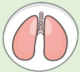

## 肺阻塞 (COPD) 肺部運動訓練

## 上肢運動—彈力帶訓練

## 什麼是肺阻塞？

呼吸道慢性發炎，不可逆的阻塞性疾病

台灣十大死因第八位

症状：咳

痰

喘

危險因子：

吸菸或二手菸

環境有害物質

或職業接觸

家族史

或其他肺部狀況

## 上肢運動重要性

透過上肢運動，改善上肢肌肉力量  
提高運動耐力及呼吸強度  $ \leftrightarrow $  減緩呼吸喘之不適程度

須經常練習才有效唷!!  

訓練頻率  
每周3次以上  

訓練時間  
每次至少20~30分鐘  

 $ ^{*} $ 建議頻率與時間提供參考，可依個人狀況增減調整  

參考資料來源  
1. 台灣胸腔暨重症加護醫學會(2022)·2022奔跑吧!小肺!-肺阻塞的肺部復健衛教手冊  
2. 台灣胸腔暨重症加護醫學會(2017)·肺阻塞知多少-台灣肺阻塞全方位照護手冊  

| 聯絡資訊 |  |  |
|----------|---|---|
| **義大醫院** | **義大癌治療醫院** | **義大大昌醫院** |
| 地址:高雄市燕巢區角宿里義大路1號 | 地址:高雄市燕巢區角宿里義大路21號 | 地址:高雄市三民區大昌一路305號 |
| 電話:07-6150011 轉 5072 肺阻塞個管師 | 電話:07-6150022 轉 6477 肺阻塞個管師 | 電話:07-5599123 呼吸胸腔科門診 |