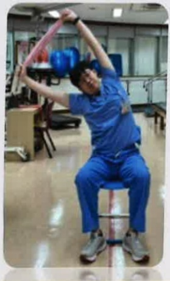

## 上身直立挺胸運動

向上伸展

## 雙手拿毛巾

向右伸展

向左伸展

伸展到最高時 吸氣2-3秒 吐氣4-6秒

每個動作10下，3個動作為1組，每日至少3組

 $ ^{*} $ 示範動作頻率與組數提供參考，可依個人狀況增減調整 $ ^{*} $ 

## 面對牆面 間隔一大步

雙腳打開 雙手撐牆

胸部往地面延伸 維持5~10秒

每次10下 每日至少3次

義大醫療 呼吸胸腔科