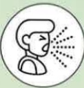
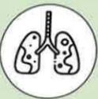

## 肺阻塞（COPD）肺部運動訓練

## 下肢運動—走路、跑步機訓練

## 什麼是肺阻塞？

呼吸道慢性發炎，不可逆的阻塞性疾病

台灣十大死因第八位

症状：咳

痰

喘

危險因子：

吸菸或二手菸

環境有害物質

或職業接觸

家族史

或其他肺部状况

21X29.7cm

## 下肢運動訓練重要性

1. 呼吸道慢性發炎進而阻塞氣道，可能使肺部存在動態過度充氣而限制病人運動能力。

2.透過運動訓練可減少運動時呼吸困难狀況，改善日常活動與生活品質。

2024.07印製

3.下肢運動訓練分為耐力訓練與阻力訓練，兩者結合訓練可增加運動能力與肌肉強度

4. 走路與跑步機訓練適合平衡能力佳者，可搭配噉嘈與腹式呼吸同時訓練

## 參考資料來源

1. 台灣胸腔豎重症加護醫學會(2022)•2022台灣肺復原實務指引•台北市：台灣胸腔豎重症加護醫學會

2. 台灣胸腔暨重症加護醫學會(2022)·2022奔跑吧！小肺！-肺阻塞的肺部復健衛教手冊·台北市：台灣胸腔暨重症加護醫學會

## 聯絡資訊

<table border=1 style='margin: auto; width: max-content;'><tr><td style='text-align: center;'>義大醫院</td><td style='text-align: center;'>義大癌治療醫院</td><td style='text-align: center;'>義大大昌醫院</td></tr><tr><td style='text-align: center;'>地址:高雄市燕巢區角宿里義大路1號</td><td style='text-align: center;'>地址:高雄市燕巢區角宿里義大路21號</td><td style='text-align: center;'>地址:高雄市三民區大昌一路305號</td></tr><tr><td style='text-align: center;'>電話:07-6150011 轉 5072 肺阻塞個管師</td><td style='text-align: center;'>電話:07-6150022 轉 6477 肺阻塞個管師</td><td style='text-align: center;'>電話:07-5599123 呼吸胸腔科門診</td></tr></table>

2024.06新設 HA-9-0117(1)走路運動 須穿著適當鞋子

平衡稍差者 可使用枴杖或助行器輔助

若家中有跑步機 可藉以調整適合的速度

建議每周至少3次，每次15-20分鐘，執行次數與頻率可依個人狀況增減調整