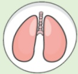

# 肺阻塞 (COPD) 肺部運動訓練

## 握力訓練

## 什麼是肺阻塞？

## 呼吸道慢性發炎，不可逆的阻塞性疾病

台灣十大死因第八位

## 症状：咳

痰

喘

## 危險因子：

吸菸或二手菸

環境有害物質

或職業接觸

家族史

或其他肺部狀況

## 肌少症及握力訓練重要性

1. 肌少症是一種全身性肌肉質量、力量及功能下降的綜合症狀，研究發現約有27%的COPD病人有肌少症。

2. 握力不僅代表手部肌肉力量，更是最佳衡量整體肌肉力量之指標。

3. COPD病人握力不足、骨骼肌與呼吸肌功能下降，會增加急性發作風險及死亡率、造成肺功能惡化與影響生活品質。研究發現握力每↓1公斤，COPD惡化的風險↑5%。

## 參考資料來源

1. Mackenzie Holden et al.(2021). Handgrip Strength in People With Chronic Obstructive Pulmonary Disease: A Systematic Review and Meta-Analysis. PubMed. Retrieved Jun 1, 2021, from https://pubmed.ncbi.nlm.nih.gov/33561266/

2. Jie He et al.(2023). Prevalence of sarcopenia in patients with COPD through different musculature measurements: An updated meta-analysis and meta-regression. PubMed. Retrieved Feb 16, 2023, from https://pubmed.ncbi.nlm.nih.gov/36875833/

3. Chi-Tai Lee & Ping-Huai Wang(2021). Handgrip strength during admission for COPD exacerbation: impact on further exacerbation risk. BMC. Retrieved July 21, 2021, from https://bmcpulmmed.biomedcentral.com/articles/10.1186/s12890-021-01610-7

## 聯絡資訊

<table border=1 style='margin: auto; width: max-content;'><tr><td style='text-align: center;'>義大醫院</td><td style='text-align: center;'>義大癌治療醫院</td><td style='text-align: center;'>義大大昌醫院</td></tr><tr><td style='text-align: center;'>地址:高雄市燕巢區角宿里義大路1號</td><td style='text-align: center;'>地址:高雄市燕巢區角宿里義大路21號</td><td style='text-align: center;'>地址:高雄市三民區大昌一路305號</td></tr><tr><td style='text-align: center;'>電話:07-6150011 轉 5072 肺阻塞個管師</td><td style='text-align: center;'>電話:07-6150022 轉 6477 肺阻塞個管師</td><td style='text-align: center;'>電話:07-5599123 呼吸胸腔科門診</td></tr></table>## 握力訓練

可依個人狀況

選擇適合大小與強度

初期訓練可從低強度開始

每下2~5秒，20下為1組，每日至少3組，可依個人狀況調整

