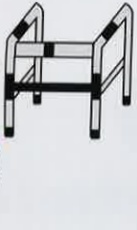
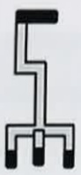
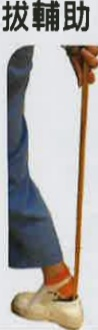
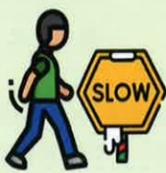

# 肺阻塞（COPD）肺部運動訓練

日常節能技巧

## 什麼是肺阻塞？

呼吸道慢性发炎，不可逆的阻塞性疾病

台灣十大死因第八位

## 🧠 症状：咳

痰

## 危險因子：

吸菸或二手菸

環境有害物質

或職業接觸

家族史

或其他肺部狀況

義大醫療財團法人 21X29.7cm 2024.08印製

## 節能技巧重要性

1. 節能技巧(又稱工作簡化技巧)，透過有效使用身體及安排順序操作，讓病人節省精力、保持行動獨立，並減少疾病所帶來的不適。

2. 適當運用節能技巧能幫助呼吸困難、運動會喘的病人，更輕鬆的完成日常生活活動，搭配呼吸訓練可降低進行活動時所需的能量消耗。

## 參考資料來源

1. 台灣胸腔豎重症加護醫學會(2022)·2022台灣肺復原實務指引·台北市：台灣胸腔豎重症加護醫學會

2.1.台灣胸腔豎重症加護醫學會(2022)•2022奔跑吧!小肺!-肺阻塞的肺部復健衛教手冊

3. 台灣胸腔豎重症加護醫學會(2017)·肺阻塞知多少-台灣肺阻塞全方位照護手冊

## 聯絡資訊

| 聯絡單位         | 地址                                                                 | 電話                                                                 |
|------------------|----------------------------------------------------------------------|----------------------------------------------------------------------|
| 義大醫院         | 地址:高雄市燕巢區角宿里義大路1號                                     | 電話:07-6150011 轉 5072 肺阻塞個管師                                 |
| 義大癌治療醫院   | 地址:高雄市燕巢區角宿里義大路21號                                   | 電話:07-6150022 轉 6477 肺阻塞個管師                                 |
| 義大大昌醫院     | 地址:高雄市三民區大昌一路305號                                     | 電話:07-5599123 呼吸胸腔科門診                                       |## 穿著

集中衣物

方便拿取

減少鈕扣類衣物

坐著穿衣

避免彎腰

## 煮食與飲食

集中用具及食材

少量多餐

避免吃太飽

細嚼慢嚥避免嗆咳

小撇步

待處理事項

安排優先順序

每週工作

預先計畫分配

避免單日超負荷

## 活動與購物

善用各項輔具

走路愜意又安全

善用有輪拖車

購物採買不費力

## 穿鞋與洗澡

坐著穿鞋或使用鞋拔輔助

避免彎腰

使用長柄刷輔助避免彎腰

步調放慢

不著急

避免彎腰

避免長時間久站

善用工具輔助