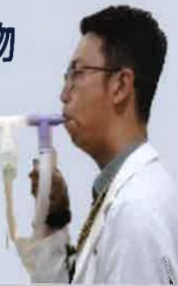
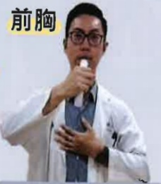

| 義大醫院 | 義大癌治療醫院 | 義大大昌醫院 |
|----------|----------------|---------------|
| 地址:高雄市燕巢區角宿里義大路1號 | 地址:高雄市燕巢區角宿里義大路21號 | 地址:高雄市三民區大昌一路305號 |
| 電話:07-6150011 轉 5072 肺阻塞個管師 | 電話:07-6150022 轉 6477 肺阻塞個管師 | 電話:07-5599123 呼吸胸腔科門診 |## 震動吐氣末正壓工具訓練

## 市售款式眾多 可挑選適合者使用

## 訓練重點

1. 吸氣：吐氣 = 1 : 3 ~ 4

2. 嘴含緊吹嘴不可漏氣

## 建議量

30下為一個循環，較喘者3~5下間可休息再繼續，一天至少2個循環

每日規律練習，次數與頻率請依個人狀況調整

## 清洗與組裝

旋转至最小刻度

向外抽出软管

移除吹嘴

清洗器由上往下放置  

清水冲洗後晾乾  

晾乾後願向抽出清洗器

## 一 般狀況

鼻子吸氣2~3秒

嘴巴

含聚吹嘴

吐氣

6秒以上

## 搭配 氣霧式藥物

裝回軟管

調整適合之強度

裝回吹嘴 即可訓練

嘴巴

含聚吹嘴

吸氣2~3秒

自我測試

臉頰不可鼓起

運用

掌根部位

嘴巴

含緊吹嘴

吐氣6秒以上

前胸

## 臉頰 不可鼓起

## 若吐氣動作正確可感受到肺部震動感

手掌放於胸脅位置上（兩乳頭中間）

後背

單手手掌放於後背

兩肩頰骨中間

→中央氣道

雙手手掌放於後背

兩肩頰骨下方

→下肺葉