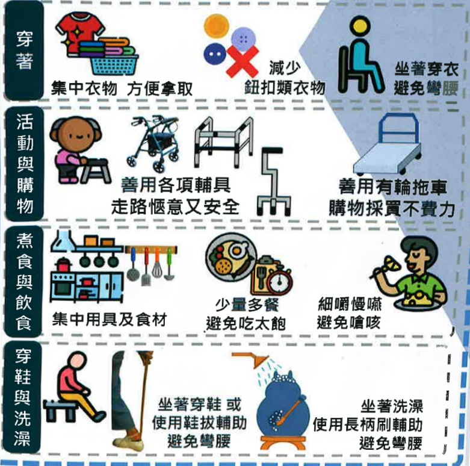

## 五、 肺阻塞非藥物治療

## 五、 肺阻塞非藥物治療

## 節能技巧(又稱工作簡化技巧)

透過安排順序操作，節省精力、保持行動獨立

適當運用節能技巧能幫助呼吸困难、運動會喘的病人，

更輕鬆的完成日常生活活動，搭配呼吸訓練可降低進行

活動時所需的能量消耗，減少疾病所帶來的不適

節能技巧

坐著洗澡

使用長柄刷輔助

避免彎腰

## 胸腔物理治療

拍痰時機

飯前1小時

飯後2小時

拍痰工具

常見為

手成空心杯狀

拍痰杯、

拍痰棒...等

減少飽食時咳痰引起嘔吐造成吸入性肺炎

拍痰方式

以每秒3~5下的速度扣擊

建議每部位3-5分鐘

每日執行3次

注意事项

須避開引流管或開刀傷口及部分器官部位...等

如有發紺、呼吸困难、生命徵象改變、咳血

立即停止拍痰

