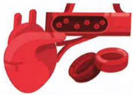
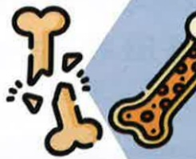

## 五、 肺阻塞非藥物治療

## 前胸

半坐臥

## 上肺葉

床傾斜角度

建議45~60度

## 中肺葉 下肺葉

扣擊鎖骨下上肺位置

## 後背

前傾坐姿

## 後背雙側同時

頭低腳高 俯臥

適合年輕平衡感較佳無高血壓心血管高腦壓...等禁忌症者

後背

側臥

俯臥(3/4俯臥)

胸前用枕頭墊高

扣擊 (1) 腋下 (2) 腋下平行脊椎處 (3) 肩胛骨下方

## 五、 肺阻塞非藥物治療

肺阻塞共病與營養照護

共病

肺阻塞是一種慢性發炎的疾病，常合併有性疾病，可能影響肺阻塞的疾病控制

心血管疾病

骨質疏鬆

肺癌

支氣管擴張症

感染症

睡眠呼吸中止症