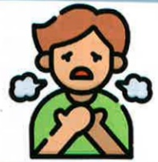
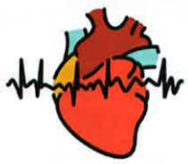
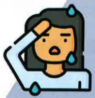
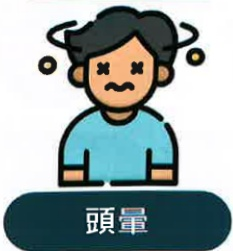

## 五、 肺阻塞非藥物治療

## 缺氧徵兆

呼吸困难

心跳過快

冒冷汗

意識混亂

頭暈

嘴唇手指發紺

## 長期居家氧氣供應的設備

醫師會根據病人的活動能力、給氧流量和室內環境、經濟考量等因素選擇最佳氧氣供應設備常見有：

插電式/攜帶充電式

氧氣鋼瓶

氧氣製造機

## 六、 文獻參考

台灣胸腔暨重症加護醫學會(2017)·肺阻塞知多少-台灣肺阻塞全方位照護手冊·台北市：台灣胸腔暨重症加護醫學會

台灣胸腔暨重症加護醫學會(2021)·2021第一次使用吸入器就上手·台北市：台灣胸腔暨重症加護醫學會

台灣胸腔暨重症加護醫學會(2022)·2022台灣肺復原實務指引·台北市：台灣胸腔暨重症加護醫學會

台灣胸腔暨重症加護醫學會(2022)•2022奔跑吧! 小肺! -肺阻塞的肺部復健衛教手冊

台灣胸腔暨重症加護醫學會(2023)·台灣肺阻塞臨床照護指引·台北市：台灣胸腔暨重症加護醫學會

圖片來源：https://www.flaticon.com/

圖片來源：https://www.canva.com/