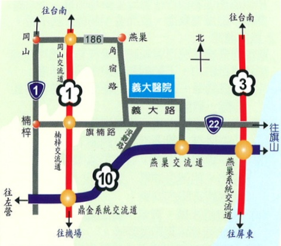

或意識混亂、嗜睡的情形要儘速看醫師。

(2) 節省體力

 $ ^{*} $ 適宜的工作高度，物品盡量靠進身邊，活動時減少身體移動，儘可能坐著執行，譬如：刷牙、洗臉時可坐著，洗澡時可利用長柄刷，並放置椅凳於浴室。

 $ ^{*} $ 事先安排好一天的活動、休息時間表，並將輕的、重的工作平均分配，交替執行，應避免推、舉、抬重物，可利用節省勞力裝置，譬如推車。

* 活動中常常休息，避免過度勞累，必要時依照醫囑使用氧氣。

 $ ^{*} $ 衣服要寬鬆易穿，避免彎腰或綁鞋帶的鞋子。

 $ ^{*} $ 飲食方面選擇易烹飪的譬如微波爐食品。

(3) 清除痰液的方法

*深呼吸：用鼻子深深吸一口氣，屏住呼吸數秒鐘，慢慢用嘴唇呼氣。

 $ ^{*} $ 咳嗽方法：用鼻子深深吸一口氣，屏住呼吸數秒鐘，吐氣時身體向前彎曲用手壓迫腹部，增加咳嗽力量再咳出痰液。

* 拍痰及姿位引流：依照肺部解剖位置藉由重力拍痰及咳嗽使痰排出。

地址：高雄縣824燕巢鄉角宿村義大路1號

電話：07-6150011

網址：edah@edah.org.tw

本著作權非經著作權人同意不得轉載翻印或轉售

著作權人：義大醫院

表單編號：HA-1-0004（1）

## 慢性阻塞性肺部疾病

## 什麼是慢性阻塞性肺部疾病

## 一、 定義

係指一種長期慢性且無法完全恢復之呼吸道阻塞疾病，致使氣體無法通暢地進出呼吸道，通常它包含有慢性支氣管炎，肺氣腫。

## 二、 發生原因

抽煙、空氣污染、感染、過敏、遺傳及老化之肺臟

## 三、 檢查

1. 身體檢查。

2. 胸部 X 光片。

3. 肺功能檢查。

4. 動脈血液氧氣分析。

5. 痰液檢查。

6. 胸部電腦斷層檢查。

## 、症状

1. 慢性支氣管炎

面色發紅或發紺、體重增加、咳嗽常出現於清晨、持續兩年，每年至少三個月。

2. 肺氣腫

面色紅潤、體重減輕、呼氣時頸靜脈怒張、呼氣延長。

## 治療

1. 戒煙

2. 藥物治療

3. 飲食治療

4. 居家氧氣治療

5. 呼吸運動

## 六、 護理指導

### 1. 藥物需知

在用藥方面醫師會依照症狀增、減藥物劑量，所以病患切勿自行任意調整藥物劑量，否則對病情不但沒有幫助，反而會引起極大的不適。

### 2. 飲食需知

適當的營養狀況可以減輕呼吸作功，還可以增加身體抵抗力。下列的飲食原則可供參考：

（1）選擇簡單、富變化且方便烹調的食物譬如炒麵、鹹粥等。

(2) 採少量多餐方式，每餐不要吃大飽，餐前可先休息，餐後不要立刻躺下。

(3) 在熱量提供方面，可在飲食中增加不飽合脂肪，如黃豆油等，這樣可以增加熱量又可減輕呼吸的負擔。

(4) 足夠的水果、青菜，養成規則排便習慣，預防便秘以免阻礙呼吸。

(5) 依照醫師建議攝取適量的水份及鹽份，所以要少吃醃漬食物、醬菜、罐頭食品。

(6) 避免食用會脹氣的食物，譬如：豆類、蘿蔔、花椰菜、洋蔥、玉米、甘藍等。

(7) 吃東西時要細嚼慢嚥，吃當中如感呼吸困難，可先休息等呼吸乎順了再吃，或依照醫師指示使用氧氣。

(8) 其它有關飲食方面的問題，應請教醫師、護理人員和營養師。

3. 居家氧氣治療需知

病患若需要在家使用氧氣時，應先瞭解以上幾點並確時遵守：

(1) 要先認識缺氧的徵兆如：頭暈、頭痛、嗜睡、呼吸困难、心跳加快、發黑等。

(2) 在使用或儲存氧氣房間內，嚴禁抽煙，使用打火機，點火柴等有火源的東西。

(3) 氧氣儲存容器不要置於熱源或電器用品（譬如暖器機，傳熱管，電視，電動刮鬍刀等）旁邊。

（4）氧氣儲存容器要固定好以免翻倒。

(5) 氧氣儲存容器要放置於通風良好的地方，不要放在通風不良封閉(如車廂，衣櫃)的地方。

(6) 氧氣用品不可塗上任何潤滑劑。

### 4. 呼吸運動需知

（1）要穿著寬鬆衣服並在舒適環境進行。

(2) 運動必須在餐前執行，避免胃的食物阻礙肺部擴張。

(3) 要由最低的運動量、時間、次數開始，然後慢慢的增加。

(4) 用氧氣的人，在運動時要依照醫師指定，將氧氣量調到最適合的流量。

(5) 運動中，如果有頭暈、氣喘、心跳加速、發黑等現象時要馬上停止。

### 5. 日常居家生活保健

患者除了前面所提到的治療方式外也要有良好的居家環境，應用各種節省能量的方式做好日常保健，才能擁有良好的生活品質。

## (1) 避免感染

 $ ^{*} $ 不要到人多的公共場所，避免和感冒的人接觸。

 $ ^{*} $ 要有良好的營養狀況和充足的睡眠，以增加抵抗力。

 $ ^{*} $ 適時添加衣物避免受寒。

 $ ^{*} $ 認識感染的徵象，如果發生痰量增加、變黃、變黏稠、發燒、咳嗽、呼吸困难加劇