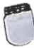
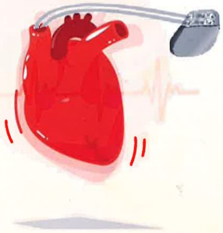
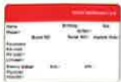

· 隨時告知醫護人員：在接受其他手術或醫療程序之前，必須告知醫護人員您有植入心臟節律器，以確保所用的設備或治療方法不會對節律器產生干擾。

## 心律去颤器是甚麼？

楦入式心律去颤器是由電池和微小的電腦晶片所組成，可以手術方式植入上胸部或腹部。主要針對心因性猝死(心室纖維顫動)的次級預防。當電腦偵測到心室纖維顫動時，會輸出電流，進行除顫，挽救生命。去顫器於心跳過慢或過快時給予調整以及修正心臟節律。

修正心臟節律過程中，病患感覺會因電流大小，身體反應而定，從無感到胸口有重擊感，胸口或上臂肌肉的不自主收縮。通常只會維持短暫時間。

· 手術後照護及注意事項請參考以上。

參考資料：

National Heart, Lung, and Blood Institute. (2022). What Are Pacemakers? <https://www.nhlbi.nih.gov/health/pacemakers>

心臟節律器的新進展廖瑀、陳儒逸國立成功大學醫學院附設醫院內科部心臟血管科國立成功大學醫學院內科學誌 2022:33:1-8 衛生福利部資料

## 若您有任何問題請與我們聯絡 祝您早日康復

地址：高雄市燕巢區角宿里義大路1號

電話：07-6150011

義大癌治療醫院

地址：高雄市燕巢區角宿里義大路21號

電話：07-6150022

義大大昌醫院

地址：高雄市三民區大昌一路305號

電話：07-5599123

本著作權非經著作權人同意不得轉載翻印或轉售

著作權人：義大醫療財團法人

29.7×20cm 2025.08印製 2024.10修訂 HA-1-0009(2)

## 裝置節律器 之照護

## 心臟節律器是什麼？

心臟節律器是由節律器、導線及電極三種部份所組合成的精密電子儀器(圖一)

，以手術方式植入胸前皮下肌肉組織層上

藉由連於裝置在心臟內的電極導線，偵測出發生心律不整時，會立即送出電流脈衝刺激心臟，幫助調節心臟的節律。

## 節律器適用病患

心跳過緩-竇房節病變症候群(Sick Sinus Syndrome，SSS)或者房室傳導阻斷，心率低於每分鐘40次，導致暈眩、疲勞等症狀。

## 造成心律不整的原因

1. 心臟病、糖尿病、高血壓、慢性阻塞性肺部疾病，以及甲状腺功能亢進之類的疾病。

2. 酒精與特定藥物，甚至是藥物成癮亦可能造成心律不整。

3. 先天體質容易罹患心律不整。

4. 心臟傳導系統因心臟病發作或毒品受損。

5. 咖啡因、情緒起伏與懷孕都有可能影響心臟。

## 節律器植入手術方式

醫師於鎖骨下皮膚上，劃開一道一到兩英吋長的切口，將電極導線穿過鎖骨下靜脈及上腔靜脈進入心臟，在皮下肌肉組織層上做一個小囊袋，並將電極導線連接上節律器，測試正常運作後，在將節律器放入囊帶，最後傷口縫合。

## 手術後照護

## (一) 傷口護理

· 保持清潔與乾燥：在手術後的幾天內，應保持傷口區域的清潔和乾燥，防止感染。

·觀察傷口：留意傷口是否有紅腫、滲液或發熱等感染跡象，如果發現這些症狀，應立即聯繫醫生。

· 避免過度活動：在手術後的幾週內，應限制肩部或胸部的過度活動，避免抬高手臂或提重物，因為這些動作可能拉扯到植入節律器的導線。

## (二) 避免電子設備干擾

·遠離強磁場與電子設備：一些電子設備或強磁場可能會干擾心臟節律器的運作，應避免靠近強電磁源，例如MRI核磁共振，因此在進行這檢查前需告知醫師，出示您的心臟節

律器識別卡。

## (三) 定期回診與檢查

·電池檢查：節律器的電池壽命通常為8到10年，需定期回診檢查裝置的運行情況，並測量電池電量及導線功能。

## (四) 警惕異常狀況

· 如果出現暈眩、胸痛、呼吸急促、心跳異常等不適症狀，應立即就醫，因為這些可能是裝置無功能或其他心臟問題的徵兆。

## (五) 生活方式的調整

· 健康飲食與運動：保持低鹽、低脂飲食，適量運動，以及避免吸菸和過量飲酒。