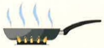

## 腸胃炎注意事項

## 一、 腸胃炎定義：

腸胃炎是胃或腸黏膜發炎所引起的疾病，常見原因有食物中毒、或食入各種病毒、細菌、寄生蟲所汙染的食物和水、飲酒過量、過敏、情緒障礙等。

## 二、 適用對象：

1. 腸胃炎患者及其照護者。

## 三、 症状：

1. 嚴重嘔吐和腹瀉，常連帶有腹部痛性痙攣及絞痛。

2. 發燒、出汗。

3. 可因長期大量喪失體液而致脫水甚至休克。

4.嘔吐物和糞便中可能有少量血。

5.嘔吐、腹瀉等徵狀約在二至四天後便停止，但也可能持續更長的時間。

## 四、 注意事项：

1. 若有噁心、嘔吐、腹瀉或發燒時，應禁食且補充少許開水和電解質溶液外，並臥床休息，以利於恢復體力。

2. 若無嘔吐，但仍腹瀉時，只可飲用清流質（如果汁、運動飲料、米湯等），不可喝刺激性飲料如茶、咖啡及檸檬汁、橙汁等酸性飲料，以免刺激胃腸而再度嘔吐。

3.嘔吐後可漱口清潔口腔，減輕異味。

4. 儘量減少牛奶食用，因有輕瀉作用。腹瀉初期或是輕度腹瀉，可使用稀釋過的普通奶粉，若情況未改善或嚴重腹瀉或長期腹瀉則需考需2-8週的腸胃奶粉。

5. 若腹瀉停止後，且會覺得餓，可逐漸食用少量、清淡、易消化食物，如稀飯、白吐司等，但不可同時喝流質。

6. 症狀未完全消失前，不可進食酒、咖啡、茶，以及油腻、酸辣刺激性的食物，可樂、鮮奶、水果除蘋果外，也盡量少吃（最好暫時不吃）。

7. 務必遵照醫囑定時定量服用藥物，用完後如果尚有不適，請到門診繼續追蹤治療。

8. 若出現肛門皮膚破損，須於每次排便前，使用潤滑劑（凡士林）擦拭肛門口周圍，減輕摩擦，排便後用溫水清潔且門口，以減輕排便時引起的疼痛不適。

## 五、 預防或保健知識：

1. 正確自備食物減少因食物受污染而導致炎症反應：

(1) 烹調或進食之前須將雙手洗淨。

(2)食物需完全加熱煮沸後方可食用。

(3) 生或熟食物所使用的粘板必须分开。

(4)食物應冷藏保存，並用容器覆蓋以保護食物避免受昆蟲等污染。

2. 乳製品如牛乳、乳酪等和加工過的魚肉類食物，若放置於室溫過久，不宜食用，並注意食品有效期限。

3. 避免食用不合衛生的食物，尤其是處理不當的海鮮、生壽司。

4. 冷藏的熟肉應當充分煮熟後才吃。

5. 若發現罐頭食物容器有損壞或有膨脹、內裡的食物有異，應即丟棄。

6. 使用微波爐加熱食物時，應確保中心溫度夠熱才可進食（微波本身無殺菌能力）。

