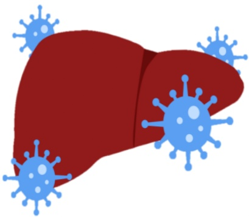

## 五、 參考資料

吳麗彬、周繡玲、劉莉妮（2022）·消化系統疾病之護理·於劉雪娥總校閱，成人內外科護理（八版，446–450頁）·華杏。

義大醫院

地址：高雄市燕巢區角宿里義大路1號

電話：07-6150011

義大癌治療醫院

地址：高雄市燕巢區角宿里義大路21號

電話：07-6150022

義大大昌醫院

地址：高雄市三民區大昌一路305號

電話：07-5599123

## 認識 A 型肝炎

## A型肝炎

## 一、 前言

當肝臟受到 A 型肝炎病毒侵犯時，就叫做 A 型肝炎。A 型肝炎主要發生在公共、家庭環境及個人衛生條件低落的國家。

## 二、 傳染途徑

1. 經口感染：飲水、吃未煮熟或生的食物，特別是貝殼類食物。

2. 糞口感染：吃到或喝到被 A 型肝炎病人糞便汙染食物或飲水。

## 三、 主要症状

1. 嘔吐、腹瀉、食慾不振、體重下降，尿液呈深色，皮膚和眼睛呈黃色（黃疸病），甚至腹痛及發燒。

2. 感染 A 型肝炎一般须二-四星期的潜伏期，才出现症状。

3. 似感冒症状如发燒、疲倦、噁心、呕吐，或者没有明显症状

4. A型肝炎預後良好致死率低，不會轉變成慢性肝炎。

## 四、 预防方法及生活注意事项

1. 養成良好的個人飲食衛生習慣，如廁前後及吃東西勤洗手。

2. 平時不吃生食。

3. 用餐時使用公筷母匙。

4. 到疫區旅遊可先注射免疫球蛋白以進行被動免疫保護。

5. 避免饮用过量含酒精饮料。

6. 生活作息正常，避免熬夜，宜有充足的睡眠。