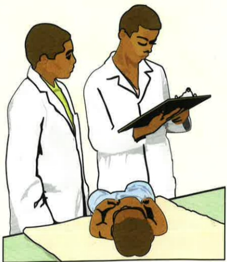

## 五、 参考文献：

吳麗彬、周繡玲、劉莉妮（2022）·免疫系

統異常之護理·於劉雪娥總校閱，成人內外科護理上冊

（八版，504-505）·台北：杏華。

## 義大醫院

地址：高雄市燕巢區角宿里義大路1號

電話：07-6150011

義大癌治療醫院

地址：高雄市燕巢區角宿里義大路21號

電話：07-6150022

義大大昌醫院

地址：高雄市三民區大昌一路305號

電話：07-5599123

本著作權非經著作權人同意不得轉載翻印或轉售

表單編號：HA-1-0082(3)

義大醫療財團法人 20X20cm 2025.06印製 2025.04修訂

認識僵直性

脊椎關節炎

## 一、 何謂僵直性脊椎炎？

僵直性脊椎炎是一種慢性脊椎發炎性疾病，主要以下背痛來表現，好發於20-40歲之年輕男性，女性也有可能發生，只是病例較少、症狀較輕。

## 二、 僵直性脊椎關節炎之症狀：

1. 慢性下背痛。

2. 晨間頸椎僵硬，尤以早晨剛起床時間，活動後症狀會減輕。

3. 運動範圍受限。

4. 除了造成關節發炎外，亦可能侵犯身體其他部位，尤其眼睛會造成葡萄膜炎或腎臟病變。

## 三、 僵直性脊椎關節炎之治療：

1. 藥物治療：

(1) 消炎止痛藥 (NSAID)：

目的在減輕疼痛，使病人能多做運動，並增進生活品質，但無法改變病程。

(2)依醫生指示服藥。最常被使用的藥是“磺鈹匹林”（Suphasalazine），具有免疫系統的功能，可以改變疾病的活性。

(3) 生物製劑：也稱之為標靶治療，把身體中發炎的媒介（如腫瘤壞死因子）、跟疾病機轉有關的介白質給去除，可抑制關節發炎，控制疼痛，延緩關節破壞，此類藥物需向健保申請許可後才可以使用。

2. 手術：

對對脊椎嚴重變形的病人，可以手術改善關節功能，髖關節嚴重受損病人可行關節修補及置換術。

## 四、 居家照護注意事項：

1. 運動

(1) 脊脊椎活動範圍及增進生活品質是非常重要，如柔軟體操、游泳、跳舞。

(2) 正正確姿勢也很重要，應避免長時間維持同一姿勢不動。

(3) 避免舉重物或提重物，以免增加腰部的負擔而造成腰痛，多做伸展脊椎的運動，以防脊椎變形。

2.飲食原則：避免肥胖，因過重會增加腰及關節負擔。

(1) 眼睛定期檢查：因為病人有20%會引起虹彩炎及葡萄膜炎現象。

(2)定期於風濕免疫科門診追蹤治療。