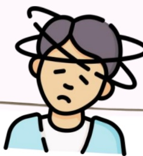
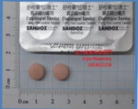
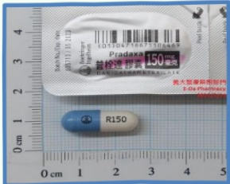
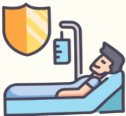
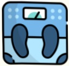
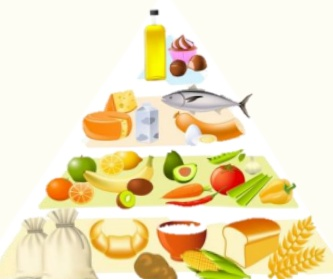
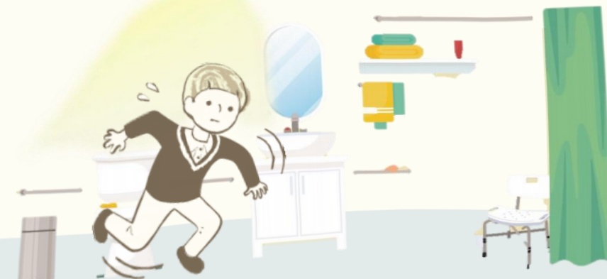
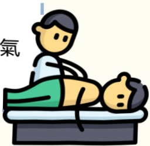

## 腦中風 患者衛教手冊## 目錄

腦中風是? - - - - - - - - - - 2  
  
腦中風的類型與症狀 - - - - - - 4  
  
腦中風危險因子 - - - - - - - 7  
  
腦中風治療藥物 - - - - - - - 11  
  
長期生活與復健 - - - - - - - 15## 什麼是腦中風？

腦中風主要是因為腦血流受阻，導致缺氧，而發生腦功能障礙。

腦中風是國人十大死因之一，中風除了對患者身心造成很大的影響，讓整個家庭陷入不安與焦慮之中。

## 33## 腦中風分期

## 急性期   (中風一週内)

## 亞急性期(2週-6個月)

維持期(6個月後)

1. 患者應在安全安靜的環境，例如專科病房接受專業照顧

2. 減低併發症之發生，如肺炎及尿道感染，並依醫師建議盡早進入復健階段。

1. 此階段為黃金復健期，盡早復健對功能復原有很大的幫助。

2. 患者應積極在專業訓練下進行復健，設定合理的目標，嘗試進行日常活動(例如穿衣、吃飯等)。

3. 約有四成的患者可能因肢體痙攣所困擾

應持續配合復健及中風預防，並注意認知功能及情緒腦中風的類型

缺血性腦中風

## 發生原因：

1 腦血管堵塞而引起血流阻塞，影響供血

## 非心因性

由於腦血管壁粥狀硬化，造成血管壁增厚形成斑塊，使血管腔越來越小，分成：

★ 大動脈粥狀硬化腦梗塞：發生在大血管的阻塞  

★ 小洞性梗塞：發生在小血管的堵塞

通常與三高(高血壓、高血脂、高血糖)有關

## 心因性

由於血栓或斑塊隨血流卡在腦血管引起堵塞：

常是由心臟內的血栓所造成的，故又稱為心因性栓塞症。通常與心律不整有關出血性腦中風

因脑血管破裂引起出血，產生血塊壓迫腦部，影響供血。

出血性中風

出血性腦中風發生時，會導致腦部腫脹及顱內壓力增加，進而傷害腦細胞及組織

通常與高血壓或動脈瘤有關

缺血性腦中風：在所有腦中風中比例約占70～80%

出血性腦中風：在所有腦中風中比例約占20～30%

腦中風危險因子

生活型態

體重過重

不健康的飲食習慣

缺乏運動

心理壓力

與憂鬱

酒精或藥物濫用

吸菸

## 衛生福利部國民健康署

1. 門診、住院、急診及社區藥局皆可提供戒菸服務，費用由菸品健康福利捐的收入支應。

2. 接受戒菸服務後，3個月及6個月後還有專人追蹤及輔導，全程關懷增強戒菸動機及意志力。

免費戒菸專線：0800-636363## 腦中風危險因子

## 其他疾病

## 高血壓

約有50%的中風是因高血壓引起

☑ 易使血管内膜受损，導致膽固醇的堆積，因而加速血管的硬化

◆ 易擠破血管增加腦出血的危險

## 糖尿病

腦中風的機率增加1.5~3倍

會造成血管的變性、血液黏度的增加及血管本身的硬化。發生在腦部常造成冠狀動脈、週邊動脈、腦動脈的粥狀硬化和小血管病變

## 心臟病

心臟的肌肉或瓣膜出現病變或心律不整，血流就會不通暢，容易凝固，最後成為腦栓塞

## 高血脂

➢ 高血脂是血管硬化的重要原因之一

膽固醇與三酸甘油脂偏高會讓血管動脈硬化，而使得腦中風的機會增加

有些中風的危險因子

可以透過改善生活型態的方式進行改善。

如：控制高血壓、糖尿病、高血指等等## 腦中風危險因子

## 再次中風評估表

<table border=1 style='margin: auto; width: max-content;'><tr><td style='text-align: center;'>危險因子</td><td style='text-align: center;'>配分</td><td style='text-align: center;'>√/×</td></tr><tr><td style='text-align: center;'>年齡&lt;65歲</td><td style='text-align: center;'>0</td><td style='text-align: center;'></td></tr><tr><td style='text-align: center;'>年齡65-75歲</td><td style='text-align: center;'>1</td><td style='text-align: center;'></td></tr><tr><td style='text-align: center;'>年齡&gt;75歲</td><td style='text-align: center;'>1</td><td style='text-align: center;'></td></tr><tr><td style='text-align: center;'>高血壓</td><td style='text-align: center;'>1</td><td style='text-align: center;'></td></tr><tr><td style='text-align: center;'>糖尿病</td><td style='text-align: center;'>1</td><td style='text-align: center;'></td></tr><tr><td style='text-align: center;'>曾發生過心肌梗塞</td><td style='text-align: center;'>1</td><td style='text-align: center;'></td></tr><tr><td style='text-align: center;'>其他的心血管疾病(除心肌梗塞及心房颤動外)</td><td style='text-align: center;'>1</td><td style='text-align: center;'></td></tr><tr><td style='text-align: center;'>周邊動脈疾病</td><td style='text-align: center;'>1</td><td style='text-align: center;'></td></tr><tr><td style='text-align: center;'>抽菸</td><td style='text-align: center;'>1</td><td style='text-align: center;'></td></tr><tr><td style='text-align: center;'>曾發生缺血性中風或暫時性腦缺血發作</td><td style='text-align: center;'>1</td><td style='text-align: center;'></td></tr><tr><td style='text-align: center;'>總分</td><td style='text-align: center;'></td><td style='text-align: center;'></td></tr></table>

評分方法：依據是否有此危險因子，分別給予0、1分總分最高為9分

<table border=1 style='margin: auto; width: max-content;'><tr><td rowspan="2">風險層級</td><td style='text-align: center;'>低度風險</td><td style='text-align: center;'>高度風險</td><td style='text-align: center;'>極高度風險</td></tr><tr><td style='text-align: center;'>分數0-2</td><td style='text-align: center;'>分數3-6</td><td style='text-align: center;'>分數&gt;6</td></tr><tr><td style='text-align: center;'>一年後再次中風的風險</td><td style='text-align: center;'>≤ 4%</td><td style='text-align: center;'>&gt; 4%</td><td style='text-align: center;'></td></tr></table>## 腦中風治療藥物

1. 以抗血小板藥物預防缺血性腦中風的首次發作或是復發，

2. 患者合併有心房纖維顫動等心臟問題，則建議使用抗凝血劑或合併治療以預防心因性腦中風復發。

阿斯匹靈(aspirin)

效用

抗血小板藥物

抑制血小板凝集作用

特殊風險

可能會些微增加出血性中風的風險

副作用風險

1. 延长出血时间

2. 肠胃道刺激

3. 罕见：荨麻疹、血管水腫、或氣喘

阿斯匹靈不建議使用於有高出血風險的患者，若您曾發生膽胃潰瘍、腸胃出血或正在使用會增加出血風險的藥物

請告知醫師，以評估出血風險的程度！！腦中風治療藥物

Clopidogrel

效用

專一性抑制血小板凝集

禁忌

禁用於嚴重肝功能不良患者、正在出血患者（如消化性潰瘍或顱內出血）、懷孕或哺乳婦女

副作用

風險

若發生出血,發生時間大多在用藥的第一個月內

1. Clopidogrel 可做為預防腦中風復發的治療方法

2. 對於不適合使用阿斯匹靈的患者,可選擇使用 clopidogrel 治療

Cilostazol

效用

抑制血小板凝集

## 禁忌

如有心室性心搏過速、心室顫動或多灶性心室性心律不整者；有不穩定心絞痛，最近6個月內心肌梗塞，或過去6個月內曾接受冠狀動脈介入治療者等，不得使用

副作用

風險

頭痛、腹瀉、心悸、頭暈及肝功能異常等

1. Cilostazol 可做為預防腦中風復發的藥物

2. 對於不適合使用阿斯匹靈的患者，於排除心衰竭病史後，可使用 cilostazol 減少腦中風復發的風險## 腦中風治療藥物

## 抗凝血劑

## 新型口服抗凝血劑

## dabigatran

## rivaroxaban

## apixaban

edoxaban

• 可使用固定劑量且不需定期驗血監測

## 優點

- 與 warfarin 相較，藥物交互作用較少，與食物沒有交互作用

若未按時服藥，容易增加血液凝固的風險

• 可能因肠胃不適副作用而導致停藥

## 注意

- 若出血或需進行緊急手術時，需考慮使用可快速中和凝血異常的解毒劑

無法評估其抗凝血功能是否在治療範圍內

• 肾功能不全的患者须小心使用腦中風治療藥物

抗凝血劑

Warfarin

## 優點

- 臨床上使用經驗豐富

- 有效控制在安全治療範圍內，則副作用少

- 一旦過量或出血，醫師可使用維他命K作為解毒劑

注意

- 安全範圍較窄

- 多種食物與藥物交互作用

- 患者需常做血液監測以維持適當的 INR（評估凝血功能，INR 值愈大愈容易出血）

- 有些患者可能對 warfarin 十分敏感或出現抗藥性

- 使用於老年人出血風險會增加

## 用藥安全：

1. 對的藥-藥到病除，錯的藥-藥到命除

2. 用藥安全自己來，健康生活才精彩

3. 藥品嚴把關，生命有保障

4. 藥物不亂買，安全才信賴## 腦中風長期生活與復健

當神經功能及生命徵象穩定後，依照個案的動作、認知功能受損程度，開始積極安排復建計畫。為了日後返家能夠盡量生活自理，減少對照顧者的依賴，此階段主要目標就是提升自我照顧能力。

## 復健從住院時開始

急性期復健以關節活動為主。當患者情況穩定後,就可以練習翻身、坐起、移位、使用輔具等,進而學習走路及手部功能以期達到日常生活獨立的目標。患者在出院後仍然需持續復健,使功能恢復到最佳的狀況。

## 腦中風長期生活與復健

住院復健

職能治療

物理治療

語言治療

自我照顧

動作功能

心理社會

幫助患者訓練手部功能,並加強日常生活中自我照顧的能力。

幫助患者學習翻身、移位、行走及恢復活動能力。

協助患者恢復語言理解及表達的能力，以及訓練患者吞嚥功能。

在照顧者協助下學習穿衣、進食、如廁、盥洗等基本日常生活功能。

盡量讓患肢參與活動。

家屬衛教、個案心理支持。## 日常生活

## 食

## 進食前

先選擇較濃稠的食物，再進食固體食物。

液體食物要確認不會嗆到時才可以進食。

建議適當的使用增稠劑。

## 進食中

食物從健康的一側放入口中。

使用適合口腔大小的湯匙，且進食速度不宜太過急促。

## 進食後

進食時應採坐姿，進食後仍坐立30分鐘後才躺下。

## 其他注意事项

每天攝取足夠水分，以維持良好排便習慣。

均衡飲食及營養紀錄，並固定紀錄體重。

持續進行吞嚥治療，定期對吞嚥功能進行評估，以適時的調整飲食內容與方式

避免過度使用動物性油烹飪。並減少油、鹽、糖的攝取。

管灌飲食在室溫下放置不宜超過30分鐘，超過時間請勿食用。

## 不宜過度進補

➢ 選擇瘦肉、堅果類、脫脂或低脂奶製品

➢ 飲食包含豐富蔬菜水果

選擇全穀類及高纖食品其他注意事项

合併症

嚴重性

應對方式

吞嚥障礙

23%~50%的急性腦中風患者

會合併吞嚥困難症狀

吞嚥困難會增加吸入性肺炎、肺部感染及營養失調的機會，導致延長住院天數,增加中風的死亡率

1. 質地選擇：若液體容易嗆咳時，可搭配食物增稠劑

(濃稠度請依照治療師調配為宜)

2. 姿势調整：建議以低頭姿勢來進食，

且應盡量避免仰頭姿勢

(請您依照治療師的建議執行)

當有以下情況時，表示有吞嚥的問題：

一、進食過程中，有食物積在口腔內或往外掉。

二、吃東西或吞嚥時常咳嗽或嗆咳。

三、嘴角無法自然閉合，口水會從嘴角流出。## 其他注意事项

## 維持健康體重

18.5

24

身體質量指數

27

BMI=

體重(公斤)

身高 $ ^{2} $ (公尺)

30

35

BMI<18.5

 $$ 18.5\leq BMI<24 $$ 

 $$ \begin{aligned}&24\leq BMI<27\\&\underline{27\leq BMI<30}\\&\underline{30\leq BMI<35}\\&\underline{BMI\geq35}\end{aligned} $$ 

體重過輕

健康體重

過重

輕度肥胖

中度肥胖

重度肥胖

腰圍(公分)

男性≥90公分

女性≥80公分

## 控制慢性疾病目標值

<table border=1 style='margin: auto; width: max-content;'><tr><td style='text-align: center;'>血壓</td><td style='text-align: center;'>血脂</td><td style='text-align: center;'>血糖</td></tr><tr><td style='text-align: center;'>收縮壓/舒張壓</td><td style='text-align: center;'>低密度固醇(LDL)值</td><td style='text-align: center;'>糖化血色素(HbA1c)</td></tr><tr><td style='text-align: center;'>&lt;140/90mmHg</td><td style='text-align: center;'>&lt;100mmHg</td><td style='text-align: center;'>&lt;7%</td></tr><tr><td style='text-align: center;'>g</td><td style='text-align: center;'>或降低至治療前數值的50%</td><td style='text-align: center;'></td></tr></table>## 日常生活 衣

穿著舒適、方便更換及洗滌容易為原則，盡量穿著前釦式衣服，衣服比合身大一號為佳。

穿衣、褲原則上都在坐姿下進行。

## 脫

由健側先脫掉，再脫患側。

## 穿

由患側先穿，再穿健側。

避免穿需繫鞋帶的鞋子，以預防鞋帶鬆脫絆倒。

## :

避免穿過於合身的

衣服，以免穿脫不

便。## 日常生活住

屋內屋外的行進動線上要有穩固可抰的扶手或家具及相關無障礙設施，避免跌倒。

床不宜過高，要讓患者下床時兩腳不會懸空，可以踏在地上。

居家環境應有明亮之光線，以免視線不佳而跌倒。

房間擺設儘量不要變動。

浴室應有扶手及止滑設施，以及使用坐式馬桶較安全。

## 以味思合

## 日常生活行

1. 應每2~3小時為患者翻身

2. 適時做被動式關節運動

3. 保持皮膚清潔乾燥，或使用氣墊床，避免壓瘡。

4. 注意保持呼吸道通畅，鼓励患者多深呼吸、咳痰，或由家人协助背部扣摩。

5. 建議可多採坐姿，可增加肺部的擴張。

患者的床鋪應有保護裝置如床圍或床攔，必要時給予保護性約束預防跌倒及管路自拔。

的才技巧

由躺到坐

step1

先側身

將患腳勾住帶到床緣。

step2

健側手臂用力將身體撐起。

step3

健側手掌撐在床上，

並支撐身體即可坐起。行走技巧  
行走的技巧-使用四脚拐杖的方法  
上楼梯健侧脚先上下楼梯患侧脚先下  
健肢向前一步依序前進Fiction:

https://www.fiction.com/

社團法人台灣腦中風學會：

https://www.stroke.org.tw/Goweb2/include/index.php

台灣腦中風病友協會：

http://www.stroke.org.tw/

参考资料来源：

___

## 储忘录義大醫院：

地址：高雄市燕巢區角宿里義大路1號

電話：07-6150011

義大癌治療醫院：

地址：高雄市燕巢區角宿里義大路21號

電話：07-6150022

義大大昌醫院

地址：高雄市三民區大昌一路305號

電話：07-5599123

本著作權人非經著作權人同意不得轉翻印或轉售

著作權人：義大醫療財團法人