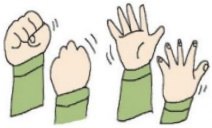

## 認識骨折治療與照護

## 一、 何謂骨折

骨折是指身體骨頭因為直接或間接的外力造成碎裂或變形，骨頭的組織受到損壞，且有時可能會傷及周圍的肌肉、軟組織和神經。

## 二、 骨折分類

1. 簡單性骨折/閉鎖性骨折：骨折處僅為裂痕，皮膚沒有損傷。

2. 粉碎性骨折/完全性骨折：骨折處完全斷裂成兩端或破裂成多塊、碎片狀。

3. 複雜性骨折/開放性骨折：骨折處附近皮膚和黏膜損傷，斷骨接觸到皮膚或者環境。

## 三、 發生骨折時可見之症狀：

疼痛，嚴重時會併發內出血、腫脹、和周圍大神經、動靜脈的壓迫及損傷。

## 四、 治療方法：

1. 簡單骨折依照骨折處位移不大或位於較不容易受到外力影響的位置，可考慮保守治療，利用護木或石膏固定。

2. 複雜性/完全性/開放性骨折則必須進行手術復位及固定，其手術方法分為：

(1)內固定：以手術的方式，包括骨釘、鋼板釘合在骨折處。

(2) 外固定：從體外固定骨折處。

伍、骨折病人手術前後注意事項：

### 1. 手衔前準備：

(1) 完成胸部 X 光、受傷肢體的 X 光、心電圖及血液檢查。

(2)醫師解釋病情後填妥手術同意書、麻醉同意書、視需要自費醫材同意書。

(3)手術前8小時(午夜12時)開始禁食、禁水。

(4)若有服用抗血栓藥物(如抗凝血劑或抗血小板製劑)或血糖用藥(如SGLT2抑制劑)，請依醫師指示服藥或停藥，並主動告知醫護人員。

(5)下肢骨折在手術後通常受傷的肢體不能完全負重，請準備助行器及枳杖。

2. 手術後照護需知：

(1)傷口處若有引流管，則必須放置於手術部位同一側並避免牽扯或拉到，以保持通畅並避免滑脫。

(2)手術後傷口疼痛，醫師會開立口服止痛藥給您定時服用；若服用止痛劑超過1小時疼痛仍未改善時，請告知護理師評估您的狀況，必要時依醫囑給予其他止痛劑。

(3)以棉被、枕頭或抬高枕，將手術肢體抬高超過心臟，減輕腫脹不適。

(4)手術後開始每2小時翻身一次，第一天開始每天要搖高床頭至少3次，多執行深呼吸活動，以維持呼吸道通畅。

(5)手術後為了減輕傷口疼痛及減少肢體腫脹不適，可依醫囑給予局部冰敷，每次15~20分鐘，一日四次為原則。

(6)上肢骨折手術後，可以使用三角巾固定支

拖患肢增加舒适度。

(7)原則上術後傷口每日換藥一次，請您保持傷口敷料清潔乾燥，若不慎弄溼敷料，或滲血多時請告知護理人員通知醫師為您更換敷料。

(8) 骨外固定鋼釘之清潔，保持鋼釘處清潔、乾燥，每天早晚固定時間各消毒一次，若有滲出液或發紅情形則可增加消毒次數。

(9)每天攝取足夠的熱量，飲食方面應多增加蛋白質攝取，如魚、肉、蛋、奶類，補充鈣質（小魚乾、葡萄乾、芝麻、紫菜等）及維生素D（曬太陽），以補足流失的營養及促進骨頭及傷口的癒合。

(10)建議您減少使用刺激性物質，如咖啡、濃茶、抽煙、喝酒等，因刺激性物質會延長骨折癒合時間。

(11)骨折後，受傷肢體負重的程度須遵循醫師評估後的指示。

(12)患肢可執行肌肉收縮運動，促進血液循環，(手指握拳放鬆運動)如圖一，(足背下壓及屈曲運動)如圖二，依體能狀況每小時進行約十次的肌肉收縮運動，但不宜劇烈運動。

圖一 手指握拳放鬆運動

圖二 足背下壓及屈曲運動

## 伍、 参考资料：

袁素娟（2020）·肌肉骨骼系统疾病之護理·於劉雪娥總校閱，成人內外科護理下冊（八版，589-590頁）·華杏。

鄧崇勵、李素貞、袁光霞、吳依蘋（2021）·肌肉骨骼系統病人的護理·於林貴滿等作，內外科護理技術（九版，465-467頁）·華杏。

義大醫院

地址：高雄市燕巢區角宿里義大路1號

電話：07-6150011

義大癌治療醫院

地址：高雄市燕巢區角宿里義大路21號

電話：07-6150022

義大大昌醫院

地址：高雄市三民區大昌一路305號

電話：07-5599123

## 認識骨折治療 與照護

