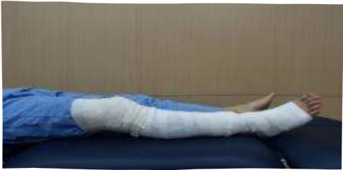
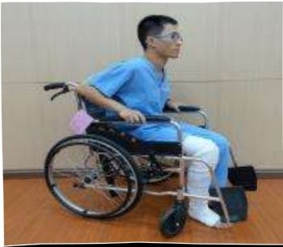
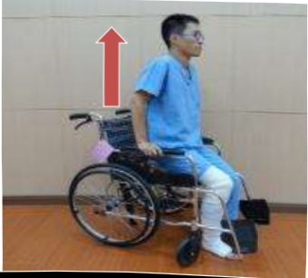

|  |  |  |
|---|---|---|
| **關節彎曲活動角度訓練目的:增加患側關節循環及維持關節角度圖片繃帶纏綁肢體為手術患肢示意圖** |  |  |
| **平躺姿勢:盡可能將大腿/膝蓋彎曲,再慢慢伸直** |  |  |
|  |  |  |
| **平躺姿勢使用毛巾協助:盡可能將大腿/膝蓋彎曲,再慢慢伸直** |  |  |
|  |  |  |
| **坐姿:盡可能將大腿/膝蓋彎曲,再慢慢將腳放回地面** |  |  |
|  |  |  |
| **強化上臂肌力訓練目的:增加雙側上肢肌力,幫助手術後轉位及使用助行器能力使用有扶手的固定式椅子,盡可能伸直手肘並抬起身體,再慢慢將身體降下至椅面** |  |  |
|  |  |  |

   (width:27%)

