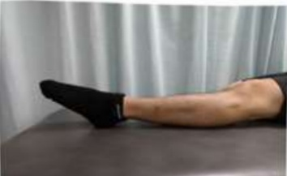
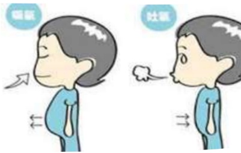

## 陸、手術後復健運動訓練

## 請配合物理治療師所提供的復健訓練

## 一、 衔後當天

1. 冰敷：每天 4 次，每次 15 分鐘。

2. 足背運動：每天 4 次，每次 15 下。請先平躺，將雙腿伸直平放，並把腳掌向上提拉，維持 5 秒後，下壓 5 秒。目標為增加肢體末稍循環，降低患膝水腫。

繃帶纏綁肢體為手術患肢示意圖

3. 夾臀運動：每天 4 次，每次 15 下。在平躺姿勢下進行，目標在維持患側肌力，為下床前做準備。

4. 呼吸運動：每天 4 次，每次 15 下。目標在協助排除麻醉藥物及強化呼吸。

5. 視情況給予協助或輪椅轉位如第 34 頁

