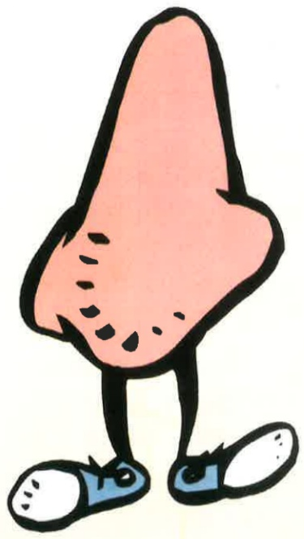

（四）鼻胃管照護注意事項

★每日更換固定鼻胃管的紙膠並重新固定，需每次更換固定的位置，避免皮膚破皮或壓傷。

★ 每日執行口腔護理及用棉籤清理鼻腔。

★ 灌食後一小時內避免激烈活動如抽痰、拍痰、翻身、復健、化痰等。

四、參考文獻

蘇麗智等（2017）·鼻胃管灌食法，

實用基本護理學（下冊）·

（七版，108-115頁）·華杏。

義大醫院

地址：高雄市燕巢區角宿里義大路1號

電話：07-6150011

義大癌治療醫院

地址：高雄市燕巢區角宿里義大路21號

電話：07-6150022 義大大昌醫院

地址：高雄市三民區大昌一路305號

電話：07-5599123

本著作權非經著作權人同意不得轉載翻印或轉售

著作權人：義大醫療財團法人

20X20cm 2025.07印製 2024.07修訂 HA-1-0131(3)

## 鼻胃管灌注注意事项

義大醫療財團法人

E-DA HEALTHCARE GROUP## 鼻胃管灌食注意事项

## 一、 定義：經由鼻胃管提供病人營養或治療藥物。

二、適用對象：當病人無法由口進食，但具有完整或部分的腸胃道功能者。

## 三、 照護方式及注意事項

## （一） 灌食前注意事项

★ 灌食前必須抬高床頭30-60度，防止食物逆流，灌食後維持高坐臥或坐姿至少30分鐘。

★ 檢查鼻胃管位置，若有以下情形暫停灌食。如：固定的膠布脫落、病人口中有鼻胃管脫出或繞纏在嘴巴。

★ 使用灌食空針反抽是否有反抽物，確定胃管是否在胃內。

★評估胃消化情形，觀察胃內容物顏色與量，若反抽超過100 C.C.則暫不灌食，但反抽物可再灌回胃內，不用丟棄。

★ 反抽物呈墨綠色、暗紅色、白色或咖啡色，告知醫護人員，暫停灌食。

## （二） 灌食注意事项

★ 將空針連接鼻胃管，利用重力原理，將食物倒入灌食針筒後，將針筒拿高與鼻尖距離15~20公分或液面與胃部距離30~45公分，使流質食物緩慢留下。

★ 若灌食太濃稠可加入少許溫開水稀釋，以利灌食。

★ 若感覺不易灌入，可能原因有：胃管出口被食物塞住或管口碰到胃壁，如發生以上情形通知醫護人員。

★ 灌食過程有咳嗽、呼吸困难，須立即停止灌食，並通知醫護人員或立即就醫。

## （三） 灌食後注意事項

★ 灌入溫開水30C.C.沖淨鼻胃管，避免胃管阻塞或食物在管中發臭。

★鼻胃管開口處用胃管反摺塞入或栓子塞住，避免空氣進入胃內。

★ 灌時空針以冷水清洗，防止空針遇熱變形及管子汙染，造成病人腹瀉。