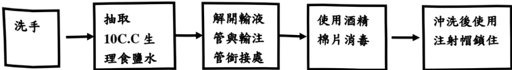

【八、居家靜脈營養注射結束處理步驟】

(1)注意環境清潔。

(2)將桌面擦乾淨，再用酒精擦拭桌面。

(3)準備用物(10c.c空針、20c.c生理食鹽水、酒精棉片)

(4) 使用肥皂洗手或使用乾洗手液。

(5) 關掉管夾。

(6)將導管反摺。

(7)轉開導管和輸注管的銜接處。

(8)使用酒精棉片消毒導管接處，連接已抽好的生理食鹽水。

(9)打入 10C.C 生理食鹽水。

(10)接上注射帽固定好。

(11)醫療廢棄物必須帶回醫院處理，不可丟棄在家中之垃圾桶；如注

射針筒、針頭、空針、點滴連接管、點滴軟袋、玻璃安瓶。

(13)針筒等銳利的醫療廢棄物要裝在罐子或瓶子。

(14) 點滴連接管、點滴軟袋要裝在不滲水的袋子裡回醫院處理。