片影衛術手

全膝關節置換

# 注意事项

## 認識膝關節置换術照護## 目錄

壹、我的基本資料 …… 1  
貳、我的照護團隊 …… 2  
參、認識膝關節置换術 …… 3  
一、簡介 …… 3  
二、我該接受人工膝關節置換手術嗎？…… 3  
三、何謂全膝關節置換術 …… 4  
四、適應症 …… 4  
肆、住院流程介紹 …… 5  
伍、手術前準備 …… 6  
一、用物準備 …… 6  
二、手術前該停止抗血栓用藥嗎？…… 7  
三、手術須知 …… 8  
四、術前復健運動準備 …… 9  
陸、手術後照護須知 …… 12  
一、手術後肢體擺位及照顧注意事項 …… 12  
二、管路放置注意事項 …… 13  
三、飲食指導 …… 15四、手術後藥物.....19  
柒、疼痛照護.....21  
一、疼痛的影響.....21  
二、術後常用止痛方式.....22  
三、除藥物治療外可以減輕疼痛的方法.....23  
四、關於疼痛常見疑問.....23  
捌、手術後復健運動訓練.....25  
一、術後當天.....25  
二、術後第一天.....26  
三、術後第二天.....27  
四、術後第三天.....28  
五、術後第四天.....29  
六、術後第五天.....30  
七、術後第六天以上(含第六天).....31  
八、助行器使用方法.....32  
九、步行活動.....33  
十、輪椅轉位.....33  
玖、預防跌倒.....34壹拾、術後保養及注意事項 …… 35  
  
一、如何預防深層靜脈血栓 …… 36  
  
二、返家後傷口護理 …… 37  
  
三、返家照護注意事項 …… 38  
  
壹拾壹、居家復健計畫 …… 40  
  
一、拉筋運動篇 …… 40  
  
二、肌力運動篇 …… 41  
  
壹拾貳、參考資料 …… 42## 壹、 我的基本資料

姓名：___  
性别：☐男 ☐女  
年齡：___  
疾病史：□無 □心臟病 □糖尿病 □高血壓 □痛風  
☐中風 ☐其他___  
藥物過敏史：☐無 ☐有 ___  
手術部位：☐右膝 ☐左膝  

本次重要藥物記錄：  
☐阿斯匹靈 用藥時間： 年 月 日 至 年 月 日  
☐抗凝血劑(通血路藥物):藥名___  
用藥時間：___ 年 ___ 月 ___ 日 至 ___ 年 ___ 月 ___ 日  

手術前後追蹤結果：  

|              |          | 日期       | 弯曲角度 | 伸直角度 | 疼痛指數 |
|--------------|----------|------------|----------|----------|----------|
|              |          |            |          |          |          |
| 手術前       |          |            |          |          |          |
| 出院前       |          |            |          |          |          |
| 手術後3個月內 | 第一次回診 |            |          |          |          |
|              | 第二次回診 |            |          |          |          |
|              | 第三次回診 |            |          |          |          |## 貳、我的照護團隊

| 職稱           | 上班諮詢時間                     | 咨詢電話                         | 非上班諮詢時間     | 咨詢電話                             |
|----------------|----------------------------------|----------------------------------|--------------------|--------------------------------------|
| 個管師         | W1~6 08:00~16:00                | 07-6150011 轉 5574              | 24hr 皆可諮詢      | 07-6150011 轉 257099 值班護理長     |
| 物理治療師     | W1-5 08:00~17:00               | 07-6150011 轉 257061           | 24hr 皆可諮詢      | 07-6150011 轉 3711、3712、3721、3722 病房護理師 |
| 社工師         | W1~5 08:00~17:30               | 07-6150011 轉 1332、1339       | 24hr 皆可諮詢      | 07-6150011 轉 257084               |
| 藥師           | W1-5 08:00~17:00               | 07-6150011 轉 257310           | 24hr 皆可諮詢      | 07-6150011 轉 2130 急診藥局        |
| 營養師         | W1~5 08:00~17:00               | 07-6150011 轉 257504           | 24hr 皆可諮詢      | 07-6150011 轉 257504               |
| 臨床心理師     | W1~5 08:00~17:00               | 07-6150011 轉 8585             | 24hr 皆可諮詢      | 07-6150011 轉 2666                 |
| 護理師         | 7A 病房(三班輪值) 7B 病房(三班輪值) | 07-6150011 轉 3711、3712、3721、3722 | 24hr 皆可諮詢      | 07-6150011 轉 3711、3712、3721、3722 |

## 參、認識膝關節置換術

## 一、 簡介

膝關節退化時，會產生疼痛、腫脹、變形、患肢無力，嚴重者會造成行走不便。初期門診追蹤，先以藥物治療及患肢復健，若藥物及復健治療均無法緩解疼痛或變形，造成行走不便，即須進行全膝關節置換術。

正常的膝關節

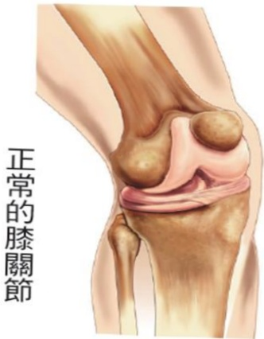

## 退化的膝關節

## 二、 我該接受人工膝關節置換手術嗎？

✓適度運動

✓物理治療

✓口服止痛劑

✓保持理想體重

✓輔具使用

✓脛骨截骨矯正

手術

✓人工關節置換術

治療退化性關節炎-醫病共享

決策影片

✓注射玻尿酸

✓注射PRP-高濃度血小板血漿

## 三、 何謂全膝關節置換術

因膝關節受損或有病變而進行置換脛骨、股骨人工關節的植入過程。人工膝關節由金屬及高密度塑膠材質，依照人體膝關節構造、形狀、功能製作而成，醫師將已磨損軟骨切除，置換脛骨、股骨人工關節的植入來取代。

## 四、 適應症

1. 退化性關節炎

2. 類風濕性疾病

3. 外傷性關節炎

4. 痛风性關節炎

5. 骨壞死

6. 感染性關節炎

## 肆、 住院流程介绍

## 伍、 手術前準備

## 一、 用物準備

## (1) 助行器

術後 1–2 天起，醫護人員將教導病人如何使用輔具下床活動

(2)冰敷袋 手術後冰敷傷口使用，可預防患肢腫脹及減輕疼痛

## (3) 自備藥物

請將平時常規服用藥物，於住院當天連同藥物及藥袋攜帶至醫院交給護理人員，以便醫護人員了解用藥情況。（若有服用抗凝血劑或抗血小板或通血路藥物，請依醫師指示服用，並告知醫護人員）

(4)醫療一級包趾彈性小腿襪 手術後穿著，可預防下肢深層靜

脈桎塞

(5)相關同意書簽立

✓ 手術同意書

✓ 麻醉同意書

✓ 麻醉術前評估表

✓ 自費同意書

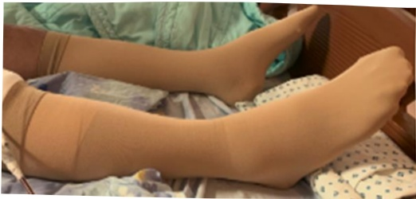
## 二、 手術前該停抗血栓用藥?

人工關節手術前有哪些抗凝血藥物需要暫停使用?需要暫停多久?

關節退化的年長者不乏已有心血管疾病，正在服用

[通血路]藥物的患者，這些藥物對於心血管有保護的作用，可以避免心臟病、中風等悲劇發生。停藥與否的考量在於取得好處與風險之間的平衡。

「在接受任何手術前，請告知您的醫師正在服用本藥」

請主動找您的醫師討論，切勿自行決定藥品服用方式。

## 抗血栓藥物(通血路)

## 抗血小板藥

• 阿斯匹靈

· 利血達

• 保栓通/健克栓

· 普達/健立達

· 腦康平

抗凝血藥

• 可邁丁/歐服寧

- 新型抗凝劑(普栓達、拜瑞妥、艾必克寧、里先安)## 三、 手術須知

1. 入院当天完成抽血检查、胸部 X 光、心電圖及麻醉前評估等檢查。

2. 為了避免手術時，嘔吐造成吸入性肺炎，故手術前須禁食8小時。醫護人員於晚間9點後告知禁食時間。禁食項目包含:食物、水及任何需要咀嚼物品，如:口香糖、檳榔、

3. 手術前一日或當日，請病人執行患肢及身體沐浴。

4. 手術前，由醫師執行手術部位標示，醫護人員送開刀房前會將手術部位做局部清潔，並包上治療巾。

5. 手術時間約 4~6 小時，視個人麻醉方式及麻醉甦醒時間而有所不同。若是採用全身麻醉者，麻醉過程中因會喉嚨放置呼吸管協助呼吸，故可能會造成喉嚨疼痛不舒服或有咳出微量血絲情形，可少量多次喝溫開水來改善；但若有持續咳出鮮血情形時，應立即告知醫護人員協助處理。

6. 整個手術過程中及術後返回病室時，均需有至少一位家屬陪同。## 四、 術前復健運動準備

運動時機：手術前

運動目標：維持關節彎曲角度/增加肌肉力量，幫助手術後順利康復

運動頻率：每個動作維持 5 秒，每回合重複 15 次，一天 4 回合。

訓練目的：增加患側肌肉力量，且建議雙邊皆執行圖片繃帶纏綁肢體為手術患肢示意圖

平躺姿势: 将脚向上抬起

坐姿: 将小腿向上伸直

站姿：将脚向上抬高|  |  |  |
|---|---|---|
| **關節彎曲活動角度訓練目的:增加患側關節循環及維持關節角度圖片繃帶纏綁肢體為手術患肢示意圖** |  |  |
| **平躺姿勢:盡可能將大腿/膝蓋彎曲,再慢慢伸直** |  |  |
|  |  |  |
| **平躺姿勢使用毛巾協助:盡可能將大腿/膝蓋彎曲,再慢慢伸直** |  |  |
|  | 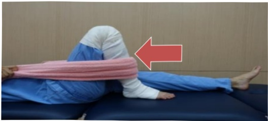 |  |
| **坐姿:盡可能將大腿/膝蓋彎曲,再慢慢將腳放回地面** |  |  |
|  |  |  |
| **強化上臂肌力訓練目的:增加雙側上肢肌力,幫助手術後轉位及使用助行器能力使用有扶手的固定式椅子,盡可能伸直手肘並抬起身體,再慢慢將身體降下至椅面** |  |  |
| 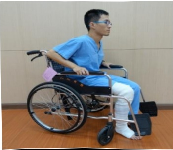 |  |  |

  

强化心肺耐力

訓練目的：增加手術前心肺耐力

圖片繃帶纏綁肢體為手術患肢示意圖

## ★固定式腳踏車10分鐘

物理治療師貼心提醒您，小心安全，預防跌倒

義大醫療財團法人 復健科物理治療團隊 製作## 陸、手術後照護須知

## 一、 手術後肢體擺位及照顧注意事項

1. 術後為了預防患肢腫脹，造成疼痛

及末梢循環障礙，故護理人員將協

助病人以抬高枕或棉被抬高患肢及

冰敷使用。

2. 患肢膝下勿使用支托物或墊枕頭，以免膝蓋攣縮，導致

往後無法將腿伸直。

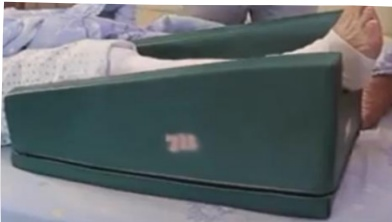

3. 冰敷患肢膝盖应经常更换冰敷位置，避免冰敷膝窝及同时冰敷侧膝盖，造成血液循环障碍，且夜间入睡后应停止冰敷。

4. 術後因防止病人發燒及肺部擴張不全，要經常深呼吸咳嗽。醫護人員將會協助教導每2小時翻身拍背（避開腰部及脊椎），請病人加強水分攝取，一天2000~3000cc（但有限水病人除外）。

5. 可搖高床頭約 30 度~45 度以方便進食及預防嘔吐造成

嗆傷。

深呼吸嗽及翻

身拍背技巧## 二、 管路放置注意事项

## (一) 留置導尿管

1. 基於手術後活動安全，故手術後會留置導尿管

2. 醫護人員會評估拔除留置導尿管的時機。

3. 留置導尿管會固定在大腿內側(女生)或下腹部(男生)。

4. 尿袋要放在低於膀胱的地方，高於膀胱易導致尿液逆流而感染。尿袋底部要離地至少3公分以上，免接觸地面。

## 離地面至少3公分

5. 若是出現有尿量持續減少或膀胱脹痛情形，請確認管路是否有反摺，並請醫護人員協助處理。## (二) 引流管

1. 術後於患肢手術處會放一條引流管引流血水預防血腫。

2. 引流管放置期间，除了要预防管路

滑脫外，在 Y 型接管處更須時常擠壓。冰敷時也應避免

冰敷引流管，防止血塊形成阻

3. 應多翻身或下床活動，以利血水引流。引流管若迅速膨起，可能血水量過多或管路漏氣，請立即告知醫護人員前往評估。

4. 引流管因採負壓抽吸，故置放於床上即可，不須垂吊於床邊。但應避免反摺，下床活動時可固定於衣服避免管路拉扯造成滑脫。

5. 引流管拔除時間，視個人引流量不同而有所變動。若需拔除，會由醫師協同專科護理師協助拔除。## 三、 飲食指導

1. 術後返回病室後，若無頭暈或嘔吐情形，則採漸進式飲食：先試喝少量開水，若無嘔吐情形，1小時候就可飲用流質食物（如：果汁），進而再食用軟質及好消化食物（如：稀飯），而待隔天後即可正常飲食。漸進式飲食可預防因麻醉引起腸蠕動緩慢所造成消化不良。

2. 多食用維他命C的水果，如：奇異果、櫻桃、葡萄等，及高蛋白質食物，如：雞、鴨、魚、牛肉等，促進傷口癒合，並多食用高纖食物，如：綠色青菜來預防便秘。

3. 切記進食應採半坐臥或坐姿，因躺臥進食易導致嗆傷引起吸入性肺炎。

術後飲食指導

營養治療科提供術後飲食參考食譜## 術後飲食參考食譜

## 1500 卡

熱量 350卡

| 超商 | 鹽蔥燒肉御飯糰+義美豆奶 |
|------|------------------------|
| 鹽蔥燒肉御飯糰 | 飯37g（約1/4碗飯）燒肉10g |
| 豐美豆奶 | 260ml（約7分滿）（含糖15g） |

| 自助餐 | 醬燒滷排骨便當 |
|--------|----------------|
| 白飯 | 150g (3/4碗) |
| 滷排骨 | 65g (2/3掌心) |
| 紅蘿蔔炒蛋 | 60g (蛋半颗/紅蘿蔔約1/4碗) |
| 清炒大黄瓜 | 58g (大黄瓜約1/4碗) |
| 蒜炒小黄瓜 | 55g (小黄瓜約1/4碗) |
|        | 芭樂 160g (1/3颗) |

| 套餐 | 水饺套餐 |
|------|---------|
| 水餃皮 | 60g (3/4碗) |
| 酸醃小黄瓜 | 蔬菜105g (一碗) |
| 凉拌胡藿葡絲 | 干絲凉拌海带 |
| 紫菜湯 |         |
| 水餃餡 | 猪肉餡70g (一個掌心) |
| 蘋果1份 | 3/4碗 (8分滿量) |

義大醫療財團法人 營養治療科團隊 製作## 術後飲食參考食譜

熱量 530卡

蛋白質 24克

## 1600 卡

| 早餐店 | 傳統粉漿蛋餅+鮮奶 |
|--------|------------------|
| 粉漿蛋餅 | 錢皮150g (3/4碗) |
| 低脂鮮奶 | 蛋1顆 |
|        | 鮮奶280ml |

| 套餐 |  |
|------|---|
| 白飯 |  |
| 酸醃小黃瓜 |  |
| 涼拌胡蘿蔔絲 |  |
| 干絲涼拌海帶 |  |
| 紫菜湯 |  |
| 燒肉 |  |
| 蛋 |  |
| 蘋果1份 |  |

| 台式燒肉飯套餐 |  |
|----------------|---|
| 150g (3/4碗) |  |
| 蔬菜共105g (一碗) |  |
| 45g (1/3~2/3個掌心) |  |
| 油蛋一顆 |  |
| 120g (3/4碗或8分滿量) |  |

熱豐 540卡

蛋白質 23.5克

| 套餐 | 半筋半肉牛肉麵+豆腐 |
|------|---------------------|
| 麵條 | 340g(扣吸水率)3份(3/4碗) |
| 牛肉 | 60g(2/3個掌心) |
| 小白菜 | 24g(1/4碗) |
| 涼拌豆腐 | 90g(約1/3盒裝嫩豆腐) |
|  | 奇異果120g(1顆半) |

黄大髮院 髮養治療科 版權所有

義大醫療財團法人 營養治療科團隊 製作# 術後飲食參考食譜

1800卡

| 早餐店 | 起司蛋吐司+義美豆奶 |
|--------|---------------------|
| 語美豆奶 | 260ml 約7分滿 (含糖 15g) |
| 兩片土司 | 100g (一碗飯) |
| 美生菜 | 10g |
| 起司1片 | 全脂起司一片 |
| 煎荷包蛋 | 蛋一顆 |

| 便當店 | 正宗便當 |
|--------|----------|
| 白飯 | 200g（一碗） |
| 豬肉片 | 50g（約1/3~2/3個掌心） |
| 五香豆干 | 42g（約1/3掌心） |
| 滷蛋 | 60g（蛋一顆） |
| 清炒高麗菜 | 80g（約3/4碗） |
| 蒜炒小白菜 | 75g（約3/4碗） |
|  | 橘子150g（1顆） |

義大醫療財團法人 營養治療科團隊 製作## 四、 手術後藥物

## (一) 预防性抗生素

1. 外科手術預防性抗生素是指病人接受手術前，傷口未被污染或感染前就先給予抗生素，以避免術後發生感染。

2. 可能發生的副作用如過敏或腸胃不適，若出現皮膚紅疹、搔癢、腹瀉的等症狀，請立即告知醫療團隊。

## (二) 抗血栓藥物

1. 為了避免深層靜脈血栓的發生，在手術後醫師會評估病人的狀況決定是否給予抗血栓藥物(如抗血小板藥物、抗凝血劑等)。

2. 如果您有胃肠道出血、消化性溃疡等病史，请先告知醫療團隊。

3. 服藥期間，如果要接受外科手術、拔牙、內視鏡檢查或其他可能造成出血的處置及檢查時，請提早告知醫師有在服用這類藥品。

4. 服用抗血栓藥物期間，日常活動時請小心避免受傷。刷牙或刮鬍子時應使用軟毛牙刷及電動刮鬍刀。5. 可能發生的副作用如胃腸不適或出血反應(例如手術部位血腫、牙齦出血、瘀傷、血尿或黑便)。如有出血現象，請立即回診告知醫療團隊。

6. 若您在接受膝關節置換術前已經接受抗血栓藥物治療，經與原處方醫師討論後已於手術前停藥。手術後請與您的手術醫師討論重新使用抗血栓藥物的時間。## 柒、 疼痛照護

## 一、 疼痛的影響

疼痛是個人主觀痛苦的感覺，可能是持續性的或一陣陣的，也可能是鈍痛、刺痛或尖銳痛，在生理上病人會有焦慮、失眠、降低食慾、心跳加快、血壓上升及內分泌失調。更可能因疼痛減緩呼吸（上腹部及胸部手術疼痛會隨呼吸而加劇）、不願意下床活動引發肺擴張不全、靜脈血栓等合併症，導致延後出院。

只有您自己才能描述疼痛，勇敢地告诉醫師、護理師您的疼痛困擾。只要透过正确的表达及评估方法，90%的疼痛都可以获得有效的缓解。

## 您可以這麼做：

1. 您可以說出那個地方疼痛，也可以用手指出疼痛的部位。

2. 告知醫護人員第一次痛是什麼時候、多久痛一次、每次疼痛持續多久。

3. 明確說出疼痛的感覺，例如：鈍痛、刺痛或尖銳痛？

4. 告知疼痛是否已影響平常的生活作息，例如：無法入眠等。

5. 正確地表達您的疼痛分數。建

議您可利用「疼痛評估量表」

來表達疼痛情況：0分不痛、10分爲不可忍受之疼痛。

## 二、 衔後常用止痛方式

## 拒絕術後疼痛，請勇於說痛

## 術後常用止痛方式有以下幾種

口服藥：針對較輕度疼痛，按醫師指示服藥，即使目前未有疼痛感仍須服用，才能有較好的疼痛控制

## 肌肉或靜脈注射(非類固醇或嗎啡類止痛藥)：

每個人對於疼痛耐受性及吸收效果不同、時間上有限制、需依醫師指示固定時間給予，或突發性疼痛需要止痛時使用。

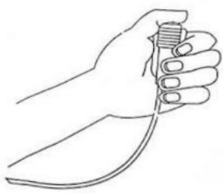

多模式止痛：由麻醉科醫師評估並選擇給藥方式與途徑，利用機器或靜脈、局部給藥，設定安全劑量及鎖定時間，提供給病人自己選擇。## 三、 除藥物治療外可以減輕疼痛的方法

1. 藉由一些活動來分散對疼痛的注意力，如聽音樂、打牌、打麻將、散步。

2. 放鬆心情、保持愉悅心情，如：可藉由家人或朋友的陪伴，給予心理支持，有助於您減輕對疼痛的感覺。

3. 將肢體擺放為您平時感覺最舒服的姿勢。

4. 藉由宗教信仰，如：念佛、祷告，來分散對疼痛的注意。

5. 可詢間您的主治醫師是否可藉由冰敷或熱敷減緩疼痛情況。

6. 當疼痛無法忍受時，您還是可以告知醫護人員，調整止痛藥物。

## 四、 關於疼痛常見疑問：

1. 使用止痛藥不會影響傷口癒合，反而可因疼痛緩解促進下床，幫助傷口癒合。

2. 止痛藥的副作用：過敏皮膚癢、頭暈、噁心、嘔吐等，都可透過調整劑量改善。

3. 使用自控式止痛：治療目的是用最少劑量的藥，達到病人臥床休息時不覺得疼痛，但在劇烈咳嗽或走動時，仍可能有疼痛感覺，但疼痛程度會減輕許多。

4. 自控式止痛使用時間：手術 2-3 日後，疼痛會隨著時間而慢慢減輕，可改用口服止痛藥，停止使用自控式止痛。

5. 自控式止痛與傳統止痛不同點：

(1)自控式止痛是由機器固定持續給藥，若感覺特別疼痛時可自己按鈕給藥減輕疼痛。

(2)傳統止痛是忍受不了才給藥，給藥後 30 分鐘開始作用，藥效可維持 4–6 小時。

6. 使用自控式止痛，麻醉科醫師會依據病人各項條件來設定藥量及時間，使用期間也會隨時注意病人情形調整劑量，故不會上癮或造成藥物過量。

7. 麻醉科醫師會評估病人狀況，若有意識不清、血壓過低、低血容性或敗血性休克，則無法使用自控式止痛。

8. 健保給付傳統止痛方式，自控式止痛需自費。## 捌、 手術後復健運動訓練

## 請配合物理治療師所提供的復健訓練

## 一、 術後當天

1. 冰敷：每天 4 次，每次 15 分鐘。

2. 足背運動：每天 4 次，每次 15 下。請先平躺，將雙腿伸直平放，並把腳掌向上提拉，維持 5 秒後，下壓 5 秒。目標為增加肢體末稍循環，降低患膝水腫。

繃帶纏綁肢體為手術患肢示意圖

3. 夾臀運動：每天 4 次，每次 15 下。在平躺姿勢下進行，目標在維持患側肌力，為下床前做準備。

4. 呼吸運動：每天 4 次，每次 15 下。目標在協助排除麻醉藥物及強化呼吸。

5. 視情況給予協助或輪椅轉位如第 34 頁

## 二、 衔後第一天

1. 被動性患膝關節角度運動：每天 2 次，每次 30 分鐘。執行

角度 50 度。

2. 冰敷：每天 4 次，每次 15 分鐘。

3. 坐床沿，每天4次，每次5分鐘。

4. 足背運動：每天 4 次，每次 15 下。

繃帶纏綁肢體為手術患肢示意圖

5. 股四頭肌及腦旁肌運動：每天 4 次，每次 15 下。患肢需平放且伸直，在膝窩處放一卷毛巾，使膝及足部上抬，用力做下壓動作，維持 5 秒後放鬆。目標為肌力訓練。

股四頭肌運動

繃帶纏綁肢體為手術患肢示意圖

膕旁肌運動

6. 視情況給予協助輪椅轉位如第 33 頁## 三、 術後第二天

1. 被動性患膝關節角度運動：每天 2 次，每次 30 分鐘。執行角度 60 度。

2. 冰敷：每天 4 次，每次 15 分鐘。

3. 足背運動：每天 4 次，每次 15 下。

4. 股四頭肌及腦旁肌運動: 每天 4 次, 每次 15 下。

5. 下床活動

（1）站立：每天4次，每次5分鐘。

（2）輔具輔助行走：每天4次，每次5分鐘。助行器使用如第32頁。

繃帶纏綁體為手術患肢示意圖

6. 視情況給予協助輪椅轉位如第 33 頁

## 術後第三天

1. 被動性患膝關節角度運動：每天 2 次，每次 30 分鐘。執行角度 70 度。

2. 冰敷：每天 4 次，每次 15 分鐘。

3. 股四頭肌及腦旁肌運動：每天 4 次，每次 15 下。

繃帶纏綁肢體為手術患肢示意圖

4. 坐於床旁，膝盖伸直至中間角度並維持5秒鐘，膝彎曲時，須慢慢放回。目標為增加患肢肌肉力量。

繃帶纏綁肢體為手術患肢示意圖

5. 直抬腿運動：每天 4 次，每次 15 下。先平躺，伸直患肢，把患肢抬高 30 度並維持 5 秒鐘，再慢慢放下。目標為加

強患肢肌肉力量。

6. 下床活動: 輔具輔助行走: 每天4次，每次5分鐘。助行器使用如第32頁。

繃帶纏綁肢體為手術患肢示意圖## 五、 術後第四天

1. 被動性患膝關節角度運動：每天 2 次，每次 30 分鐘。執行角度 80 度。

2. 冰敷：每天 4 次，每次 15 分鐘。

3. 足背運動：每天 4 次，每次 15 下。

4. 股四頭肌及腦旁肌運動：每天 4 次，每次 15 下。

5. 直抬腿運動：每天 4 次，每次 15 下。

6. 屈膝伸膝牵拉運動：每天 4 次，每次 15 下。在可忍受的疼痛範圍下，在彎曲及伸直末端角度，停留秒 5 秒。目標為增加患膝關節彎曲及伸直角度。

繃帶纏綁肢體為手術患肢示意圖

7. 下床活動: 輔具輔助行走: 每天 4 次, 每次 5 分鐘。助行器使用如第 32 頁。## 六、 衔後第五天

1. 被動性患膝關節角度運動：每天 2 次，每次 30 分鐘。執行角度 90 度。

2. 冰敷：每天 4 次，每次 15 分鐘。

3. 足背運動：每天 4 次，每次 15 下。

4. 股四頭肌及腦旁肌運動：每天 4 次，每次 15 下。

5. 直抬腿運動：每天 4 次，每次 15 下。

6. 屈膝伸膝牵拉運動：每天 4 次，每次 15 下。在可忍受的疼痛範圍下，在彎曲及伸直末端角度，停留秒 5 秒。目標為增加患膝關節彎曲及伸直角度。

繃帶纏綁肢體為手術患肢示意圖

7. 下床活動: 輔具輔助行走: 每天 4 次, 每次 5 分鐘。助行器使用如第 32 頁。## 七、 術後第六天以上(含第六天)

1. 被動性患膝關節角度運動：每天 2 次，每次 30 分鐘。執行角度 100 度。

2. 冰敷：每天 4 次，每次 15 分鐘。

3. 足背運動：每天 4 次，每次 15 下。

4. 股四頭肌及膕旁肌運動：每天 4 次，每次 15 下。

5. 直抬腿運動：每天 4 次，每次 15 下。

6. 屈膝伸膝牵拉運動：每天 4 次，每次 15 下。

7. 下床活動輔具輔助行走：每天 4 次，每次 5 分鐘。

術後復健運動

做完復健運動後，記得幫您

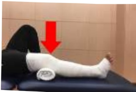

的膝關節

喔！

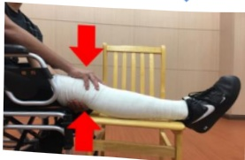
## 八、 助行器使用方法

## 助行器先往前移動↓患肢先跨出去↓好腳再跟進

1. 調整助行器高度，手肘微彎度。

2. 身體重心放在沒手術的腳

注意雙腳與肩同寬，並同步

齊）。

3. 雙手將助行器挪前一步，需意間距勿過大，以預防動作穩，造成跌倒。

4. 手握助行器支撑身體，先踏患肢到紅色區域，使行走重達到最穩狀態。提醒！踏出太步容易跌倒。

5. 没有手術的腳再往前一步，不

越患肢為最安全行走方式

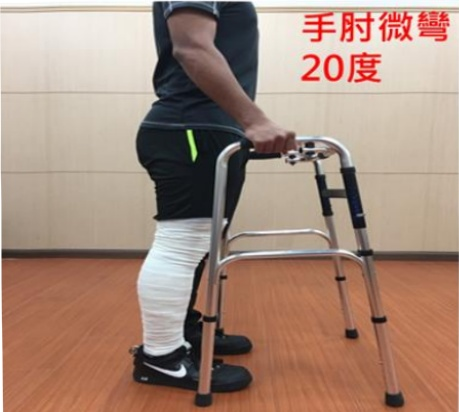

手肘微彎

20度

繃帶纏綁肢體為手術患肢示意圖## 九、 步行活動

1. 術後第一天：請盡量鼓勵病人半坐臥（約70度-90度），以預防下床活動時，發生姿勢性低血壓。可採漸進下床，首先搖高，待10分鐘後無不適情形，再坐於床邊5-10分鐘，若無頭暈不適，在他人協助下，再用助行器站立；站立時無頭暈不適，才可使用助行器於病房內走動。

2. 術後第2天以後: 可以在病室走道以助行器步行, 1 天 4 次, 1 次 5 分鐘。活動後臥床休息時, 需要抬高並冰敷患肢, 以利消腫。

3. 助行器使用至少需維持 6–8 星期，以預防骨頭未癒合前負重過大。

## 十、 輪椅轉位

繃帶纏綁肢體為手術患肢示意圖

## 玖、 预防跌倒

# 跌倒是可以預防的，只要一些小改變，就可以避免陷入跌倒的危機，請注意千萬不可以一個人下床!!!

定期練習肌力、柔軟度和身體平衡

四肢動作不可少

床邊復健運動

時時注意環境的安全

五體投地人不老

床上復健運動

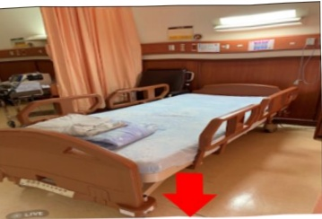

床時，電動床降最低

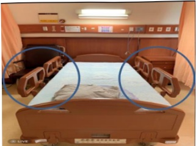

離開時，雙側床欄拉起

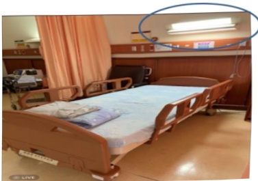

注意室内燈光明亮

選擇合適的鞋子及輔具

六字口訣要知曉

使用輔具方法

注意正在吃的藥物作用及副作用

是否引起造成跌倒的原因

## 壹拾、 術後保養及注意事項

## 一、 如何预防深層靜脈血栓

避免久坐、久站、臥床時避免長期壓迫到下肢，任何姿勢勿保持過久，如站立雙腿交叉，衣服太緊、維持理想體重、攝取適當的水份和低脂飲食、合宜的運動和禁止吸煙。

## 術後穿著醫用彈性襪

穿著彈性襪原則：

1. 衔後至少穿3天

2. 早上下床前穿上，晚上洗澡時脫下

（建議穿 8 小時/天，穿一個月）

3. 請手洗、平放陰乾

（禁脱水烘乾、吊掛曝曬陽光）

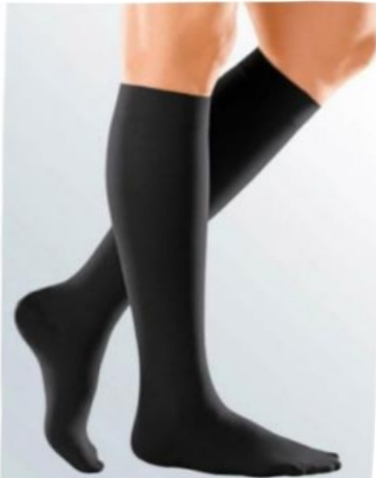
## 二、 返家後傷口護理

1. 接觸傷口前後需洗手。

2. 傷口消毒或清潔須由內向外，不可來回擦拭，消毒範圍約傷口範圍外推5公分，更換傷口時，應盡量避免傷口暴露於空氣中時間過久。

3. 須每天換藥一次(可於擦澡後再執行)。但若紗布有血水滲出、不慎淋濕或紗布掉落，就必須立即更換傷口。

4. 保持傷口及紗布清潔乾燥，避免淋浴弄濕傷口，盡量採擦

5. 换药准备用物：

（1）20ml 生理食鹽水：請單次使用

後丟棄

(2)  $ 4 \times 4 $  紗布

(3) 無菌沖洗棉枝

（4）水溶性優碘：保存期限為開封

後 1 星期。

(5) 3M 紙膠：若對紙膠過敏者，可改選購抗過敏膠帶）

(6) 6 吋彈繃(可清洗後重覆使用)。### 6. 傷口護理步驟：

1. 以洗手液或肥皂洗净笺手。

2. 拆開紗布並觀察傷口

3. 以生理食鹽水棉棒，進行傷口清潔，由傷口中心環形向外轉擦拭，逐漸擴大至直徑大於傷口周圍 5 cm，避免來回擦拭。

面，抓住紗布一角取出，對準傷口的中心，覆蓋傷口後，勿再次移動，膠帶固定。

4. 以水溶性優點棉棒，進行傷口消毒，由傷口中心環形向外轉擦拭，逐漸擴大至直徑大於傷口周圍 5 cm，避免來回擦拭。

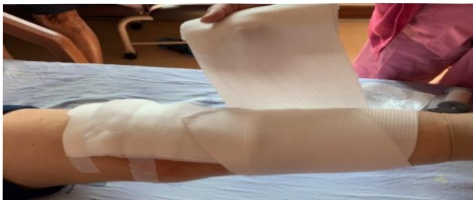

6. 依醫師指示使用彈繃包紮以及搭配彈性襪穿著## 三、 返家照護注意事項

1. 返家後每天繼續執行在醫院教導的復健運動。

2. 傷口儘量保持乾燥，若有紅腫及異常滲液情形，請盡速回診檢查。

3. 避免傷口擦撞及激烈運動(如：跑步、跳躍)，需遵守醫師教導活動限制。

4. 術後 6–8 星期內需使用助行器，直到門診追蹤時醫師認為可以恢復正常活動為止，需要預防跌倒。

5. 當長時間下床活動後，因患肢末稍血液回流速度較慢，腳掌易腫脹情形，故應於下床活動後抬高患肢且冰敷傷口，以利消腫

6. 下列活動須經醫師認可後才可以執行：開車、半蹲、提重物(3 公斤以上)、走遠路、爬山。

7. 過安檢門的時候機器會提示有你攜帶了金屬，可以向安檢員解釋或提供醫院手術證明。

8. 體內、外有金屬品例如：人工關節，禁止深層熱敷(如短波)

會因為熱度過度集中而造成燒傷。

9. 當病人有感冒或其他部位感染或看牙科治療時，請主動告知醫師有置換人工關節，以利醫師評估用藥原則。10. 傷口可碰水時機：醫師告知傷口何時可以碰水後，才可以採淋浴。

11. 若有下列問題應立即返診：

（1）傷口長期仍未痊癒，持續有滲液、異味、流血不止。

(2) 傷口有紅腫、傷口周圍皮膚發熱、傷口嚴重疼痛未改善。

(3) 持續發燒超過38.5度。

(4) 滑倒或撞到膝盖时。## 壹拾壹、 居家復健計畫

## 一、 拉筋運動篇

目標：逐漸增加膝關節角度達 0–120 度

停10–20秒後

放鬆，

重複20下，

每天至少4回

抬高直膝拉筋

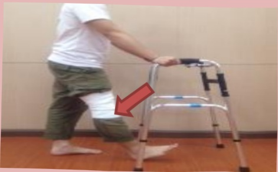
## 二、 肌力運動篇

停10–20秒後放鬆，

重複20下，

每天至少4回

小腿後勾(1)

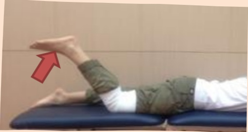

大腿壓浴巾捲

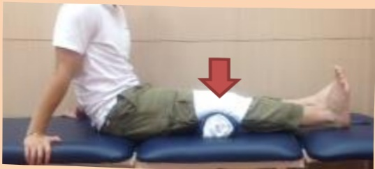

小腿後勾(2)

## 壹拾 貳、參考文獻 Reference

1. American Diabetes Association (ADA) 2015 Guideline.

2. Ayalon O, Liu S, Flics S, et al. A multimodal clinical pathway can reduce length of stay after total knee arthroplasty. HSS J. 2011 Feb;7(1):9-15.

3. American Society of Hematology 2019 guidelines for management of venous thromboembolism.

4. Benedetti MG, Sarti D, Stagni SB, et al. Fast-Track and Rehabilitation Following Primary Knee Arthroplasty: A Literature Review. The Open Rehabilitation Journal. 2015(8):17-24.

5. Chaurasia A, Garson L, Kain ZL, et al. Outcomes of a joint replacement surgical home model clinical pathway. Biomed Res Int. 2014:296-302.

6. Christelis N, Wallace S, Sage CE, et al. An enhanced recovery after surgery program for hip and knee arthroplasty. Med J Aust. 2015 Apr 20;202(7):363-368.

7. Den HA, Gliesche K, Timm J, et al. Pathway-controlled fast-track rehabilitation after total knee arthroplasty: a randomized prospective clinical study evaluating the recovery pattern, drug consumption, and length of stay. Arch Orthop Trauma Surg. 2012 Aug;132(8):1153-1163.

8. Gooch K, Marshall DA, Faris PD, et al. Comparative effectiveness of alternative clinical pathways for primary hip and knee joint replacement patients. Osteoarthritis cartilage. 2012 Oct;20(10):1086-1094.9. Mackeen AD, Packard RE, Ota E, Berghella V, Baxter JK. Timing of intravenous prophylactic antibiotics for preventing postpartum infectious morbidity in women undergoing cesarean delivery. The Cochrane Database of Systematic Reviews, 2014;12 : CD009516.

10. Sandral I. Berrios-Torres; Craig A. Umscheid; Dale W. Bratzler, et al (2017). Centers for Disease Control and Prevention Guideline for the Prevention of Surgical Site Infection, 152(8):784-791.

11. Sandral I. Berrios-Torres; Craig A. Umscheid; Dale W. Bratzler, et al (2017). Centers for Disease Control and Prevention Guideline for the Prevention of Surgical Site Infection, 152(8):784-791.

12. Xu GG, Sathappan SS, Jaipaul J, et al. A review of clinical pathway data of 1,663 total knee arthroplasties in a tertiary institution in Singapore. Ann Acad Med Singapore. 2008 Nov;37(11):924-928.
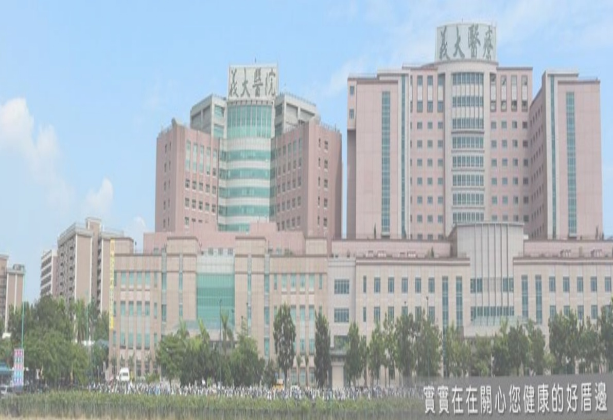

義大醫院

地址：高雄市燕巢區角宿里義大路1號

電話：07-6150011

本著作權非經著作權人同意不得轉載翻印或轉售

著作權人：義大醫療財團法人

義大醫療財團法人 21*29.7cm 2021.11 印製 2021.10 修訂 HA-10160(4)