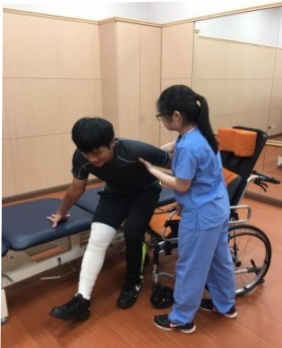

## 九、 步行活動

1. 術後第一天：請盡量鼓勵病人半坐臥（約70度-90度），以預防下床活動時，發生姿勢性低血壓。可採漸進下床，首先搖高，待10分鐘後無不適情形，再坐於床邊5-10分鐘，若無頭暈不適，在他人協助下，再用助行器站立；站立時無頭暈不適，才可使用助行器於病房內走動。

2. 術後第2天以後: 可以在病室走道以助行器步行, 1 天 4 次, 1 次 5 分鐘。活動後臥床休息時, 需要抬高並冰敷患肢, 以利消腫。

3. 助行器使用至少需維持 6–8 星期，以預防骨頭未癒合前負重過大。

## 十、 輪椅轉位

繃帶纏綁肢體為手術患肢示意圖

