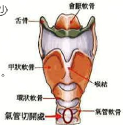

地址：高雄市824燕巢區角宿里義大路1號

電話：07-6150011

網址：edah@edah.org.tw

本著作權非經著作權人同意不得轉載翻印或轉售

著作權人：義大醫院

表單編號：HA-1-0162(2)

義大醫院 20X20cm 2013.11印製 2013.07修訂

## 氣管切開術

## 氣管切開術

## 一、 什麼是氣管切開術？

氣管切開術（氣切）是在頸部氣管處，第一、第二或第三、第四氣管軟骨間切一個小洞，放入氣切套管以維持氣道通順。

## 二、 什麼樣的人需要做氣管切術？什麼時候做最好？

(一)氣管內插管超過14天以上，經醫師評估後認須儘早氣切以利脫離呼吸器。

(二)需要長期使用人工呼吸器者，例如：昏迷...等。

(三)上呼吸道阻塞，例如：腫瘤...等疾病。

(四)無法自行排除痰液並且反覆發生吸入性肺炎的長期臥床病患人。

(五)曾嘗試拔除氣管內插管卻失敗的患者。

(六)少數病人需早期(七日內)接受手術-如上呼吸到阻塞、頭頸部或胸腔外傷、昏迷或四肢之癱瘓需長期臥床病患。

## 三、 為什麼要做氣管切開術？

(一)可降低口腔感染率，同時有助於口腔清潔及減少潰瘍發生。

(二)患者嘴巴可閉合且較為舒適，不會因長期張嘴而造成黏膜乾燥

(三)降低人工氣道的阻力，以利儘早脫離人工呼吸器。

(四)較容易抽吸呼吸道分泌物，以減少肺炎感染率。

(五)氣切套管不易移位脫落，較為安全。

(六)意識清醒且吞嚥能力正常的患者，經由訓練及調適後可由口腔進食。

(七) 使用特殊氣切套管可使病患發聲，促進病患溝通能力。

## 四、 氣管切開術有危險嗎？

## (一) 手術開刀時間約30分鐘左右。

（二）氣管切開術危險性不高，即使糖尿病患者仍可施行，其併發症為：傷口出血、皮下氣腫、氣胸、氣管狹窄、感染、喉頭損傷、疼痛、吞嚥困難…等，大多數的併發症皆可由補救措施改善。

## 五、 氣管切開術就一定可以脫離呼吸器嗎？

氣管切開術後不保證能順利脫離呼吸器，但成功機率大於氣管內管，並且可提升病人的生活品質。

## 六、 氣管切開術後的傷口會一輩子都存在嗎？

經由醫師評估後移除氣切套管，傷口於短時間內（因人而異）多可自行癒合，少部份的人如無法自行癒合，也可經由醫療措施補救。

## 七、 有氣管可以吃東西嗎？

因氣管在前、食道在後，所以可以像正常人一般吃東西，吞嚥時聲帶關閉氣管，食物進入食道是不會影響呼吸。

## 八、 氣切管有沒有機會拿掉？

當氣管切開術的原因(如使用呼吸器、痰多難咳)解決後，有機會可以移除氣切套管，傷口約7-10天可自動癒合。