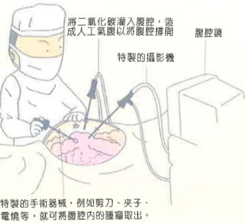

### 5. 活動指導：

術後24小時內採漸進式下床活動，

且家屬務必攪扶全程陪伴。

可使用束腹帶，減少活動時肌肉牽扯。

可將床頭抬高，練習深呼吸，咳嗽，並於床上翻身。

術後6-8週內避免提超過5kg重物，

三個月內不可從事騎馬、騎腳踏車、久坐及劇烈運動，

避免骨盆腔充血

引起不適。

### .月經回復

子宮切除者，不會再

有月經。

部分子宮肌瘤切除、單側卵巢切除

者會再有正常月經。

一般婦科手術後6-8週骨盆內深層組織復原可恢復正常性生活。

返家若出現發燒、腹部劇烈疼痛及異常陰道分泌物情形應立即就醫。地址：高雄市824燕巢區角宿里義大路1號

電話：07-6150011

網址：edah@edah.org.tw

本著作權非經著作權人同意不得轉載翻印或轉售

著作權人：義大醫療財團法人

表單編號：HA-1-0164（1）

義大醫療財團法人20X29.7cm 2015.11印製 2012.06新設

## 婦科腹腔鏡 手術須知

## 婦科腹腔鏡手術須知

## 手術前準備事項：

1. 填寫手術及麻醉同意書，完成麻醉前評估。

2. 執行抽血、X光及心電圖檢查。

3. 手術前需移除身上活動物品：活動假牙、耳環、手環、戒指及飾品，去除指甲油。

4. 手術前一晚12點開始禁食，包括水。手術當日早晨五~六點灌腸及注射點滴。

5.進入手術室時會執行皮膚剃雉。

6. 手術當日穿著免洗內褲，並準備免洗內褲、衛生棉及束腹帶。

特製的手術器械，例如剪刀、夾子、電燒等，就可將腹腔內的腫瘤取出。

## 手術後注意事項：

1. 手術後可注射止痛劑，改善疼痛。

2. 手術中若有執行腸沾黏剝離時，腸子受到刺激會引起絞痛可給予止痛藥物改善。

3. 手術完畢後麻醉及腹腔灌入二氧化碳可能會出現噁心、嘔吐、喉嚨痛、肩膀、後頸疼痛情形。

### 4. 傷口照護

* 腹部預計有1-3個約0.5-1cm傷口，美容膠黏貼，紗布覆蓋，保持乾燥即可。

腹腔镜手術

*術後回診，醫師診視傷口後，才可以淋浴（約7-10天）傷口若出現紅、腫、熱、痛或分泌物，需就醫。

### 5. 飲食指導：

 $ ^{*} $ 依手術狀況決定手術後8小時或排氣後，才可進食。

*少量多餐：先喝水、米湯，無不適，再進食粥兩餐，即可改為乾飯。

*容易腹脹者，避免產氣食物如豆類、地瓜、洋蔥、汽水，需搭配少量進食及多下床活動。

 $ ^{*} $ 禁食煙、酒、濃茶、咖啡、辛辣食物及中藥類食物。

* 雙側卵巢切除者，易有骨質疏鬆症的發生，可多增加鈣質食物攝取。

4. 手術後會有靜脈注射點滴、尿管，並依手術狀況留置腹部引流管；之後視恢復狀況移除管路。

5. 手術後1-2週陰道會有少量紅褐色

分泌物。

