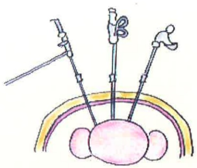

### 5. 活動指導：

術後24小時內採漸進式下床活動，

且家屬務必攪扶全程陪伴。

可使用束腹帶，減少活動時肌肉牽扯。

可將床頭抬高，練習深呼吸，咳嗽，並於床上翻身。

術後6-8週內避免提超過5kg重物，

三個月內不可從事騎馬、騎腳踏車、久坐及劇烈運動，

避免骨盆腔充血

引起不適。

### .月經回復

子宮切除者，不會再

有月經。

部分子宮肌瘤切除、單側卵巢切除

者會再有正常月經。

一般婦科手術後6-8週骨盆內深層組織復原可恢復正常性生活。

返家若出現發燒、腹部劇烈疼痛及異常陰道分泌物情形應立即就醫。地址：高雄市824燕巢區角宿里義大路1號

電話：07-6150011

網址：edah@edah.org.tw

本著作權非經著作權人同意不得轉載翻印或轉售

著作權人：義大醫療財團法人

表單編號：HA-1-0164（1）

義大醫療財團法人20X29.7cm 2015.11印製 2012.06新設

## 婦科腹腔鏡 手術須知

