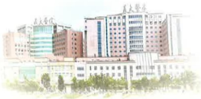

## 圆满平安心

因緣際會我們才能在此相聚，當因緣終了，就是彼此說再會的時刻！也許過去不能好好相處，但希望在最後一刻能好好把握，讓我們彼此均能生死兩相安！

就像日出日落一般，即使有再多的不捨與心痛，終要陪伴彼此走完人生最後一段旅程。我們願意幫助您照顧摯愛的親人，並協助他（她）在人生的終點站時畫下完美的句點。

## 身體照顧

## (1) 意識狀況：

在接近生命終點時部份的人意識清楚，有時閉眼休息、睡眠時間可能增加。部份的人會有譫妄情形，如自言自語、目光無神、對空氣打招呼、和過去的親人對話、提到平常掛念的事件或人、雙手向空中揮動或抓物等。有的人吐氣時會規律呻吟，有的人會坐臥不安、叫喊，或想下床走動。

## 照護準備：

 $ ^{*} $ 須注意安全，預防意外發生，如：跌倒。

*針對有不安傾向的病人可與醫師討論鎮靜劑的使用。

*用心傾聽，了解這些訊息對病人的意義，讓病人有表達內心世界的機會。

*不需認同病人一些不切實際的幻覺，但也不要直接否定他，可溫柔而有耐心的幫助他(她)認出週遭每一個人及熟悉或喜愛的事物。

(2) 疲倦及虚弱：