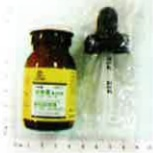
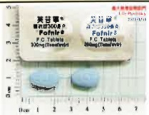
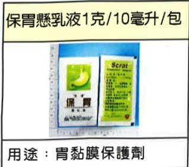

## 2、 預防移植術後感染用藥

| 孟克杏錠 480 毫克  |  | [l] |
| :--- | :--- | :--- |
| 用途：预防肺部感染 |  |  |
| 貝樂克 0.5 毫克 | 欣苷 0.5 毫克 | 芙苷寧 300 毫克 韋立得 2.5 毫克 |
|  |  |  |
| 用途：治療 B 型肝炎或預防 B 型肝炎復發 |  |  |

## 3、 其他

## 七、 術後傷口照護

為保持傷口平整、減少蟹足腫發生之機率，請每3天更換傷口紙膠(或美容膠)且至少貼3~6個月，若傷口有發紅、發癢難耐時，可先移除紙膠（或美容膠），待發紅、發癢症狀緩解再重新黏貼。黏貼方式為與傷口垂直且每片紙膠(或美容膠)需重疊(如下方圖示)。可淋浴，淋浴後將傷口上之紙膠(或美容膠)擦乾即可。

附錄 1

| 高鉀食物 |
| :--- |
| 香蕉、草莓、哈密瓜、柳丁、芭樂、楊桃、蕃茄 |
| 馬鈴薯、大頭菜、茼蒿、胡蘿蔔、油菜、萵苣、菠菜 |
| 紅蒐菜、黃豆芽、草菇、綠色花椰菜、高麗菜芽 |
| 咖啡、堅果類、運動飲料、巧克力、可可、低鈉醬油 |