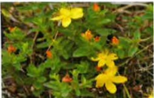
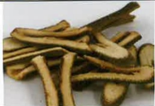

## 附錄 2

## 移植病人應避免使用中草藥、草本植物

### 【一】食物、中草藥與 Cyclosporine 及 Tacrolimus 的交互作用

| 效果 | 物品 |
|------|------|
| 增加藥品的濃度 | 洋甘菊、北美黃連、枳實、枳殼 |
| 降低藥品的濃度 | 黃芩、黃柏 |
| 減少免疫抑制創的作用 | 人參 |
| 保健食品 | 銀杏(抑制凝血功能) |
| 保健食品 | 紅麴(須先與醫師或藥師討論後，方可食用) |

### 【二】與免疫抑制劑具有交互作用的常見中草藥、草本植物

| 中草藥/草本植物 | 图片 |  | 中草藥/草本植物 | 图片 |  |
|------------------|------|---|------------------|------|---|
| 洋甘菊 |  |  | 枳實 |  |  |
| 金絲桃草 |  |  | 黃芩 |  |  |
| 銀杏 |  |  | 甘草 |  |  |
| 枳殼 |  |  | 黃連 |  |  |

### 服藥時間點注意事項

* 空腹狀態服藥(FK506、山喜多/睦體康)  
  吃藥  用餐 或 用餐 2小時 → 吃藥  
* 回診注意事項  
  1. 回診當日早上若抽血，請勿服藥；抽完血後再服用  
  2. 請將藥物隨身攜帶，方便服用  
  3. 當天晚上的藥，請依日常時間點服用  

| 時間 | 注意事項 |
|------|----------|
| 07:00 |  |
| 09:00 | 服抗排斥藥 |
| 10:00 | 服早上飯後藥 |
| 19:00 | 前吃完晚餐 |
| 21:00 | 服抗排斥藥 |
| 22:00 | 服睡前藥 |

  

## 資料來源

☑ 藥品資訊：各藥品仿單、UpToDate資料庫  
衛生福利部食品藥物管理署 中西藥併用咨詢資料庫  
衛生福利部食品藥物管理署 食品藥物消費者枝事服務網-台灣食品成分資料庫 2017年版  

## ☑臨床營養-膳食療養學

◆肝病防治學術基金會專刊  
◆黃慧齡(2015)。肝移植的營養照護。彰化護理，22(1)，12-12。  

☑ Transplantation of the liver. 2005 p.491~503  
◆ EASL Clinical Practice Guidelines: Liver transplantation. Journal of Hepatology 2016;64(2): 433-485.