

義大醫院

地址：高雄市燕巢區角宿里義大路1號

電話：07-6150011

義大癌治療醫院

地址：高雄市燕巢區角宿里義大路21號

電話：07-6150022

義大大昌醫院

地址：高雄市三民區大昌一路305號

電話：07-5599123

本著作權非經著作權人同意不得轉載翻印或轉售

著作權人：義大醫療財團法人

義大醫療財團法人 21X29.7cm 2024.06印製 2024.02修訂 HA-1-0173(2)

# 認識饒關節置換術照護 注意事項

## ~~目錦~~

壹、我的照護團隊.....1  
貳、認識髖關節置換術.....2  
一、簡介.....2  
二、何謂全髖關節置換術.....3  
三、適應症.....3  
參、住院流程介紹.....4  
肆、手術前準備.....5  
一、用物準備.....5  
二、手術前該如何停用抗血栓藥物.....6  
三、手術前須知.....6  
四、術前復健運動準備.....7  
伍、手術後照護須知.....10  
一、手術後肢體擺位及照顧注意事項.....10  
二、管路放置注意事項.....11  
三、飲食指導.....12  
四、手術全期藥物使用.....16| 職稱 | 星期一~星期五諮詢時間 | 診詢電話 | 夜間及假日諮詢電話 |
|------|------------------------|----------|----------------------|
| 個管師 | 08:30~16:30 | 07-6150011轉5574、257451 | 07-6150011轉257099值班護理長 |
| 物理治療師 | 08:00~17:00 | 07-6150011轉257061 | 07-6150011轉3711、3712、3721、3722病房護理師 |
| 社工師 | 08:00~17:30 | 07-6150011轉1332、1339 | 07-6150011轉257084 |
| 藥師 | 08:00~17:00 | 07-6150011轉257310 | 07-6150011轉2130急診藥局 |
| 營養師 | 08:00~17:00 | 07-6150011轉257739 | 07-6150011轉257739 |
| 臨床心理師 | 08:00~17:00 | 07-6150011轉8585 | 07-6150011轉2666 |
| 護理師 | 7A病房(三班輪值)7B病房(三班輪值) | 07-6150011轉3711、3712、3721、3722 | 07-6150011轉3711、3712、3721、3722 | 

## 貳、認識髖關節置换術

## 一、 簡介

髖關節是連接骨盆與大腿之間的關節，它是由髖臼與股骨頭所構成，是我們在走路與行動時很重要的關節。當髖關節已經損壞，以致走路疼痛、患肢無力，嚴重者會造成行走不便，初期門診追蹤，先以藥物治療及患肢復健，若藥物及復健治療均無法緩解疼痛或變形，造成行走不便，即須進行全髖關節置換術。

正常髖關節

饒關節退化

饒關節退化

股骨頭缺血性壞死

## 二、 何謂全髖關節置换術

全人工髖關節組成是模擬人體髖關節構造來取代有病變或損傷的關節，由人工髖臼元件、人工股骨頭、人工髖臼墊片和人工股骨元件所組成，提供一個更穩定的髖關節，有效減輕疼痛、增加關節的活動。

## 三、 適應症

1. 先天性髋關節發育不良

2. 退化性髋關節炎

3. 類風濕性髖關節炎

4. 外傷性髖關節炎

5. 股骨頭缺血性壞死

6. 股骨頸骨折

## 參、住院流程介紹(適用院區:義大醫院)

## 肆、 手術前準備

## 一、 用物準備

## (1) 助行器

手術後建議盡早下床活動，醫護人員將教導病人如何使用輔具下床

## (2) 冰敷袋

手術後冰敷傷口使用，可預防患肢腫脹及減輕疼痛

## (3) 自備藥物

請將平時常規服用藥物，於住院當天連同藥物及藥袋攜帶至醫院交給護理人員，以便醫護人員了解用藥情況。若有服用抗血栓藥物(如抗凝血劑或抗血小板製劑)或血糖用藥(如SGLT2抑制劑)，請依醫師指示服藥或停藥，並主動告知醫護人員。

(4)醫療一級包趾彈性小腿襪手術後穿著，可預防下肢深

## 層靜脈栓塞

## (5) 相關同意書簽立

✓手術同意書

✓麻醉同意書

✓麻醉術前評估表

✓自費同意書

## 二、 手術前該如何停用抗血栓藥物？

由於抗血栓藥物會延長凝血時間，若預計接受人工關節置換術，應主動告知醫師目前正在服用哪種抗血栓藥品？請手術醫師評估是否需事先停藥？也可以回診請教原開立抗血栓藥物醫師是否同意停藥？停藥幾天？因此請依照醫師指示服用抗血栓藥品，並主動告知醫護人員術前是否停藥與停藥日期。切勿自行任意停用以避免停藥天數不足造成出血風險或停藥太久造成栓塞事件發生。

## 三、 手術前須知

1. 入院當天完成抽血檢查、胸部X光、心電圖及麻醉前評估等檢查。

2.為了避免手術時，嘔吐造成吸入性肺炎，故手術前須禁食8小時。醫護人員於晚間9點後告知禁食時間。禁食項目包含：食物、水及任何需要咀嚼物品，如：口香糖、檳榔、糖果。

3.手術前一日或當日，請病人執行患肢及身體沐浴。

4. 手術前，由醫師執行手術部位標示，醫護人員送開刀房前會將手術部位做局部清潔，並包上治療巾。

5. 手術時間約4~6小時，視個人麻醉方式及麻醉甦醒時間而有所不同。若是採用全身麻醉者，麻醉過程中因會喉嚨放置呼吸管協助呼吸，故可能會造成喉嚨疼痛不舒服或有咳出微量血絲情形，可少量多次喝溫開水來改善；但若有持續咳出鮮血情形時，應立即告知醫護人員協助處理。

6.整個手術過程中及術後返回病室時，均需有至少一位家屬陪同。

## 四、 術前復健運動準備

運動時機：手術前

運動目標：維持關節彎曲角度/增加肌肉力量，幫助手術後順利康復

運動頻率：每個動作維持5秒，每回合重複15次，一天4回合。

## 股四頭肌肌力訓練

訓練目的：增加患側肌肉力量，且建議雙邊皆執行

圖片繃帶纏綁肢體為手術患肢示意圖

平躺姿势：将脚向上抬起

## 坐姿：将小腿向上伸直

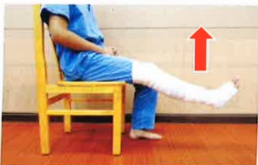

站姿：将脚向上抬高

## 關節彎曲活動角度

訓練目的：增加患側關節循環及維持關節角度

圖片繃帶纏綁肢體為手術患肢示意圖

## 平躺姿勢：盡可能將大腿/膝蓋彎曲，再慢慢伸直

## 平躺姿势使用毛巾協助：盡可能將大腿/膝蓋彎曲，再慢慢伸直

## 坐姿：盡可能將大腿/膝蓋彎曲，再慢慢將腳放回地面

## 強化上臂肌力

訓練目的：增加雙側上肢肌力，幫助手術後轉位及使用助行器能力

使用有扶手的固定式椅子，盡可能伸直手肘並抬起身體，再慢慢將身體降下至椅面

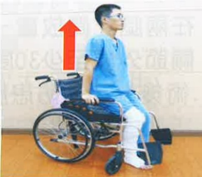

## 强化心肺耐力

## 訓練目的：增加手術前心肺耐力 圖片繃帶纏綁肢體為手術患肢示意圖

##  $ ^{※} $ 固定式腳踏車10分鐘

 $ ^{※} $  腳踏車高度：腳踩到底，膝蓋接近伸直

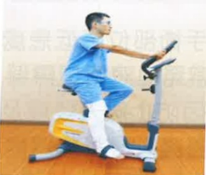

##  $ ^{※} $ 行走於安全平面10分鐘

物理治療師貼心提醒您，小心安全，預防跌倒義大醫療財團法人 復健科物理治療團隊 製作## 伍、 手術後照護須知

## 一、 手術後肢體擺位及照顧注意事項

1. 手術後，我們將協助您把腿部向外自然展開，且會為您在兩腿之間放置一個枕頭（三角枕），保持兩腳打開使髖關節外展至少30度以防脫臼。

2.術後為了預防患肢腫脹，造成疼痛及末梢循環障礙，可用枕頭將手術之腿部墊高，可減輕水腫。

平 躺

側 躺

3.冰敷手術部位降低患處疼痛及腫脹，應經常更換冰敷位置，避免血液循環障礙，且夜間入睡後應停止冰敷。

4. 術後因防止病人發燒及肺部擴張不全，要經常深呼吸咳嗽。醫護人員將會協助教導每2小時翻身拍背（避開腰部及脊椎）。請病人加強水分攝取，一天 2000~3000cc（但有限水病人除外）。

5. 可搖高床頭約 30度~45度 以方便進食及預防嘔吐造成嗆傷。

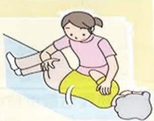

## 二、 管路放置注意事项

## (一) 留置導尿管

1. 基於手術後活動安全，故手術後會留置導尿管。

2. 醫護人員會評估拔除留置導尿管的時機。

3. 留置導尿管會固定在大腿內側(女生)或下腹部(男生)。

4. 尿袋要放在低於膀胱的地方，

高於膀胱易導致尿液逆流而感染。尿袋底部要離地至少3公分以上，免接觸地面。

5.若是出現有尿量持續減少或膀胱脹痛情形，請確認管路是否有反摺，並請醫護人員協助處理。

離地面至少3公分

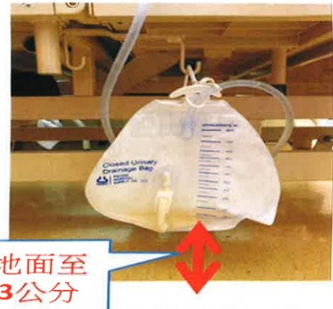

## (二) 引流管

1. 術後於患肢手術處會放一條引流管，引流血水預防血腫。

2. 引流管放置期间，除了要预防管路滑脱外，在Y型接管处更须时常挤压。冰敷时也应避免冰敷引流管，防止血块形成阻塞。

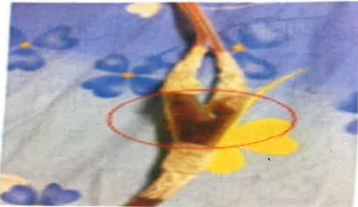
### 三、飲食指導

1. 術後返回病室後，若無頭暈或嘔吐情形，則採漸進式飲食：先試喝少量開水，若無嘔吐情形，1小時後就可飲用流質食物（如：果汁），進而再食用軟質及好消化食物（如：稀飯），而待隔天後即可正常飲食。漸進式飲食可預防因麻醉引起腸蠕動緩慢所造成消化不良。

2. 多食用維他命 C 的水果，如：奇異果、櫻桃、葡萄等，及高蛋白質食物，如：雞、鴨、魚、牛肉等，促進傷口癒合，並多食用高纖食物，如：綠色青菜來預防便秘。

3. 切記進食應採半坐臥或坐姿，因躺臥進食易導致嗆傷引起吸入性肺炎。

## 營養治療科提供術後飲食參考食譜

## 術後飲食參考食譜 1500卡

| 超商 | 鹽蔥燒肉御飯櫃+義美豆奶 |
|------|------------------------|
| 鹽蔥燒肉御飯燒 | 飯37g（約1/4碗飯）燒肉10g |
| 義美豆奶 | 260ml（約7分溼）（含糖15g） |

| 自助餐 | 器烧酒挤骨便当 |
|--------|----------------|
| 白饭 | 150g (3/4碗) |
| 渣排骨 | 65g (2/3掌心) |
| 紅蓮葛炒蛋 | 60g (蛋半颗/紅蓮葛約1/4碗) |
| 清炒大黄瓜 | 58g (大黄瓜約1/4碗) |
| 蒸炒小黄瓜 | 55g (小黄瓜約1/4碗) |
|        | 芭桑 160g (1/3顆) |

| 套餐 | 水餃套餐 |
|------|----------|
| 水餃點酸醃小黄瓜涼拌胡薤醬絲干絲涼拌海帶紫菜湯水餃飴蘋果1份 | 60g (3/4碗) 蔬菜105g (一碗) 猪肉餡70g (一個掌心) 3/4碗 (8分滿量) |

大院發治康科醫所## 術後飲食參考食譜 1600卡

| 早餐店 | 傳統粉漿蛋餅+鮮奶 |
|--------|------------------|
| 粉漿蛋餅 | 餅皮150g (3/4碗) |
| | 蛋1颗 |
| | 低脂鮮奶：鮮奶280ml |

| 套餐 | 台式烧肉飯套餐 |
|------|----------------|
| 白飯 | 150g (3/4碗) |
| 酸醃小黃瓜 |  |
| 涼拌胡蘿蔔絲 | 菸菜共105g (一碗) |
| 干絲涼拌海帶 |  |
| 紫菜湯 |  |
| 燒肉 | 45g (1/3~2/3個掌心) |
| 蛋 | 酒蛋一類 |
| 蘋果1份 | 120g (3/4碗或8分滿量) |

| 套餐 | 半筋半肉牛肉麵+豆腐 |
|------|---------------------|
| 麵條 | 340g(扣吸水率)3份(3/4碗) |
| 牛肉 | 60g(2/3個掌心) |
| 小白菜 | 24g(1/4碗) |
| 涼拌豆腐 | 90g(約1/3盒裝嫩豆腐) |
|  | 奇異果120g(1颗半) |

费大智发发借夜夜

## 術後飲食參考食譜 1800卡

| 早餐店 | 起司蛋吐司+義美豆奶 |
|--------|---------------------|
| 義美豆奶 | 260ml 約7分滿(含糖15g) |
| 兩片土司 | 100g(一碗飯) |
| 美生菜 | 10g |
| 起司1片 | 全脂起司一片 |
| 煎荷包蛋 | 蛋一颗 |

| 便當店 | 正宗便當 |
|--------|----------|
| 白飯 | 200g(一碗) |
| 豬肉片 | 50g(約1/3~2/3個掌心) |
| 五香豆干 | 42g(約1/3掌心) |
| 油蛋 | 60g(蛋一顆) |
| 清炒高麗菜 | 80g(約3/4碗) |
| 蒜炒小白菜 | 75g(約3/4碗) |
|  | 橘子150g(1顆) |

| 便當店 | 奶油蒜香鹽舒肥雞肉套餐 |
|--------|------------------------|
| 白飯 | 200g(一碗) |
| 雞肉 | 70g(一個手掌心) |
| 漑心蛋 | 蛋半颗 |
| 蒜炒青江 | 50g(半碗) |
| 菜拌木耳絲 | 50g(半碗+蛋少許) |
| 紅蘿蔔炒蛋 | 奇異果120g(1颗半) |

最大壁厚及表面厚度及槽深有## 四、 手術全期藥物使用

## (一) 预防性抗生素

1. 外科手術預防性抗生素是指病人接受手術前，傷口未被污染或感染前就先給予抗生素，以避免術後發生感染。

2. 可能發生的副作用如過敏或腸胃不適，若出現皮膚紅疹、搔癢、腹瀉的等症状，請立即告知醫療團隊。

## (二) 抗血栓藥物

1.為了避免深層靜脈血栓的發生，在手術後醫師會評估病人的狀況決定是否給予抗血栓藥物(如抗凝血劑或抗血小板製劑)。

2.如果您有胃腸道出血、消化性潰瘍等病史，請先告知醫療團隊。

3. 服藥期間，如果要接受外科手術、拔牙、內視鏡檢查或其他可能造成出血的處置及檢查時，請提早告知醫師有在服用這類藥品。

4. 服用抗血栓藥物期間，日常活動時請小心避免受傷。刷牙或刮鬍子時應使用軟毛牙刷及電動刮鬍刀。

5. 可能發生的副作用如胃腸不適或出血反應（例如手術部位血腫、牙齦出血、不明原因瘀青、血尿、血便或黑便）。如有出血現象，請立即回診告知醫療團隊。

6. 若您在接受關節置換術前已經接受抗血栓藥物治療，經與原處方醫師討論後已於手術前停藥。手術後請與您的手術醫師討論重新使用抗血栓藥物的時間。

## 陸、疼痛照護

## 一、 疼痛的影響

疼痛是個人主觀痛苦的感覺，可能是持續性的或一陣陣的，也可能是鈍痛、刺痛或尖銳痛，在生理上病人會有焦慮、失眠、降低食慾、心跳加快、血壓上升及内分泌失調。更可能因疼痛減緩呼吸(上腹部及胸部手術疼痛會隨呼吸而加劇)、不願意下床活動引發肺擴張不全、靜脈血栓等合併症，導致延後出院。

只有您自己才能描述疼痛，勇敢地告诉醫師、護理師您的疼痛困擾。只要透过正确的表達及评估方法，90%的疼痛都可以获得有效的缓解。

## 您可以這麼做：

1. 您可以說出那個地方疼痛，也可以用手指出疼痛的部位。

2. 告知醫護人員第一次

痛是什麼時候、多久痛一次、每次疼痛持續多久。

3.明確說出疼痛的感覺，例如：鈍痛、刺痛或尖銳痛？

4. 告知疼痛是否已影響平常的生活作息，例如：無法入眠等。

5.正確地表達您的疼痛分數。建議您可利用「疼痛評估量表」來表達疼痛情況：0分不痛、10分為不可忍受之疼痛。## 二、 術後常用止痛方式

## 拒絕術後疼痛，請勇於說痛

## 術後常用止痛方式有以下幾種：

口服藥：針對較輕度疼痛，按醫師指示服藥，即使目前未有疼痛感仍須服用，才能有較好的疼痛控制。

## 肌肉或靜脈注射(非類固醇或嗎啡類止痛藥)：

每個人對於疼痛耐受性及吸收效果不同、時間上有限制、需依醫師指示固定時間給予，或突發性疼痛需要止痛時使用。

多模式止痛：由麻醉科醫師評估並選擇給藥方式與途徑，利用機器或靜脈、局部給藥，設定安全劑量及鎖定時間，提供給病人自己選擇。

神經阻斷術：在超音波導引下精確定位神經所在，將局部麻醉藥物注射於神經周圍，使神經暫時麻痺，可提供6~8小時止痛效果。施打部位之肢體會有麻木、感覺遲鈍或肌肉無力狀況，待藥效消失後就會恢復正常。

## 三、 除藥物治療外可以減輕疼痛的方法

1. 藉由一些活動來分散對疼痛的注意力，如聽音樂、打牌、打麻將、散步。

2. 放鬆心情、保持愉悅心情，如：可藉由家人或朋友的陪伴，給予心理支持，有助於您減輕對疼痛的感覺。

3.將肢體擺放為您平時感覺最舒服的姿勢。

4.藉由宗教信仰，如：念佛、禱告，來分散對疼痛的注意。

5. 可詢間您的主治醫師是否可藉由冰敷或熱敷減緩疼痛情況。

6.當疼痛無法忍受時，您還是可以告知醫護人員，調整止痛藥物。

## 四、 關於疼痛常見疑問：

1. 使用止痛藥不會影響傷口癒合，反而可因疼痛緩解促進下床，幫助傷口癒合。

2. 止痛藥的副作用：過敏皮膚癢、頭暈、噁心、嘔吐等，都可透過調整劑量改善。

3. 使用自控式止痛：治療目的是用最少劑量的藥，達到病人臥床休息時不覺得疼痛，但在劇烈咳嗽或走動時，仍可能有疼痛感覺，但疼痛程度會減輕許多。4. 自控式止痛使用時間：手術2–3日後，疼痛會隨著時間而慢慢減輕，可改用口服止痛藥，停止使用自控式止痛。

5. 自控式止痛與傳統止痛不同點：

(1)自控式止痛是由機器固定持續給藥，若感覺特別疼痛時可自己按鈕給藥減輕疼痛。

(2)傳統止痛是忍受不了才給藥，給藥後30分鐘開始作用，藥效可維持4~6小時。

6. 使用自控式止痛，麻醉科醫師會依據病人各項條件來設定藥量及時間，使用期間也會隨時注意病人情形調整劑量，故不會上癮或造成藥物過量。

7. 麻醉科醫師會評估病人狀況，若有意識不清、血壓過低、低血容性或敗血性休克，則無法使用自控式止痛。

8. 健保給付傳統止痛方式，自控式止痛需自費。

## 染、手術後復健運動訓練

配合物理治療師指導的復健運動，可有效提昇功能恢復

影片教學

## 一、 術後當天

1. 冰敷：每天4次，每次15分鐘。

2. 足背運動：每天4次，每次15下。平躺，雙腿，請將腳掌向上提拉，維持5秒後，下壓5秒。目的為增加肢體末稍循環，降低開刀腳末梢水腫。

3.夾臀運動：每天4次，每次15下。

在平躺姿勢下進行，

目的為維持開刀腳臀

部肌力，為下床前做

好準備。

4. 呼吸運動：每天4次，每次15下。

目的為協助排除麻醉藥物及強化呼吸肌功能。

5. 視情況床頭漸進式搖高、坐床緣或協助輪椅轉位如第27頁

夾臂運動

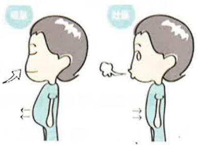
## 二、 術後第一天

1. 冰敷：每天4次，每次15分鐘。

2. 足背運動：每天4次，每次15下

3. 足踝繞圈運動：每天4次，每次15下。

4. 股四頭肌及腦旁肌運動：

彈性襪肢體為手術患肢示意圖

每天4次，每次15下。開刀腳平放，在膝窩處放置毛巾捲，出力下壓毛巾捲，維持5秒後放鬆。目的為增加肌力。

彈性襪肢體為手術患肢示意圖

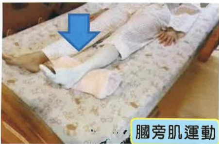

彈性襪肢體為手術患肢示意圖

5. 髋外展運動及髋屈曲運動：每天4次，每次15下。開刀腳打開及彎曲。目的為增加開刀腳腿部血液循環及關節角度。

彈性襪肢體為手術患肢示意圖

彈性襪肢體為手術患肢示意圖

6. 坐床緣：每天4次，每次5分鐘。目的為循序漸進提升體能。

7. 病房内使用助行器步行，或視情況協助輪椅轉位如第27頁。

## 三、 術後第二天

1. 冰敷：每天4次，每次15分鐘。

2. 足背運動：每天4次，每次15下。

3. 足踝绕圈運動：每天4次，每次15下。

4. 股四頭肌及腦旁肌運動: 每天4次，每次15下。

5. 髋外展運動及髋屈曲運動：每天4次，每次15下。

6. 髖轡曲運動：每天4次，每次15下。

7. 髋伸直運動：每天4次，每次15下。

彈性襪肢體為手術患肢示意圖

彈性襪肢體為手術患肢示意圖

8. 使用助行器步行：每天4次，每次5分鐘。提升體能及下肢肌耐力，助行器使用如第25頁。

9. 視情況協助輪椅轉位如第27頁。

## 四、 術後第三天

1. 冰敷：每天4次，每次15分鐘。

2. 足背運動：每天4次，每次15下。

3. 足踝绕圈運動：每天4次，每次15下。

4. 股四頭肌及腦旁肌運動：每天4次，每次15下。5. 髋外展運動及髋屈曲運動：每天4次，每次15下。

6. 髋彎曲、髋伸直運動：每天4次，每次15下。

7. 髋外展運動：每天4次，每次15下。

8. 坐姿膝伸直運動：每天4次，每次15下。

彈性襪肢體為手術患肢示意圖

彈性襪肢體為手術患肢示意圖

9. 使用助行器步行：每天4次，每次5分鐘。提升體能及下肢肌耐力，助行器使用如第25頁。

## 五、 術後第四天以上

1. 冰敷：每天4次，每次15分鐘。

2. 足背運動：每天4次，每次15下。

3. 足踝绕圈運動：每天4次，每次15下。

4. 股四頭肌及腦旁肌運動：每天4次，每次15下。

5. 髋外展運動及髋屈曲運動：每天4次，每次15下。

6. 髖彎曲、髖伸直運動：每天4次，每次15下。

7. 髋外展運動：每天4次，每次15下。

8. 坐姿膝伸直運動：每天4次，每次15下。

9. 大腿後側肌群伸展運動：每天4次，每次15下。

10. 小腿後側肌群伸展運動：每天4次，每次15下。

大腿後側肌群伸展運動

彈性襪肢體為手術患肢示意圖

小腿後側肌群伸展運動

彈性襪肢體為手術患肢示意圖

11. 使用助行器步行：每天4次，每次5分鐘。提升體能及雙下肢肌耐力，助行器使用如第25頁。

## 六、 正確使用助行器行走運動與上下樓梯的方式

1. 助行器行走運動

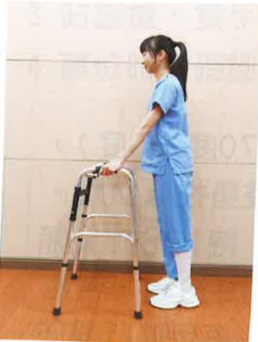

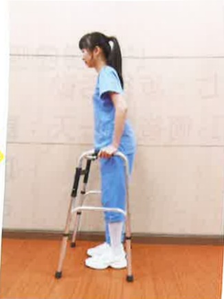

彈性襪肢體為手術患肢示意圖### 2. 上下楼梯正確方式

(1)開刀後的1~3個月內為患肢最大保護期。

(2)請遵守健肢先上樓梯，患肢先下樓梯，兩腳踏在同階梯的原則(口訣為好人健肢上天堂，壞人患肢下地獄)。

繃帶纏綁肢體為手術患肢示意圖

## 七、 步行活動

1. 術後第一天：請盡量鼓勵病人半坐臥（約70度~90度），以預防下床活動時，發生姿勢性低血壓。可採漸進下床，首先搖高，待10分鐘後無不適情形，再坐於床邊5~10分鐘，若無頭暈不適，在他人協助下，再用助行器站立；站立時無頭暈不適，才可使用助行器於病房內走動。

2. 術後第二天以後：可以在病室走道以助行器步行，1 天 4 次，1 次 5 分鐘。活動後臥床休息時，需要抬高並冰敷患肢，以利消腫。

3. 助行器使用至少需維持6~8星期，以預防骨頭未癒合前負重過大。

## 八、 輪椅轉位

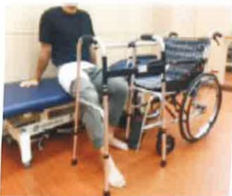

## 繃帶纏綁肢體為手術患肢示意圖

1. 站起或坐下時，開刀腳向前伸，健側下肢在後。

2. 站起時，雙手下壓出力，身體向上站起，勿過度前傾。

3. 站起後，雙手移至助行器把手處扶好。

4. 轉位時需確認輪椅或床是否在臀部可坐到的範圍內。## 捌、 預防跌倒

跌倒是可以預防的，只要一些小改變，就可以避免陷入跌倒的危機，請注意千萬不可以一個人下床！！！

定期練習肌力、柔軟度和身體平衡

四肢動作不可少

床邊復健運動

五體投地人不老床上復健運動

## 時時注意環境的安全

下床時，電動床降最低

離開時，雙側床欄拉起

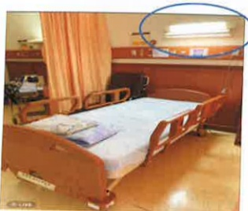

注意室内燈光明亮

選擇合適的鞋子及輔具

注意正在吃的藥物作用及副作用，是否引起造成跌倒的原因

六字口訣要知曉

使用輔具方法

## 玖、 術後保養及注意事項

## 一、 如何預防深層靜脈血栓

避免久坐、久站、臥床時避免長期壓迫到下肢，任何姿勢勿保持過久，如站立雙腿交叉，衣服太緊、維持理想體重、攝取適當的水份和低脂飲食、合宜的運動和禁止吸煙。

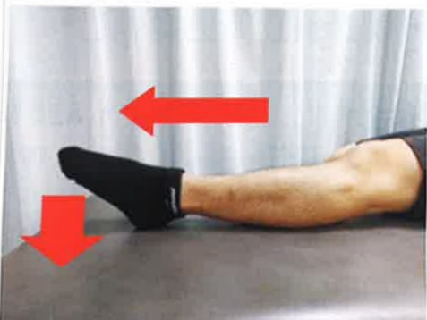

## 術後若有穿著醫用彈性襪需求，其原則如下：

1. 術後至少穿 3 天

2. 早上下床前穿上，晚上洗澡時脫下（建議穿 8 小時/天，穿一個月）

3. 請手洗、平放陰乾  

(禁脫水烘乾、吊掛曝曬陽光)

## 二、 返家後傷口護理

### 1. 接觸傷口前後需洗手。

2. 傷口消毒或清潔須由內向外，不可來回擦拭，消毒範圍約傷口範圍外推 5 公分，更換傷口時，應盡量避免傷口暴露於空氣中時間過久。

3.須每天換藥一次(可於擦澡後再執行)。但若紗布有血水滲出、不慎淋濕或紗布掉落，就必須立即更換傷口。

4.保持傷口及紗布清潔乾燥，避免淋浴弄濕傷口，盡量採擦澡方式。

5. 换乘準備用物：

(1)20ml 生理食鹽水：請單次使用後丟棄

(2) $ 4 \times 4 $  纱布

(3) 無菌沖洗棉枝

(4) 水溶性優碘：保存期限為開封後 1 星期。

(5)3M 紙膠：若對紙膠過敏者，可改選購抗過敏膠帶）

(6)6 吋彈繃(可清洗後重覆使用)。

### 6. 傷口護理步驟：

1. 以洗手液或肥皂洗净笺手。

3. 以生理食鹽水棉棒，進行傷口清潔，由傷口中心環形向外轉擦拭，逐漸擴大至直徑大於傷口周圍5cm，避免來回擦拭。

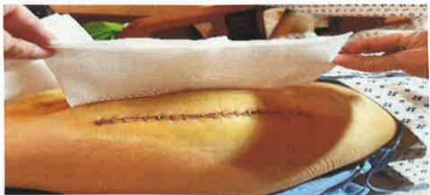

5. 紗布封口撕開後避免碰觸包裝內面，抓住紗布一角取出，對準傷口的中心，覆蓋傷口後，勿再次移動，膠帶固定。

2. 拆開紗布並觀察傷口

4. 以水溶性優碘棉棒，進行傷口消毒，由傷口中心環形向外轉擦拭，逐漸擴大至直徑大於傷口周圍 5cm，避免來回擦拭。

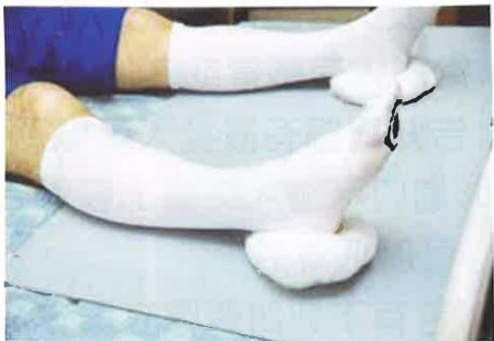

6.依醫師指示使用彈繃包紮以及搭配彈性襪穿著。## 三、 返家照護注意事項

1.返家後每天繼續執行在醫院教導的復健運動。

2.傷口儘量保持乾燥，若有紅腫及異常滲液情形，請盡速回診檢查。

3. 避免傷口擦撞及激烈運動(如：跑步、跳躍)，需遵守醫師教導活動限制。

4. 術後 6~8 星期內需使用助行器，直到門診追蹤時醫師認為可以恢復正常活動為止，需要預防跌倒。

5. 當長時間下床活動後，因患肢末稍血液回流速度較慢，腳掌易腫脹情形，故應於下床活動後抬高患肢且冰敷傷口，以利消腫。

6. 下列活動須經醫師認可後才可以執行：開車、半蹲、提重物（3 公斤以上）、走遠路、爬山。

7. 過安檢門的時候機器或許會提示你有攜帶了金屬，可以向安檢員解釋或提供醫院手術證明。

8. 體內、外有金屬品例如：人工關節，禁止深層熱敷（如短波）會因為熱度過度集中而造成燒傷。

9. 當病人有感冒或其他部位感染或看牙科治療時，請主動告知醫師有置換人工關節，以利醫師評估用藥原則。

10. 傷口可碰水時機：醫師告知傷口何時可以碰水後，才可以採淋浴。

11. 若有下列問題應立即返診：

(1)傷口長期仍未痊癒，持續有滲液、異味、流血不止。

(2)傷口有紅腫、傷口周圍皮膚發熱、傷口嚴重疼痛未改善。

(3)持續發燒超過38.5度。

## 壹拾、 居家復健

(一)注意事項：手術後 3 個月內請維持日常生活正確姿勢，避免危險動作

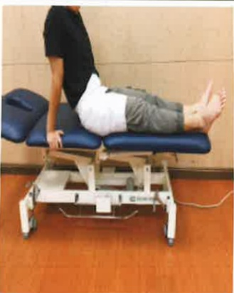

上下床姿势

關節不彎曲超過90度

雙腳不交叉

開刀腳不過度扭轉

站起與坐下

雙手出力扶扶手

關節不彎曲超過90度

扶好助行器穗走## (二) 坐姿穿褲子方式

|  |  |  |
|---|---|---|
|  |  |  |
|  |  |  |
| 1. 裤管請先捲好 | 2. 裤子放開刀腳邊 | 3. 從開刀腳穿入 |
| 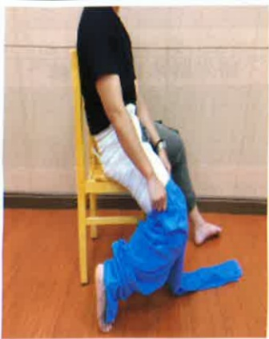 |  | 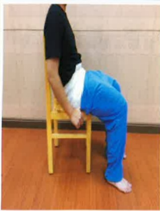 |
| 4. 髖關節不扭轉 | 5. 開刀腳往前擺正 | 6. 肚子抬高穿好 |

## (三) 貼心叮嚀，以下為常犯的錯誤：

|  | 正確姿勢 | 危險動作 |
|---|---|---|
| 關節不彎曲超過90度 | 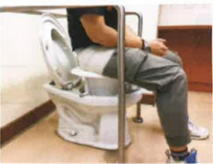 |    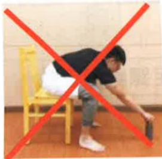 |
|  |  |  |
| 腳不交叉不過度扭轉 |  |    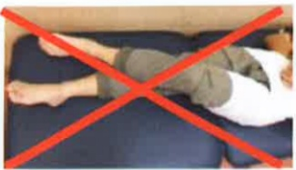 |
| [F20]  |  | 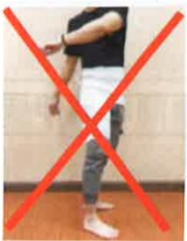    |## (四) 居家復健運動：

運動目的：逐漸增加髖關節角度與力量，  
盡早恢復日常活動  

運動處方：維持10~15秒鐘。每次15下，每天四次  

## 熱身運動  

  

  

  

髖關節運動
  

| 髖彎曲運動 | 髖伸直運動 | 髖外展運動 |
|-----------|-----------|-----------|
|  |  | 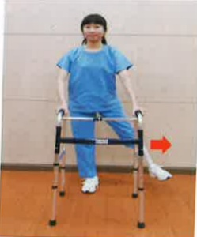 |
| 大腿後側肌群伸展 | 小腿後側肌群伸展 | 直抬腿運動 |
| 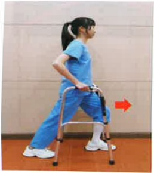 |  | 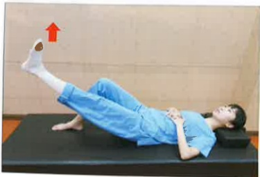 |

## 緩和運動  

| 足背運動 | 膝伸直運動 |
|---------|-----------|
|  |  |
| 助行器輔助行走運動(1)助行器往前(2)開刀腳先走(3)另一腳跟上 |  |
|  |  |

## 注意事项：

(1)返家後，建議每天進行四次居家復健運動，每次約30分鐘。  
(2) 每項運動可依照您的開刀部位恢復程度，維持5~15秒的力量。  
(3)每次運動後，需冰敷10~15分鐘，並配合醫師開立的藥物處方箋，將開刀腳的疼痛控制好，才會有好的復健成效。  
(4) 運動時，若發生強烈的疼痛，請立即就醫，進行醫療處置。  
(5) 手術後6~8星期内需使用助行器行走，以預防跌倒，直到門診追蹤時醫師認為可以恢復正常活動。  
(6) 手術後三個月內，上樓梯，未開刀腳先上階梯；下樓梯，開刀腳先下階梯，以保護開刀腳，圖片可參考衛教本第26頁。  
上下樓梯有跌倒風險，建議家屬應陪伴。## 壹拾壹、 参考资料

1. 林笑、吳翠娥、李和惠、邱飄逸、羅筱芬（2020）·

骨骼、肌肉、關節疾病病人之護理·於胡月娟總校閱，

內外科護理學下冊（六版，909-911頁）·華杏。

2. 袁素娟（2020）· 肌肉骨骼系统疾病之護理·於劉雪娥總校閱，成人內外科護理下冊（八版，569-572頁）。華杏。

3. American Academy of Orthopaedic Surgeons (AAOS). (2022, February). Total Hip Replacement Exercise Guide.

https://orthoinfo.aaos.org/en/recovery/total-hip-replacement-exercise-guide/

4. Gabbert, T., Filson, R., Bodden, J., & Coppola, C. (2019). Summary: NAON's Best Practice Guideline, Total Hip Replacement (Arthroplasty). Orthopaedic Nursing, 38(1), 4-5. http://doi.org/10.1097/NOR.0000000000000520

5. Shapira, J., Chen, S.L., Rosinsky, P.J., Maldonado, D.R., Lall, A.C. & Domb, B.G (2021). Outcomes of outpatient total hip arthroplasty: a systematic review. Hip international: The journal of clinical and experimental research on hip pathology and therapy, 31(1), 4-11. http://doi.org/10.1177/1120700020911639

6. Zhao, J., & Davis, S. P. (2019). An integrative review of multimodal pain management on patient recovery after total hip and knee arthroplasty. International Journal of Nursing Studies, 98, 94-106. https://doi.org/10.1016/j.ijnurstu.2019.06.010