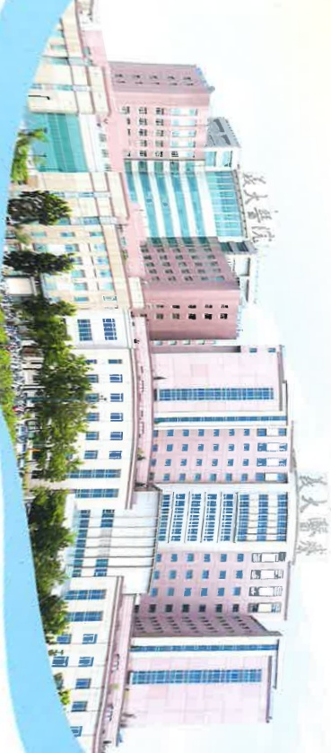
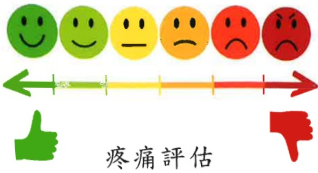
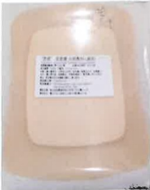
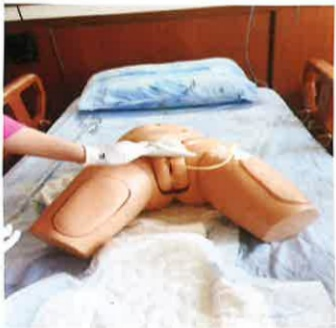

## 加護病房 衛教手冊

## 我大醫療財團法人 E-DA HEALTHCARE GROUP主動自我介紹，並配戴識別證，可由病室外的名牌得知其三班照護的護理師。

## 03003 3A03

日班：

小夜班：

大夜班：

## 會客原則：

為了有效的感染控制，會限制探訪的時間及兩位人數的限定，也需要落實隔離防護穿著隔離衣、戴口罩、洗手，避免造成交互感染，如延遲會客，仍會完成30分鐘的會客時間

## 確實洗手避免感染

步腳—

手掌心對手掌心相互捲洗

左右手背，手指交错，互搓洗

步驟三：

左右手心，手指交緒，互攥洗

步驟四：左右手指互扣·旋轉式搓洗

步驚五：左右手拇指，相互旋轉式搓洗

步驟六：左右手掌心，以手指旋轉式搓洗

進入加護病房時記得將您的手機關機，因病人身上有許多管路及儀器，易受電磁波影響，也讓您及您的家屬瞭解術後放置任何管路的目的及重要性，故勿自行移動病人及必要性會給予保護性約束措施。

## 疼痛照護：

術後傷口及管路的放置易造成疼痛不適，醫護人員進行每小時評估疼痛指數，並適度給予止痛劑使用，可以減輕疼痛及不適感。

疼痛評估

一

針劑、口服止痛

## 預防跌倒：

臥床時使用床欄，針對加護病房高危險群跌倒病人，加強標示。

## 預防失禁性皮膚炎及壓傷：

急重症患者及老年人，由於身體病生理情況，易引起失禁性皮膚炎及壓傷，做好失禁性皮膚炎及壓傷預防，可降低失禁性皮膚炎及壓傷的發生。

長效保膚霜

乾洗潔膚液

無痛保護膜

泡棉敷料## 尿管護理：

外科加護病房病人多數因手術需要、需密切監測尿液，或是急性尿滯留而放置導尿管使用，若導尿管照護不當易造成感染，故每日應清潔會陰部及導尿管。

1. 將便盆或尿布垫在病人臀部下方，以沖洗壺沖水。

2. 用肥皂水或沐浴

乳塗抹於病人尿道口、會陰部及

尿管上段處再以清水沖洗乾淨。

3. 將病人尿道口、會陰部及尿管上段以濕紙巾擦乾。

4. 協助更換乾淨尿布或衣褲。

5. 尿袋位置需維持在膀胱以下，尿袋口離地3公分以上，且開口應隨時關閉，尿袋內尿量超過1/2至2/3應倒掉。
手術後管路留置圖：

義大醫療財團法人 E-DA HEALTHCARE GROUP

義大醫院

醫院院址：高雄市蒸巢區義大路1號

醫院總機：(07) 615-0011

義大癮治療醫院

醫院院址：高雄市蘇巢區義大路21號

醫院總機：(07) 615-0022

義大大昌醫院

醫院院址：高雄市三民區大昌一路305號

醫院總機：(07) 559-9123

本著作權非經著作權人同意，不得轉載、翻印或轉售

著作權人：義大醫療財團法人

表單編號：HA10185(2)

2025年01印製 2025.01修訂