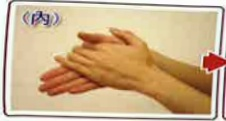
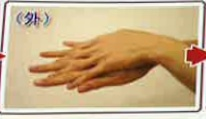
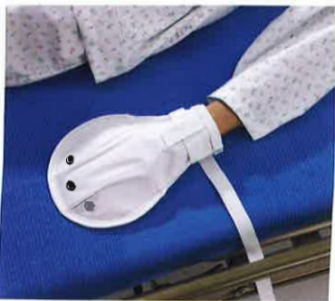
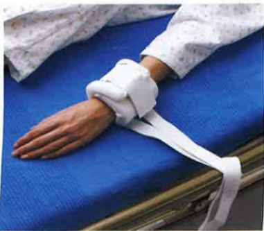

## 會客原則：

為了有效的感染控制，會限制探訪的時間及兩位人數的限定，也需要落實隔離防護穿著隔離衣、戴口罩、洗手，避免造成交互感染，如延遲會客，仍會完成30分鐘的會客時間

## 確實洗手避免感染

步腳—

手掌心對手掌心相互捲洗

左右手背，手指交错，互搓洗

步驟三：

左右手心，手指交緒，互攥洗

步驟四：左右手指互扣·旋轉式搓洗

步驚五：左右手拇指，相互旋轉式搓洗

步驟六：左右手掌心，以手指旋轉式搓洗

進入加護病房時記得將您的手機關機，因病人身上有許多管路及儀器，易受電磁波影響，也讓您及您的家屬瞭解術後放置任何管路的目的及重要性，故勿自行移動病人及必要性會給予保護性約束措施。

