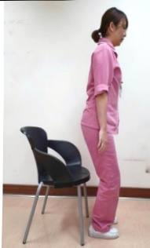

# 肌少症-照護注意事項

## ● 何謂肌少症？

堪稱高齡者失能的隱形殺手，年齡越高罹患肌少症機率就越高，容易造成長者跌倒、骨折、失能、入住機構等風險，更增加死亡機率。

● 肌少症的特徵？

持續感覺沒力氣、無法久走或久站、常跌倒、握力不足，嚴重甚至失能、生活無法自理等。

● 如何防治肌少症？

1. 規律運動、預防跌倒：阻力式運動尤佳，如：使用啞鈴、寶特瓶、彈力帶做重量訓練。其他如：快走、慢跑、游泳、太極拳等。

推牆做伏地挺身

(強化手臂與核心肌群)

起立坐下

(強化下肢和手臂肌力)

雙手上舉

(訓練手臂肌力)

坐姿抬腿

(訓練下肢肌力)

踮腳尖、翹腳趾

(訓練小腿前後側腿肌、平衡及協調能力)

※注意：請選固定、堅固的椅子，每個動作維持 5-10 秒鐘，每回合做 10-15 次，進行 2-4 回合/天，建議一星期至少執行 3 天。### 2. 營養補充：

<table border=1 style='margin: auto; width: max-content;'><tr><td style='text-align: center;'>蛋白質</td><td style='text-align: center;'>每天蛋白質攝取量需要1~1.5公克/公斤，才可減少肌肉流失的發生(慢性腎臟病或需限制蛋白質攝取者除外)，且攝取份量須平均分佈在三餐中。(例如：體重60公斤，每天需60~90公克的蛋白質)➢如：奶類、雞蛋、黃豆類(豆漿、豆腐、豆乾)、肉類(魚、雞、豬、牛)。➢牙口不好的長者，可選蒸蛋、蒸魚、豆腐、絞肉或將肉類加入飯中烹煮。</td></tr><tr><td style='text-align: center;'>維生素D</td><td style='text-align: center;'>主要幫助鈣質吸收，促進肌肉中蛋白質的合成，強化骨骼肌。➢如：黑木耳、深綠色蔬菜、高脂魚肉(鮭魚、鮪魚、鯖魚)、起司、蛋黃。➢建議每天日照10~15分鐘，可讓皮膚合成一天所需的維生素D。最佳日照時間：早上9~10點和下午4點後，穿著短袖露出皮膚效果更好。</td></tr><tr><td style='text-align: center;'>鈣質</td><td style='text-align: center;'>在老化過程中，腸胃道吸收鈣質的能力下降，一旦鈣質不足，身體就會透過副甲状腺作用將骨頭中的鈣質取出來使用，導致骨質流失。➢如：乳製品(牛奶、起司、優酪乳)、豆製品(豆腐、豆乾)、堅果、黑白芝麻、紫菜、海藻、木耳、深綠色葉菜、蝦米、沙丁魚、鮭魚等。</td></tr></table>

## 參考文獻：陳杰（2021）·淺談肌少症·秀傳醫學雜誌，20（2）·145-156。

<table border=1 style='margin: auto; width: max-content;'><tr><td colspan="3">聯絡資訊</td></tr><tr><td style='text-align: center;'>義大醫院
地址:高雄市燕巢區角宿里義大路1號
電話:07-6150011 分機:</td><td style='text-align: center;'>義大癌治療醫院
地址:高雄市燕巢區角宿里義大路21號
電話:07-6150022 分機:</td><td style='text-align: center;'>義大大昌醫院
地址:高雄市三民區大昌一路305號
電話:07-5599123 分機:</td></tr></table>

21×29.7cm 2024.08 印製

2024.05 修訂 HA-1-0198(2)