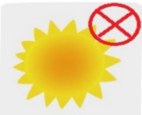
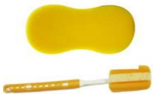
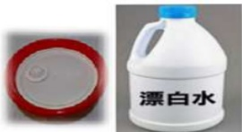

## 三、 腹膜透析引流桶清洗方式：

| 頻率   | 方法                                                                                                                                                                                                 | 圖示                                                                 |
|--------|------------------------------------------------------------------------------------------------------------------------------------------------------------------------------------------------------|----------------------------------------------------------------------|
| 每天   | 引流桶底的藍色貼紙若掉落時:1. 跟腹膜透析室領取新的藍色貼紙重新貼上, 可再用透明膠帶黏貼, 不易脫落。2. 可自行貼上其他有圖案的貼紙或油性奇異筆寫字或畫圖。 |                  |
| 每天   | 清洗後引流桶自然陰乾, 不要日曬, 因為容易造成桶子脆裂                                                                                             | 清洗工具: 海綿或軟刷 |
| 每週   | 引流桶內部每週至少1次使用洗碗精清洗                                                                                                             |                |
| 每月   | 使用漂白水浸泡, 泡製比例1:100, 以10毫升漂白水與1公升清水混和, 至少30分鐘, 將蓋子放入裝有稀釋漂白水的臉盆中, 需要整個蓋子都浸泡到                     |                |

資料來源：單位內部經主管審視後決議制定

<table border=1 style='margin: auto; width: max-content;'><tr><td colspan="3">聯絡資訊</td></tr><tr><td style='text-align: center;'>義大醫院地址:高雄市燕巢區角宿里義大路1號電話:07-6150952</td><td style='text-align: center;'>義大癌治療醫院地址:高雄市燕巢區角宿里義大路21號電話:07-6150022</td><td style='text-align: center;'>義大大昌醫院地址:高雄市三民區大昌一路305號電話:07-6150208</td></tr></table>