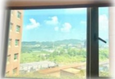
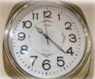

## 譫妄-照護注意事項

## 何謂譫妄？

譫妄為急性、短時間的意識混亂狀況，通常是「生理上的異常」所造成，  
大部分可矯正誘發譫妄的原因，症狀可逐漸緩解；若沒有減緩，易造成龐大  
的醫療花費、嚴重的併發症：發生跌倒、產生壓力性損傷、住院時間延長、  
較高比例入住長期照護機構、甚至更高的死亡率。

## ➢ 症状有哪些？

定向感障礙，對人、時、地有錯誤的認知，例如：無法認出熟識的人。  
注意力不集中、出現幻聽、幻視或妄想、答非所問、胡言亂語。  
✿ 日夜顛倒、晚上吵鬧不睡覺、白天卻頻頻昏睡。  
♦ 嗜睡、躺在床上不動、不吃不喝；或是變得躁動不配合醫療。  
短期內情緒波動大，呈現焦慮不安、憂鬱或亢奮。  
☐ 症狀持續時間：可能數天、數週、甚至數個月。

## 常見的導因？

| 各種併發症 | 感染、休克、缺氧、脫水、電解質不平衡、代謝異常…等。 |
|-----------|------------------------------------------------------|
| 外科手術後 | 骨科、腸胃科、泌尿科等外科手術。                     |
| 藥物       | 新增加藥物（例如鎮靜安眠藥物等）或突然停藥。         |
| 身體因素   | 臥床無活動、疼痛、尿滯留、便秘、睡眠或作息混亂…等。 |
| 環境因素   | 住院導致環境改變、放置鼻胃管或尿管、身體約束…等。   |
| 疾病       | 頭部外傷、腦中風、癲癇、心臟病…等。                 |## E-DA HEALTHCARE GROUP

## 如何治療？

首先改善會造成譫妄的原因，如：治療感染問題、調整藥物、控制疼痛、解決便秘或尿滯留等。如有過度激動、干擾治療時，可給予低劑量的抗精神病藥物。

## 照護原則：

|  |  |
|---|---|
| 1. | 提供足夠的水份及營養，以維持電解質平衡，可以帶病人喜歡的食物，但記得先詢問醫護團隊哪些食物不可以吃。 |
| 2. | 可使用眼鏡、助聽器、寫字板、圖卡等輔助溝通，以促進有效溝通，並使用低頻、和緩的語調，簡短而清楚的語句來溝通。 |
| 3. | 白天保持窗簾拉開，經常提醒病人當下的日期、時間、地點、樓層、住院的原因、目前接受的治療等資訊。 |
| 4. | 利用時鐘、手錶、日曆等，放置熟悉的物品，例如照片、收音機等，加強對人、時、地、物之定向感。 |
| 5. | 增加白天的活動，保持白天清醒、避免昏睡，如：外出散步、曬太陽、與家屬互動、播放熟悉音樂、看電視、參與社區活動等。 |
| 6. | 早協助下床活動或坐輪椅、肢體運動，一天至少3次，減少白天臥床時間，預防壓傷、深層靜脈拴塞、肺桧塞情形發生。 |
| 7. | 提供夜間適當休息及睡眠，但避免過度或不當使用鎮靜安眠藥。 |
| 8. | 除非不得已的狀況，儘量避免約束，因身體約束可能會使病人的情緒更憤怒及活動受限，造成功能衰退。 |

## 参考文献：

陳人豪(2020)・譫妄症・台灣老年學暨老年醫學會主編，老年病症候群(二版，15-28頁)・合記。

|  |  |  |
|---|---|---|
| 聯絡資訊 |  |  |
| 義大醫院地址：高雄市燕巢區角宿里義大路1號電話：07-6150011 分機： | 義大癌治療醫院地址：高雄市燕巢區角宿里義大路21號電話：07-6150022 分機： | 義大大昌醫院地址：高雄市三民區大昌一路305號電話：07-5599123 分機： |

美大聚療財團法人 21×29.7cm 2024.08 印製

2024.05 修訂 HA-1-0216(2)