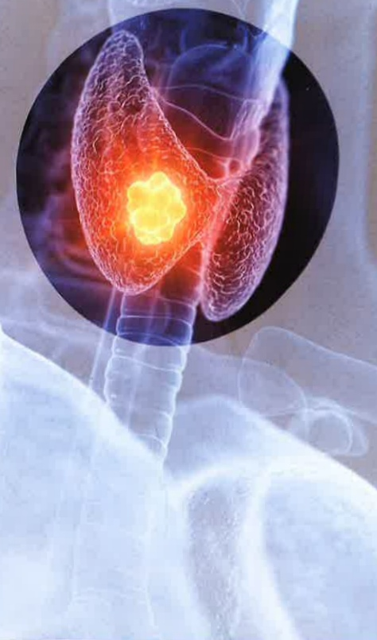

### 4. 聲音沙啞持續無改善。

## 六、 參考文獻

江豐裕（2018）· 甲狀腺手術ABC-甲狀腺及副甲狀腺手術病人指引（初版），金名圖書。

劉雪娥（2018）· 成人內外科護理(下冊)(七版)，華杏。

陳祈昌、黃莉棋（2008）·常見的甲状腺疾病·基層醫學，23（3），70-75。https://doi.org/10.6965/PMCFM.200803.0070

本著作權非經製作權人同意不得轉載翻印或轉售

著作權人：義大醫療財團法人

義大醫療財團法人21*29.7cm

2023.06新設 2024.03印製 HA-1-0219(1)

義大醫院

地址：高雄市燕巢區角宿里義大路1號

電話：07-6150011

義大癌治療醫院

地址：高雄市燕巢區角宿里義大路21號

電話：07-6150022

義大大昌醫院

地址：高雄市三民區大昌一路305號

電話：(07)559-9123

甲状腺手術

術後注意事項

## 一、 定義（甲狀腺的位置及功能）

甲狀腺的形狀就像一隻蝴蝶，位於頸部前方、喉結下方、圖繞著氣管。蝴蝶兩邊的翅膀就是甲狀腺的左右兩葉（如下圖），甲狀腺是人體重要的內分泌器官之一，可分泌甲狀腺荷爾蒙，會促進體內各種組織的新陳代謝。

图：甲状腺位置

取自https://www.top1health.com/article/88910（華人健康網）

## 適用對象

若在甲状腺組織中發現結節或腫瘤，則需進行手術相關手術方式如下：

.部分甲状腺切除術：只切除部分的甲状腺。

2. 單葉甲狀腺切除術：切除單側整葉甲狀腺。

3. 次全甲状腺切除術：切除兩側大部分的甲狀腺組織。

4. 甲状腺全切除術：切除全部的甲状腺組織（包含兩葉及峽部）。常用於治療甲状腺癌及少數多發性結節甲状腺腫及格雷氏病的病人。

5. 頸部淋巴廓清術：移除頸部區域的淋巴結和週邊組織，常與甲狀腺全切除術一起進行來達成甲狀腺癌治療的目的。

## 三、 術後注意事項

手術住院天數約4～5天，手術後活動不受限制，但下床活動要注意是否有頭暈情形，避免跌倒。

## (一) 飲食須知：

術後若護理師告知可進食時，先嘗試喝水無嘔吐等不適情形即可進食，需避免熱食，可先採冷流質飲食，如：冰淇淋、冰牛奶，以減輕傷口疼痛，隔天再進食軟質食物。術後若有嘔吐的情形，請將頭側一邊以防嗆咳，而造成吸入性肺炎。

## (二) 傷口照護：

1. 傷口可依醫囑使用冰敷，以減輕腫脹及疼痛。

2. 術後姿勢可呈半坐臥（床頭抬高45度），以利呼吸及減輕喉頭水腫情形。

3. 術後傷口會視狀況放置引流管，其功能為引流傷口血水，請保持管路通畅，切勿拉扯。

4. 為防止頸部活動引起傷口牽扯的疼痛，避免過度彎曲或伸展頸部，若要改變姿勢時請用雙手支撐頭部以減輕不適，也可使用枕頭支撐頭部，以免牽扯傷口。

5. 手術傷口會使用可吸收縫線並以美容膠覆蓋，故不需拆線。

## 四、 常見併發症

若有發生下列情形，需立即告知醫護人員：

1. 呼吸困难：可能因衔後出血形成血腫、氣管軟化塌陷

喉頭水腫、痰液阻塞或喉返神經損傷等因素造成，甲狀腺的血流豐富，術後血腫雖少見，但若發生會導致呼吸困难情形，故術後24小時要密切注意呼吸順暢性。

2. 喉返神經麻痺：會造成聲音沙啞及吃流質食物易嗆到等問題，所以手術後會確認發音是否正常。

3. 低血鈣症：主因是手術後副甲狀腺功能異常所致，手指及嘴唇周圍會有麻麻的感覺，嚴重時手腳會有麻木、抽搐的情形，補充鈣片和維生素D即可改善。

4. 甲狀腺風暴：常見的症状有術後體溫突然升高至39℃以上、脈搏加快（心跳>120次/分）或心率不整、血壓增加（收縮壓較術前增高40mmHg以上）、可能伴隨抽搐、煩躁不安、謔妄、噁心、嘔吐、腹瀉、脱水、呼吸困难、多器官衰竭等症狀，故術後需觀察是否有甲狀腺風暴症狀發生的情形。

5. 乳糜漏：其產生原因是在施行頸部廓清術中，損傷頸段胸管或淋巴管所導致，故術後需觀察引流液的顏色。

## 五、 返家照護須知

(一)飲食方面：採高蛋白飲食，如蛋、奶、魚、肉類；避免進食刺激性食物，如咖啡、茶、油炸、辛辣食物。

(二)傷口照護方面：保持傷口清潔乾燥，以防傷口感染，並依護理師教導的方式進行換藥。

(三) 若有以下的症狀請盡速返診：

1. 發燒、傷口紅、腫、熱、痛或有膿狀分泌物。

2.頸部緊繃或呼吸困難。

3. 四肢肢體麻木或抽搐情形。