# 腰椎術後照護 注意事項

## HAI## ~~目錄~~

一、手術後合併症……1  
二、手術後護理……1  
三、手術後活動……2  
四、居家照護注意事項……4  
五、復健運動……7  
初階復健運動……8  
進階復健運動……9  
六、腰椎術後之注意事項……10  
七、腰椎手術術後返家一日示範食譜……11  
八、參考文獻……13

## 一、 手術後合併症

腰椎手術後病人可能會有傷口發炎、感染、神經損傷等合併症。

## 二、 手術後護理

1. 手術後須注意手臂及腿部神經功能改變，如出現麻痺、無力或活動力下降，應立即通知醫護人員。

2. 請您小心避免牽扯身上的引流管。保持傷口乾燥，嚴密觀察傷口敷料有無血液及淡黃色液體滲出，若有，應立即通知醫護人員。

3. 每隔 2~4 小時護理人員會評估您排尿與排便情形，並注意有無尿滯留發生。

4. 手術後常因手術部位腫脹壓到神經根而感到疼痛不通，可以知會護理師適當的給予止痛劑服用。

5. 傷口於術後 7～10 天拆線，拆除後可使用美容膠黏貼保護，飲食上多攝取高蛋白、高維生素食物，以促進傷口癒合。

## 三、 手術後活動

### 1. 卧床注意事项：

(1)依醫師指示再下床活動，若您手術後48小時內仍需臥床，至少每2小時以滾木式翻身法(圖一)更換姿勢；若需於床上使用便盆，注意臀部不可以抬高。平躺時可用一枕墊於頭部，另一枕墊於膝下，注意維持脊椎的平直。經醫師許可，身體沒有不舒服症狀下，可將床頭漸進式抬高，可預防姿勢性低血壓，並請留意勿壓迫到手術部位。

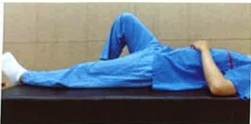

對側腳踩床後，再翻身

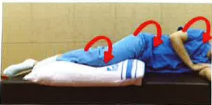

滚木式翻身法（维持脊椎一直線）

圖一、滾木式翻身之示意圖

(2)床上活動：臥床期間，髖關節及膝關節的活動可在手術傷口可忍受的疼痛範圍下，慢慢增加。上肢、腳、踝關節的關節運動，不影響患部，可盡量活動，每天至少需活動5次以上，以預防深層靜脈桎椏。

### 2. 正確的姿勢轉換：

(1)住院期間為降低傷口疼痛：

a. 可將床頭抬高，維持手術部位的平直與穩定。

b.再轉位坐到床沿，以雙手支撐床面坐起。

c. 家屬在旁協助保護病人。

起

身

側躺後

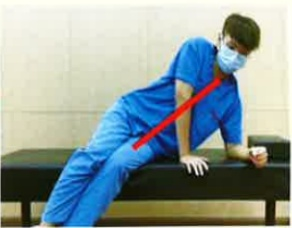

以雙手支撐床面(或請家屬協助在起床)

坐

到

站

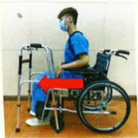

穿好背架，屁股往前移

手支撐扶手

站起來

助行器行走

頭不暈

再行走

助行器往前

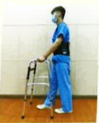

較沒力的腳先走

另一腳跟上## 四、 居家照護注意事項

1. 正確穿著背架：

(1)背架穿在衣服外面。

(2)鬆緊帶約一指寬扣緊。

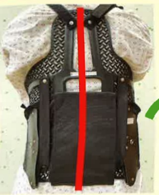

(3)不可穿太低，以免壓迫鼠蹊部，臀部以上可舒適地被支撐。

(4)主體鋼片應對稱固定在腰部腰椎兩側。

## 下床前先穿好。

背架穿戴時間請遵照手術醫師指示。

睡覺或洗澡不需穿著背架。

2. 活動相關注意事項：

(1)避免激烈轉動腰部的動作。

(2)採淋浴方式，以保持腰椎平直。

(3)術後三至四週才可開車或騎乘機

（單）車。

(4)避免推、拉、舉、抬重物及長途搭車、久坐。

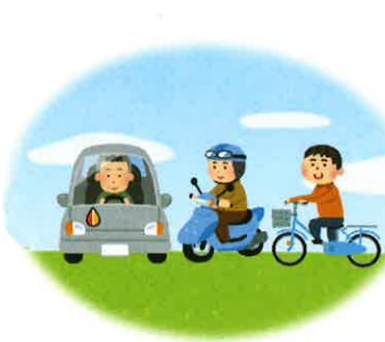

3. 维持正確的姿勢

(1) 使用雙腿的方法：

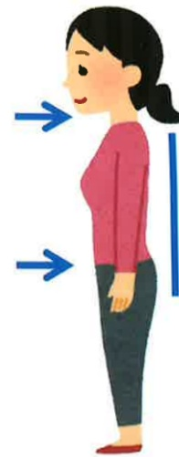

a. 站立時收下巴，頭抬高，背部平直、縮小腹並保持骨盆緊縮，以減少背部壓力。

b. 由醫師評估後才可決定能否採蹲姿撿拾物品。

c. 舉物時，將兩腿分開，蹲下，縮緊臀部和腹部肌肉，盡量將身體靠近物品，使腰椎平直，骨盆向下，由臀部及腿部肌肉來承擔物品重量。

d. 穿布鞋，勿穿拖鞋及高跟鞋，以使身體重心平衡。

## (2) 躺臥床上的姿势：

a. 側臥時，應彎曲膝關節。

b. 仰臥時，以枕頭支持膝部，並在頭下

或頸下放置平整的枕頭，以免肩頸部及手臂發生張力。

c. 勿採俯臥，因此姿勢會促使背部產生凹陷，而使肩頸部產生張力

d. 上下床時，保持腰椎直線排列，背架應於下床前穿好。

(3) 採取正確的坐姿：

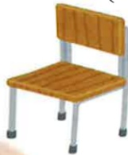

a. 要有堅固的椅背，椅子的寬度和高度應適當，使雙腿自然屈曲，並能自然垂到地面，最好讓膝關節高於髖關節。

b. 不可選擇低而軟的椅子，如軟沙發或矮凳。

c.勿猛然坐到椅子上，不建議久坐(超過30分鐘)，並收縮腹肌以挺直背部，盡可能保持頸、背部成一直線。

d. 開車時，坐椅靠背勿離方向盤太遠，

並綁上安全帶或使用硬靠背。

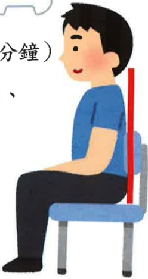

## 五、 復健運動：

1. 手術前即可開始練習本衛教單張之初階復健運動，而進階復健運動於住院中由治療師評估並指導後再執行，出院返家後亦可持續執行。

2. 穿著背架時，背板若導致手術傷口不適，可放置毛巾於背板內側。毛巾柔軟可減緩傷口疼痛，提升舒適感

3. 執行運動時，以不產生手術傷口疼痛為原則。若有疼痛產生，可諮詢物理治療師進行運動處方調整。

4. 頭暈或身體不適時，應暫停運動，預防跌倒。運動量視個人情形而定，切勿過量，以免造成手術傷口疼痛

5. 運動好處：手術後配合復健運動，可以提升手術成功率，降低背痛的復發率。

6. 運動處方：維持 10~15 秒後放鬆，每次 15 下，每天四次。

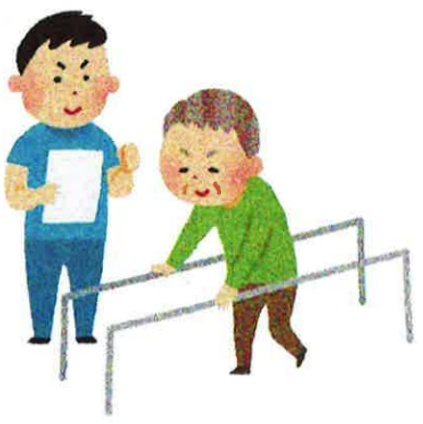

## 初階復健運動

腹式深呼吸運動

(吸氣時肚子微微凸起)

膝蓋壓毛巾

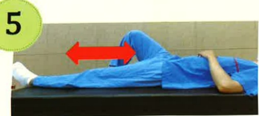

交替膝彎曲及伸直

腳踝上勾

腳跟壓毛巾

縮小腹，以背部壓毛巾

縮小腹，膝蓋彎曲，微微抬高

縮小腹，膝盖伸直，向上抬高

## 進階復健運動

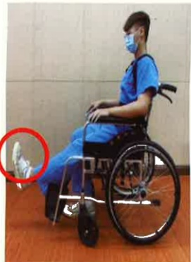

膝伸直後，腳掌提拉及下壓

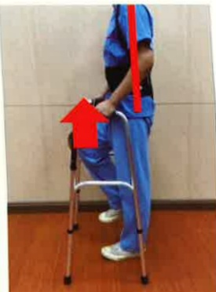

原地踏步(大腿交替上抬)

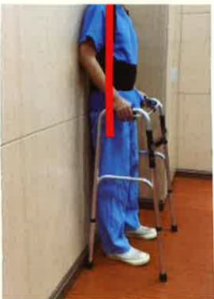

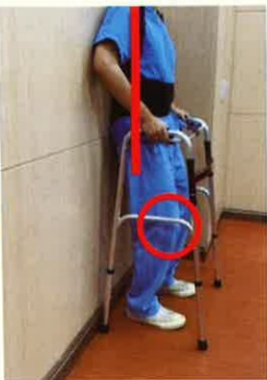

背靠牆壁微蹲，膝蓋不超過腳尖

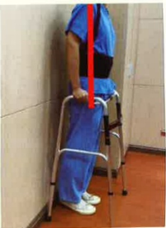

踮腳尖

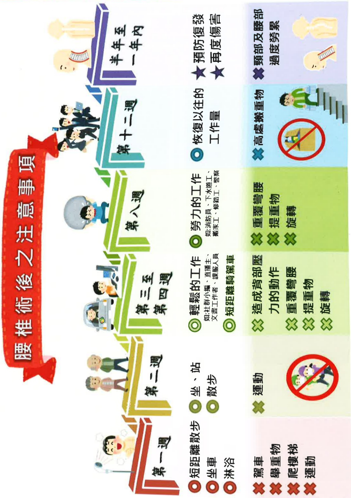

## 術後營養好傷口癒合早身體痠痛自然少

脊椎手術後飲食重點在於骨骼及肌肉復原，

攝取優質蛋白質、鈣質、鐵、鋅、維生素幫助傷口癒合

及肌肉、骨骼康健，且術後活動量減少，

攝取足量膳食纖維才可促進腸道健康!!

## 【其他術後飲食注意事項】

~義大醫療財團法人義大大昌醫院營養治療組、護理部製作

## 八、 參考文獻

陳敏麗、方妙君（2015）·神經系統疾病病人之護理·於胡月娟總校閱，內外科護理學（下冊）（五版，677-874頁）·華杏。

Park, D. K. (2022, January). Low Back Surgery Exercise Guide.

OrthoInfo. Retrieved January, 2022, from https://orthoinfo.aaos.org/en/recovery/low-back-surgery-exercise-guide/E-DA HEALTHCARE GROUP

義大醫院

地址:高雄市燕巢區角宿里義大路1號

電話:07-6150011

義大癌治療醫院

地址:高雄市燕巢區角宿里義大路21號

電話:07-6150022

義大大昌醫院

地址:高雄市三民區大昌一路305號

電話:07-5599123

本著作權非經著作權人同意不得轉載翻印或轉售

著作權人：義大醫療財團法人

HA-1-0220(1)

義大醫療財團法人 21x29.7cm 2024.03印製 2023.12新設