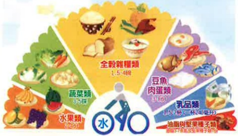

## 【國民飲食指標】

1. 飲食應依『每日飲食指南』的食物分類與建議份量，適當選擇搭配。特別注意應吃到足夠量的蔬菜、水果、全穀、豆類、堅果種子及乳製品。

2. 了解自己的健康體重和熱量需求，適量飲食，以維持體重在正常範圍內。

3. 維持多活動的生活習慣，每週累積至少150分鐘中等費力身體活動，或是75分鐘的費力身體活動。

4. 母乳哺餵嬰兒至少6個月，其後給予充分副食品。

5. 三餐應以全穀雜糧為主食。

6. 多蔬食少紅肉，多粗食少精緻。

7. 飲食多樣化，選擇當季在地食材。

8. 購買食物或點餐時注意份量，避免過多或浪費。

9. 盡量少吃油炸和高脂高糖食物，避免含糖飲料。

10. 口味清淡、不吃太鹹、少吃醃漬品、沾醬酌量。

11. 若飲酒，男性不宜超過2杯/日，女性不宜超過1杯/日，孕期絕不可飲酒。

註：1杯=酒精含量10公克，如：啤酒250毫升、紅或白葡萄酒100毫升，清酒75毫升、米酒60毫升、白蘭地及威士忌30毫升、高粱酒20毫升…等。

12. 選擇來源標示清楚，且衛生與安全的食物。

參考：衛生福利部國民健康署107年「每日飲食指南」、「國民飲食指標」、「我的餐盤聰明吃營養跟著來」。

義大醫院

地址：高雄市蒸巢區角宿里義大路1號

電話：07-6150011

義大療治療醫院

地址：高雄市蒸巢區角宿里義大路21號

電話：07-6150022

義大大昌醫院

地址：高雄市三民區大昌一路305號

電話：07-5599123

本著作權非經著作权人同意不得轉載翻印或轉售

著作權人：義大醫療財團法人

20X20cm 2025.01印製 2025.01修訂 表單編號：HA-3-0001(3)

均衡飲食

每日飲食指南

我的餐盤

義大醫療財團法人編印 E-DA HEALTHCARE GROUP## 均衡飲食

### 一般原則

每日應從各種食物中均衡的攝取各類營養素，以提供身體所需，並養成不偏食、不暴飲暴食的習慣。

---

### 第一類 乳品類（1杯 240毫升）

【我的餐盤口訣：每天早晚一杯奶】

| 營養成分           | 鈣質、優質蛋白質、脂肪及多種維生素。 |
|--------------------|--------------------------------------|
| 食物來源           | 鮮奶、無糖優酪乳、無糖優格。        |
| 小提醒             | 國人鈣質普遍攝取不足，建議早晚各一杯乳製品。若需熱量控制者，建議選用低脂或脫脂奶類或其製品。 |

---

### 第二類 水果類（每天：2-4份）

【我的餐盤口訣：每餐水果拳頭大】

| 營養成分           | 醣類、膳食纖維、維生素及植化素。     |
|--------------------|--------------------------------------|
| 食物來源           | 各種新鮮水果。                      |
| 小提醒             | 含有醣份須適量攝取，果乾和果汁含糖量較高，且易過量，建議以攝取新鮮水果為主，可挑選當令水果，多樣化攝取。 |

---

### 第三類 蔬菜類（每天：3-5份）

【我的餐盤口訣：菜比水果多一點】

| 營養成分           | 膳食纖維、維生素、植化素與礦物質。   |
|--------------------|--------------------------------------|
| 食物來源           | 葉菜類、花菜類、根菜類、豆菜類、菇類、海菜類等。 |
| 小提醒             | 高膳食纖維、熱量低又可增加飽足感，並刺激腸道蠕動。醃漬醬菜類鈉含量較高，且添加物較多，以新鮮或冷凍蔬菜為佳。 |

---

### 第四類 全穀雜糧類（每天：1.5-4碗）

【我的餐盤口訣：飯跟蔬菜一樣多】

| 營養成分           | 主要提供澱粉，是一天熱量的主要來源。 |
|--------------------|--------------------------------------|
| 食物來源           | 米飯、饅頭、麵包、地瓜、玉米、南瓜等。 |
| 小提醒             | 末精製的全穀雜糧類含豐富維生素及膳食纖維，建議三餐應以「維持原態」的全穀雜糧為主食，或每天至少1/3以上為末精製全穀雜糧類。 |
|                    |  |

---

### 第五類 豆魚蛋肉類（每天：3-8份）

【我的餐盤口訣：豆魚蛋肉一掌心】

| 營養成分           | 蛋白質與脂肪。                      |
|--------------------|--------------------------------------|
| 食物來源           | 豆腐、豆干、豆漿、魚類、海鮮、蛋類、雞、鴨、牛、羊、豬...等。 |
| 小提醒             | 植物性蛋白質含膳食纖維，飽和脂肪較低且不含膽固醇，為最佳選擇，其次挑選白肉，適度攝取紅肉。去除肥皮，蒸、烤、燙、滷、燉煮等少油烹調方式為佳。 |

---

### 第六類 油脂與堅果種子類（油脂3-7茶匙及堅果種子類1份）

【我的餐盤口訣：堅果種子一茶匙】

| 營養成分           | 堅果種子提供不飽和脂肪酸和維生素E、維生素B1、鉀、鎂、磷、鐵等。 |
|--------------------|-------------------------------------------------------------|
| 食物來源           | 沙拉油、玉米油、花生油、橄欖油等。                         |
| 小提醒             | 選擇植物性油脂，避免動物性油脂。每餐攝取1茶匙堅果種子（約大拇指第一指節量）。油脂熱量密度高，應酌量攝取。 |

