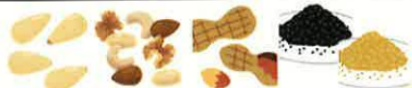

## 若需限鉀：

腎衰竭鉀離子排除能力減少，當血鉀偏高時，或每日排尿量<1000c.c時，因較容易發生高血鉀症，須限制鉀攝取。鉀離子普遍存於各種食物，遵循以下建議可減少鉀離子含量：

1) 少吃高鉀食物：如濃縮肉汁、運動飲料、中藥湯汁、雞精、咖啡、茶、生菜、巧克力、高鉀水果（小番茄、香蕉、奇異果、美濃瓜、哈密瓜）及各種果汁、果乾等。

2) 因鉀離子易溶於水，可於蔬菜洗過切後，以滾水川燙（1-3分鐘）後撈起，再以植物油拌炒，可降低鉀攝取量。

)避免使用低鈉鹽、低鹽醬油(薄鹽醬油)，該產品是以鉀取代部分鈉。

## 高鉀食物

## ☑高钾食物

<table border=1 style='margin: auto; width: max-content;'><tr><td style='text-align: center;'>零食飲料</td><td style='text-align: center;'> 巧克力、咖啡、運動飲料、果汁、堅果類、各式沖泡茶、青草茶等。</td></tr><tr><td style='text-align: center;'>湯汁</td><td style='text-align: center;'>   肉湯、菜湯、雞精、牛肉精、人蓼精、中草藥、燉品、精力湯等。</td></tr></table>

## 參考資料

1.2018 年衛生福利部國民健康署慢性腎臟病健康管理手冊

2. 慢性腎臟疾病營養治療與食物選擇技巧《台灣營養學會雜誌》46卷3期（2022/09）Pp.90-100

3. KDOQI Clinical Practice Guideline For Nutrition In CKD: 2020 update

## 義大醫院

地址：高雄市燕巢區角宿里義大路1號

電話：07-6150011

義大癌治療醫院

地址：高雄市燕巢區角宿里義大路21號

電話：07-6150022

義大大昌醫院

地址：高雄市三民區大昌一路305號

電話：07-5599123

本著作權非經著作權人同意不得轉載翻印或轉售

著作權人：義大醫療財團法人

20X29.7cm 2024.07印製 2024.03修訂 HA-3-0002(3)

## 腎衰竭飲食

## 一 般原則：

攝取足夠熱量：若無其他疾病限制，烹調可採油煎、油炸、勾芡等方式，增加熱量攝取。

建議蛋白質需要量有50%來自高生物價的蛋白質，如：魚、蛋、肉類及黄豆製品，其餘則由全穀雜糧類及蔬菜來供給。

限制蛋白質情況下，減少食用含低生物價蛋白質的食物，如：乾豆類(綠豆、紅豆、蠶豆、豌豆仁、花豆、刀豆等)、堅果類(花生、瓜子、腰果、核桃、芝麻、杏仁等)及麵筋類(麵筋、麵腸、烤麩等)。

用蛋白質含量極低的低氮澱粉(煮熟後呈透明狀為其產品特色)，取代主食類或補充熱量，如：板條、米苔目、地瓜、蘿蔔糕、太白粉、地瓜粉、澄粉、蓮藕粉、冬粉、米粉、西谷米、粉圓等。可以植物油拌炒，若無血糖代謝異常的問題，亦可適量添加砂糖、冰糖、蜂蜜等，增加熱量攝取。

禁忌：不可食用楊桃，因其含有某種神經毒素，腎臟無法排除可能會引發神經性中毒。

.遵循以下電解質(鈉、磷、鉀)的調整。

## 若需限制水分摄取：

(1)每日可攝取的水分(飲水、飲料、湯、水果、食物、藥水)可以前一天24小時之尿量，再加上500-700毫升的水分來估算。

(2) 可利用以下方式解渴：含冰塊（限量）、咀嚼☐香糖、用水漱口或利用檸檬片來刺激唾液分泌。

## 若需限制鹽分：

(1)避免高鈉食品·如醃漬及加工食品、罐頭、泡麵、湯汁、醬汁等。限量使用食鹽及調味料(味精、醬油、味噌、沙茶醬、辣椒醬、番茄醬、豆瓣醬、烏醋等)。

(2)多利用天然辛香料，蔥、薹、蒜、五香、肉桂、花椒、芹菜、香菜、檸檬、白醋等配料增加食物風味。

## 若需限磷：

對於腎功能不全者，即早適當限制飲食中的磷含量，可延緩腎功能的衰退及預防腎骨病變發生，在血磷正常情況下仍應避免攝取高磷食物。

(1)避免高磷食物，如：内臟類、乾豆類、堅果類、全穀類、蛋卵類、酵母類、乳製品、避免攝取肉湯、肉醬、加工品等。

(2)用餐時，需依醫囑正確使用磷結合劑。

## ☑高磷食物

<table border=1 style='margin: auto; width: max-content;'><tr><td style='text-align: center;'>全穀雜糧</td><td style='text-align: center;'> 糙米、燕麥、五穀米、全麥製品、紅豆、綠豆、薏仁、蓮子等。</td></tr><tr><td style='text-align: center;'>奶類</td><td style='text-align: center;'> 鮮奶及奶粉製品、優酪乳、優格、起司焗烤菜色等。</td></tr><tr><td style='text-align: center;'>堅果類</td><td style='text-align: center;'> 腰果、開心果、花生、芝麻、杏仁、核桃、瓜子等。</td></tr><tr><td style='text-align: center;'>豆魚蛋肉類</td><td style='text-align: center;'> 肉類加工品(火腿、鱗肉、培根、貢丸、魚丸、魚餃、燕餃、各類火鍋加工料等含磷酸鹽加工品)、動物內臟、魚卵、蟹黃、烏魚子、吻仔魚、小魚乾等。</td></tr><tr><td style='text-align: center;'>其他</td><td style='text-align: center;'> 巧克力、咖啡、肉湯、雞湯、汽水、乳酸菌飲料、奶精食品、零食餅乾洋芋片、即食調理包等。</td></tr></table>