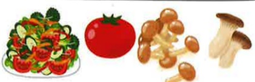
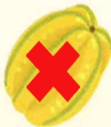
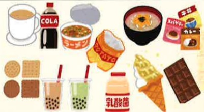

## ×高鉀食物

<table border=1 style='margin: auto; width: max-content;'><tr><td style='text-align: center;'>蔬菜類</td><td style='text-align: center;'>生菜、菇類、紫菜(乾)、海帶(乾)、榨菜筍干、大番茄等。</td></tr><tr><td style='text-align: center;'>水果類</td><td style='text-align: center;'>水蜜桃、草莓、奇異果、美濃瓜、哈密瓜、小番茄、木瓜、香蕉、釋迦、各種水果乾等。</td></tr><tr><td style='text-align: center;'>零食飲料</td><td style='text-align: center;'>巧克力、咖啡、運動飲料、果汁、堅果類、各式沖泡茶、青草茶等。</td></tr><tr><td style='text-align: center;'>湯汁</td><td style='text-align: center;'>肉湯、菜湯、雞精、牛肉精、人蓼精、中草藥、燉品、精力湯等。</td></tr></table>

## 复膜透析

..熱量：透析時身體組織會吸收透析液葡萄糖，

攻飲食來源所需熱量較一般人少，也因為易使血

夜中三酸甘油酯上升，所以必須避免單醣類及過

多油脂攝取，如含糖食品、炸物、酥油食品等。

2.蛋白質：腹膜透析較血液透析流失更多蛋白質，

所以高生物價蛋白質攝取量必須增加(每天約

6~8份黃豆製品、魚、蛋、肉類)。

3.鈉、鉀及水分：攝取量較自由，只要調整以控制水腫及電解質的不平衡情況即可。

4.其他：依照血液透析之原則，並鼓勵適度提升身體活動或養成運動習慣。

## 參考資料

1. 2018 年衛生福利部國民健康署慢性腎臟病健康管理手冊  

2. 慢性腎臟疾病營養治療與食物選擇技巧《台灣營養學會雜誌》46卷3期（2022/09）Pp.90-100  

3. KDOQI Clinical Practice Guideline For Nutrition In CKD: 2020 update

## 義大醫院

地址：高雄市燕巢區角宿里義大路1號

電話：07-6150011

義大癌治療醫院

地址：高雄市燕巢區角宿里義大路21號

電話：07-6150022

義大大昌醫院

地址：高雄市三民區大昌一路305號

電話：07-5599123

本著作權非經著作權人同意不得轉載翻印或轉售

著作權人：義大醫療財團法人

20X29.7cm 2025.01印製 2024.03修訂 HA-3-0003(3)

## 透析飲食

## 一 般原則：

透析一般分成血液透析及腹膜透析，透析浚飲食仍需控制，但限制不如透析前嚴格。

## 血液透析：

### 1. 足量蛋白質：

每天攝取達4-7份(兩)高生物價蛋白質，如黄豆製品、魚、蛋、肉類。

少吃含低生物價蛋白質的食物，如：乾豆類、堅果類及麵筋類（麵筋、麵腸、烤麩等）。限水：透析前體重增加不宜大於乾體重5%每日總攝取水量以前一天24小時尿量，再加上500-700毫升的水份來估算。解渴方式：含冰塊（限量）、咀嚼口香糖、用水漱口或利用檸檬片來刺激唾液分泌。

### 8. 若需限制鹽分：

多利用天然辛香料，葱、薑、蒜、肉桂、花椒、芹菜、香菜、檸檬、白醋等配料增加食物風味。限量使用食鹽及調味料（味精、醬油、味噌、沙茶醬、辣椒醬、番茄醬、豆瓣醬、烏醋等）。避免高鈉食品，如：醃漬及加工食品、罐頭、泡麵、湯汁、醬汁等。

### 4. 限磷

避免高磷食物(詳見附錄)。

用餐時，需依醫囑正確使用磷結合劑。

### 5. 若需限銷：

因鉀離子易溶於水，蔬菜川燙1–3分鐘後撈起，再以植物油拌炒，可降低鉀含量。

適量攝取中、低鉀含量水果，並避免高鉀食物（詳見附錄）。

避免低鈉鹽、低鹽醬油（薄鹽醬油），該產品是以鉀取代部分鈉。避免湯汁菜汁等湯水。

### 6. 鐵質

多補充富含鐵質的食物：如：紅肉、豬血、蛤貝、紅莧菜、紅鳳菜。

搭配富含維生素C的食物，可促進鐵質吸收，如：柑橘、彩椒。

動物性富含鐵質的食物含磷量也多，故要搭配磷結合劑一起使用。

### 7. 维生素

透析病人常因飲食限制或疾病代謝造成水溶性維生素缺乏，尤其是維生素B群，所以適當補充B群及葉酸是必要的，且葉酸又有預防貧血的效用

## 附錄：

楊桃會造成透析病人不明原因的神經反應，

## 切勿食用!

## 高磷食物

<table border=1 style='margin: auto; width: max-content;'><tr><td style='text-align: center;'>全穀雜糧</td><td style='text-align: center;'> 糙米、燕麥、五穀米、全麥製品、紅豆、綠豆、薏仁、蓮子等。</td></tr><tr><td style='text-align: center;'>奶類</td><td style='text-align: center;'> 鮮奶及奶粉製品、優酪乳、優格、起司、焗烤菜色等。</td></tr><tr><td style='text-align: center;'>堅果類</td><td style='text-align: center;'>腰果、開心果、花生、芝麻、杏仁、核桃、瓜子等。</td></tr><tr><td style='text-align: center;'>豆魚蛋肉類</td><td style='text-align: center;'>肉類加工品(火腿、臘肉、培根、貢丸、魚丸、魚餃、燕餃、各類火鍋加工料等含磷酸鹽加工品)、動物內臟、魚卵、蟹黃、烏魚子、吻仔魚、小魚乾等。</td></tr><tr><td style='text-align: center;'>其他</td><td style='text-align: center;'> 巧克力、咖啡、肉湯、雞湯、汽水、乳酸菌飲料、奶精食品、零食餅乾洋芋片、即食調理包等。</td></tr></table>