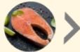

## 三、 治療後飲食原則&生活型態

### 1. 均衡饮食，食物多样化：

- 以未精緻全穀雜糧類為主食（如：地瓜/燕麥/南瓜/糙米等）

· 選擇各色蔬菜與水果（如：番茄/胡蘿蔔/甜椒/菠菜/藍莓/洋蔥等）

· 選擇優質蛋白質，注意來源與選擇順序：

黄豆製品

魚類

海鮮

蛋類

料理

白肉

紅肉

• 避免加工製品（如：香腸/火腿/培根等）

- 烹調時選用植物性油脂，增加多元不飽和脂肪酸攝取，反之應減少動物性油脂使用（如：雞油、豬油等）

- 適量補充水份，每公斤體重約需25-30ml水份，若有腎臟/心臟疾病或需要限制水份者，請洽詢醫師

### 2. 維持理想體重&健康生活型態：

• 維持身體活動，建立運動習慣

• 避免抽菸、喝酒、嚼檳榔

### 3. 根據醫師建議規律回診

## 參考資料：

1. ESPEN practical guideline: Clinical Nutrition in cancer. Clinical Nutrition 2021;40(5):2898-2913.

2. Food Safety During and After Cancer Treatment. Cancer Net. 2021.

3. Healthy Living After Cancer. Cancer Net. 2021.

4. 台灣癌症防治網-癌症新探96期。癌症病人的營養管理照護。

5. 財團法人台灣癌症基金會。自我照護管理，癌症營養。

## 四、 常見癌症飲食迷思

## 癌症病人需減少肉類攝取，甚至改成素食或生機飲食？

錯誤！治療期間需要足夠的熱量與蛋白質提供身體組織修復、重建及調節免疫功能，因此建議均衡飲食，選擇優質蛋白質，如：黃豆製品（豆腐/豆漿）、雞蛋、魚肉、海鮮、禽畜肉類、乳製品等，並避免生食，以預防感染風險。

## 吃太營養只會讓癌細胞增長？

錯誤！癌症病人熱量需求較一般人高，若營養狀況不佳，容易因營養不良導致免疫力下降、預後狀況不佳，因此應均衡飲食、維持體重。

## 治療期間補充保健食品，應多加留意？

正確！市面上保健食品有許多種，如：中草藥、人蔘、靈芝、益生菌等，若治療期間想要補充應尋求醫師或營養師建議。義大醫院

地址：高雄市燕巢區角宿里義大路1號

電話：07-6150011

義大癌治療醫院

地址：高雄市燕巢區角宿里義大路21號

電話：07-6150022

義大大昌醫院

地址：高雄市三民區大昌一路305號

電話：07-5599123

## 癌症飲食

