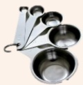

## 一、 器具準備

|  |  |
|---|---|
|  |  |
| 標準碗 | 標準量匙 |
|  |  |
| 塑膠湯匙 | 濾網 |
|  |  |
| 食物調理機 | 電鍋 |
|  |  |
| 圖理秤 | 量杯 |

## 二、 製備方法（先清洗器具+食材並將熱水倒入調理機蓋過刀片進行清洗後倒掉）

### 1. 早餐或晚點製備：

1) 食材依份量秤重加入調理機中，並加水定量至250毫升(1餐)，攪打成均匀流質狀。

2. 四正餐製備（早點+午餐+午點+晚餐）：

1) 天然食材及粉狀食材依食材份量秤重。

2) 天然食材切成小丁狀全部一起蒸熟（綠色蔬菜請另行川燙至熟）。

3) 蒸熟的食材倒入調理機中，加入200毫升溫開水攪打成流質狀。

4) 將粉狀食材、油分次加入調理機中，並加水定量至1200毫升再次攪打成均勻流質狀。  
5) 使用濾網過濾殘渣後分裝為4等份（約300毫升）加蓋，放入冰箱中冷藏。

### 3. 餐間水果(果汁)製備：

1) 水果去皮(籽)與150毫升冷開水(常溫水)一同加入調理機中，攪打完過濾即可。

---

### 製備食材份量表

| 餐次 | 食材 | 蛋白質40克 | 蛋白質50克 | 蛋白質60克 | 蛋白質70克 |
|---|---|---|---|---|---|
| 早餐+晚點 | 全脂奶粉 | 1湯匙(15g) | 2湯匙(30g) | 3湯匙(45g) | 3湯匙(45g) |
|  | 糙米粉 | 4湯匙(60g) | 4湯匙(60g) | 4湯匙(60g) | 4湯匙(60g) |
|  | 糖飴 | 8茶匙(40g) | 8茶匙(40g) | 4茶匙(20g) | 4茶匙(20g) |
| 早點+午餐+午點+晚餐 | 馬鈴薯 | 0.5碗(90g) | 0.5碗(90g) | 0.5碗(90g) | 0.8碗(135g) |
|  | 雞蛋 | 1顆(55g) | 1顆(55g) | 1顆(55g) | 1顆(55g) |
|  | 青菜葉 | 1.5碗(300g) | 1.5碗(300g) | 1.5碗(300g) | 1.5碗(300g) |
|  | 瘦肉(魚肉) | - | 3指頭寬(35g) | 1個掌心(70g) | 1個手掌(105g) |
|  | 南瓜 | 1.5碗(255g) | 1.5碗(255g) | 1.5碗(255g) | 1.5碗(255g) |
|  | 粉飴 | 3湯匙(45g) | 2湯匙(30g) | 2湯匙(30g) | 1.5湯匙(22.5g) |
|  | 植物油 | 10茶匙(50g) | 9茶匙(45g) | 8茶匙(40g) | 7茶匙(35g) |
|  | 鹽 | 1茶匙(5g) | 1茶匙(5g) | 1茶匙(5g) | 1茶匙(5g) |
|  | 酵母粉 | 2茶匙(10g) | 2茶匙(10g) | 2茶匙(10g) | 2茶匙(10g) |
|  | 水果(餐間) | 柳丁(過濾果汁) | 2顆(300g) | 2顆(300g) | 2顆(300g) | 2顆(300g) |