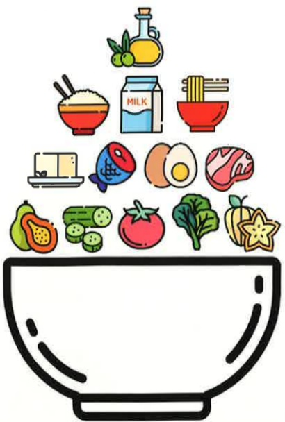
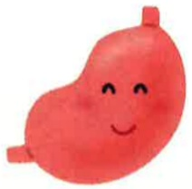

## 食物選擇表

| 食物類別           | 可食                                       | 忌食                                               |
|--------------------|--------------------------------------------|----------------------------------------------------|
| 奶類及其製品       | 不加糖奶類                                | 加糖奶製品。                                      |
| 豆、魚、蛋、肉類   | 嫩而無筋的瘦肉、內臟、海產、蛋。加工後的豆製品(如豆漿、豆腐)。 | 過老或含筋的肉類、煎蛋。未加工豆類(如紅豆、綠豆)。 |
| 蔬菜類             | 嫩而纖維低的蔬菜及瓜果類。               | 粗纖維多的蔬菜(如竹筍、芹菜)。蔬菜類的梗部、莖部和老葉。 |
| 水果類             | 去皮、去籽水果。新鮮果汁。               | 含皮、籽、粗纖維多的水果(如番石榴、鳳梨)。         |
| 全穀雜糧類         | 全穀類及其製品(如米飯、麵條)。           | 糯米。                                            |
| 油脂類             | 均可。                                    | 無。                                              |
| 調味品             | 鹽、醬油、味精、醋等。                   | 辣椒、胡椒、芥末、咖喱、沙茶醬、蒜頭等。          |
| 其他               | 蘇打餅乾、無糖果凍。                     | 甜點、肉汁、油炸食物、堅果類、濃茶、咖啡、酒。     |

## 参考资料：

1. 衛生福利部國民健康署（2021）。溫和飲食。  
https://health99.hpa.gov.tw/material/7176

2. 謝明哲、葉松鈴、蔡雅惠、邱琬淳（2020）。膳食療養學實驗。臺北醫學大學保健營養學系。

## 義大醫院

地址：高雄市燕巢區角宿里義大路1號  
電話：07-6150011

## 義大癌治療醫院

地址：高雄市燕巢區角宿里義大路21號  
電話：07-6150022

## 義大大昌醫院

地址：高雄市三民區大昌一路305號  
電話：07-5599123

本著作權非經著作權人同意不得轉載翻印或轉售  
著作權人：義大醫療財團法人  
表單編號：HA-3-0019(2)  
義大醫療財團法人 20X29.7cm 2024.06印製 2024.03修訂

## 溫和飲食

## 一、 簡介

溫和飲食是一種無刺激性，含低纖維，易於消化，具有足夠營養的飲食。可減低消化性潰瘍或胃炎病人消化系統的負擔，並提供充分的營養。

## 二、 適用對象

（一）消化性潰瘍（胃潰瘍、十二指腸潰瘍）者。

(二) 胃炎者。

## 三、 一般飲食原則

(一)細嚼慢嚥，定食定量，少量多餐。

(二)避免純吃澱粉、每餐搭配以澱粉+蛋白質+脂肪的食物為佳。

(三)飲食應含有足夠的營養且無刺激性。

## (四) 急性胃炎时；

先禁食1-2天，讓胃休息，

可喝少量的水以防止口渴。

少量多餐方式，

漸進供給牛奶及流質。

逐漸增加食物的量及種類，並以低脂食物為佳。

(五) 消化性潰瘍，依程序不同分為三期：

## 第一期(自出血至止血後的2-3天):

1. 清流質飲食。

2. 將低糖無油的食物製成流質。

✗ 第二期（止血後的2-3天至恢復期）：流質、軟質食物或溫和飲食。

## 第三期(恢复期)：

此時的飲食與普通飲食相仿，除非病人感到不適，否則應盡量選擇各類食物。

