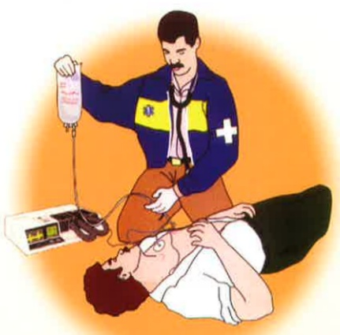
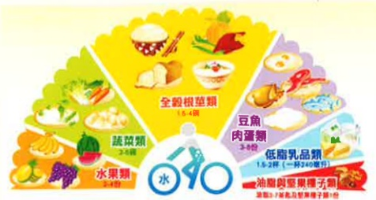

(3) 肝腦病變昏迷：

①即時診斷並去除病因，積極的藥物治療勝過不當的限制蛋白質攝取。

②蛋白質建議量：0.6-0.8克/每公斤乾體重；給予足夠的熱量，增加醣類與脂質作為熱量來源；恢復意識後，逐步回復至1-1.2克/每公斤乾體重之均衡飲食。

③避免攝取產氨(Ammonia)量高之食物，如香腸、火腿、鱲肉、乳酪、花生及筋皮類食物等。

地址：高雄市824蕪巢區角宿里義大路1號

電話：07-6150011

網址：edah@edah.org.tw

本著作權非經著作權人同意不得轉載翻印或轉售

著作權人：義大醫療財團法人

表單編號：HA-3-0023(2)

20X20cm 2016.03印製 2016.02修訂

慢性肝病

及肝昏迷飲食

## 慢性肝病 及肝昏迷飲食

1. 肝炎

(1) 慢性：

①均衡飲食。

②限制酒精攝取。

(2) 急性：

①足夠熱量及蛋白質。

②少量多餐：食慾不佳，建議補充均衡配方營養品。

③若熱量攝取不足，除腸道揚營養外，使用靜脈營養支持。

(3)酒精性：

①戒酒。

②均衡飲食。

(4)脂肪肝：

①維持理想體重，過重或肥胖者應減重。②均衡飲食。

③限制酒精摄取。

④避免攝取過多碳水化合物(如：含糖飲料、甜點、果汁、西點等)。

### 2. 熱量、蛋白質&飲食原則：

(1) 熱量：30-35大卡/每公斤乾體重。

(2) 蛋白質：1-1.2克/每公斤乾體重。

①對熱量蛋白質營養不良且於穩定期的患者則建議提1.2-1.5克/每公斤乾體重以利達正氮平衡。

②植物性蛋白質含有較高的支鏈胺基酸，及較少的甲硫胺酸與芳香族胺基酸，有利於改善肝昏迷的情形，可適量攝取。

(3)新鮮天然食物，避免加工、醃製、燻烤之食物。

(4) 攝取足夠繼維質，避免便秘。

### 3. 肝硬化伴發症處理原則：

(1) 食道靜脈曲張：選擇流質或軟質飲食，避免堅硬、大塊、粗糙、油煎、油炸等食物。

(2) 腹水/水腫：

①少量多餐，選用高熱量密度食物或配方，以減少水分攝取。

②限鈉飲食：低於2000毫克/天。

③注意水分插入 & 排出平衡：若有低血鈉症，每日液體攝取量建議控制於1000-1500cc。

④嚴重低血鈉或持續，建議液體攝取量為每日尿量加上500-700cc。