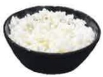
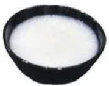
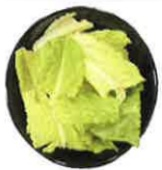
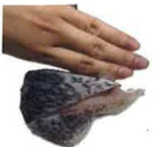

## 慢性腎臟疾病 飲食建議表

## 飲食代換圖表及攝取量建議

(熱量：___ 大卡/天 蛋白質：___ 公克/天)

| 類別 | 建議份數/天 | 食物代換表 |
|------|-------------|-----------|
| 主食 | 早:   碗 午:   碗 晚:   碗 |  |  |  |  |
| | | 飯1碗 = 粥2碗 = 羅蔔糕4塊 = *吐司2片 | | | |
| |  |  |  |  | |
| | =碗粿1個 = 地瓜2碗 = *水飯皮12片 = *饅頭1顆 | | | | |
| |  |  | | ※有*表低生理價蛋白質較高,減少食用,選擇米製品優於麵粉製品※避免雜糧穀類,如:五穀米、糙米、麥片、紫米、小米 | |
| 蔬菜 | ___份 |  |  | | 生重100克青菜 |
| 豆魚蛋肉 | 早:   份 午:   份 晚:   份 |  |  |  |  |
| | | 蛋1顆 = 豆漿1杯 = 肉絲2匙 = 蝦子3隻 | | | |
| |  |  |  |  | |
| | =小方豆干2片 = 濕豆包半個 = 牡蠣2匙 = 魚、雞、豬肉三指大小 | | | | |

美大聚感财圈法人 21X29.7cm 2024.06印製  
2024.03修訂 HA-3-0036(2)