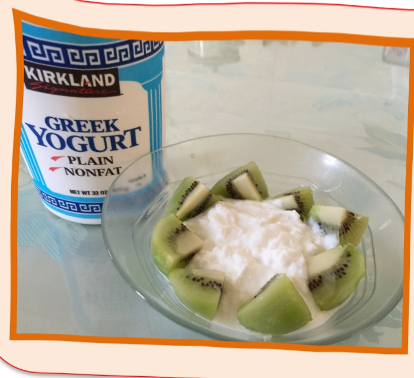

## 減重期间足夠的金白質可以維持肌肉、避免掉髮

手術後3個月均衡飲食菜單

## 一 份蛋白質

1 顆雞蛋

兩湯匙魚、肉類

30g 魚、肉類

1 盎司魚、肉類

蝦子4隻

豆腐 1/2 盒

低脂牛奶 240cc

無糖豆漿 260cc

低脂起司片 2 片

優格 120g

蒸蛋 180g

豆花 240g

<table border=1 style='margin: auto; width: max-content;'><tr><td style='text-align: center;'></td><td style='text-align: center;'>第一天</td><td style='text-align: center;'>第二天</td><td style='text-align: center;'>第三天</td><td style='text-align: center;'>第四天</td><td style='text-align: center;'>第五天</td></tr><tr><td style='text-align: center;'>早餐</td><td style='text-align: center;'>吐司一片蛋1颗无糖豆浆100ml</td><td style='text-align: center;'>小餐包1颗无糖硬格1杯拿鐵100ml</td><td style='text-align: center;'>茶葉蛋1颗无糖豆花半碗低脂牛奶100ml</td><td style='text-align: center;'>小番茄5颗蛋1颗无糖豆浆100ml</td><td style='text-align: center;'>香蕉1/2根蛋1颗低脂牛奶100ml</td></tr><tr><td style='text-align: center;'>午餐</td><td style='text-align: center;'>雞腿1隻蔬菜0.5份</td><td style='text-align: center;'>餛飩4颗蔬菜0.5份</td><td style='text-align: center;'>皮蛋豆腐蔬菜0.5份</td><td style='text-align: center;'>魚1片蔬菜0.5份</td><td style='text-align: center;'>炸雞塊去皮1塊蔬菜0.5份</td></tr><tr><td style='text-align: center;'>點心</td><td style='text-align: center;'>水果0.5份</td><td style='text-align: center;'>水果0.5份</td><td style='text-align: center;'>水果0.5份</td><td style='text-align: center;'>水果0.5份</td><td style='text-align: center;'>水果0.5份</td></tr><tr><td style='text-align: center;'>晚餐</td><td style='text-align: center;'>蛋白質2份蔬菜0.5份</td><td style='text-align: center;'>蛋白質2份蔬菜0.5份</td><td style='text-align: center;'>蛋白質2份蔬菜0.5份</td><td style='text-align: center;'>蛋白質2份蔬菜0.5份</td><td style='text-align: center;'>蛋白質2份蔬菜0.5份</td></tr><tr><td style='text-align: center;'></td><td style='text-align: center;'>第六天</td><td style='text-align: center;'>第七天</td><td style='text-align: center;'>第八天</td><td style='text-align: center;'>第九天</td><td style='text-align: center;'>第十天</td></tr><tr><td style='text-align: center;'>早餐</td><td style='text-align: center;'>吐司1片低脂起司片1片黑咖啡100ml</td><td style='text-align: center;'>奇異果1颗無糖硬格1杯低脂牛奶100ml</td><td style='text-align: center;'>水煎包1個無糖豆浆100ml</td><td style='text-align: center;'>低脂起司片2片蛋1颗拿鐵100ml</td><td style='text-align: center;'>小可頌1個無糖豆浆100ml</td></tr><tr><td style='text-align: center;'>午餐</td><td style='text-align: center;'>水餃4颗蔬菜0.5份</td><td style='text-align: center;'>雞肉粥半碗蔬菜0.5份</td><td style='text-align: center;'>豆干2片、蛋1颗蔬菜0.5份</td><td style='text-align: center;'>陽春麵半碗蔬菜0.5份</td><td style='text-align: center;'>排骨1片蔬菜0.5份</td></tr><tr><td style='text-align: center;'>點心</td><td style='text-align: center;'>水果0.5份</td><td style='text-align: center;'>水果0.5份</td><td style='text-align: center;'>水果0.5份</td><td style='text-align: center;'>水果0.5份</td><td style='text-align: center;'>水果0.5份</td></tr><tr><td style='text-align: center;'>晚餐</td><td style='text-align: center;'>蛋白質2份蔬菜0.5份</td><td style='text-align: center;'>蛋白質2份蔬菜0.5份</td><td style='text-align: center;'>蛋白質2份蔬菜0.5份</td><td style='text-align: center;'>蛋白質2份蔬菜0.5份</td><td style='text-align: center;'>蛋白質2份蔬菜0.5份</td></tr></table>