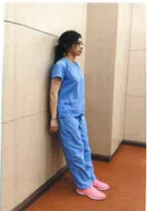

# 簡易居家下背痛運動-初階/進階

運動目的：透過運動來恢復日常活動，增加核心肌群及下肢肌力，保持健康並防止再次受傷。

運動處方：維持5~10秒鐘，每次10下，每天4次

## 第1式

牆壁滑動運動：強化背部、髋部和大腿肌肉

挺胸站立，背部靠牆，雙腳與肩同寬

身體向下滑動到半

蹲姿勢，膝蓋彎曲略

大於90度

## 第2式

抬腳運動：強化髋部及大腿肌肉

坐在椅子上，雙腳著地，背部平靠椅背

小腿平伸，

雙腳逐一舉高接近腰部高度

第 3 式 抬臀運動：強化背部及臀部肌肉

平躺屈膝，慢慢抬起臀部，保持膝盖，

臀部及腰部成一直線

第 4 式 軀幹旋轉運動：伸展背部及臀部肌肉

平躺屈膝，雙手平放兩側，保持呼吸順暢

保持呼吸順暢，慢慢下降，注意回床面依序為上背→下背→臀部

上背部平貼床面，膝蓋朝向左側或右側旋轉，緩慢放置床面| 第5式 雙膝靠胸運動:伸展背部及臀部肌肉 |  |  |
|---|---|---|
|  |  |  |
| 平躺屈膝,夾臀縮腹,下背部緊貼床面,肩膀放鬆,動作過程中,頭部不可抬起 | 屈膝,雙手置於膝部下方,雙膝靠近胸部直到背部完全伸展,維持10秒 |  |

| 第6式 單膝平舉運動:強化背部及臀髋部肌肉 |  |  |
|---|---|---|
|  |  |  |
| 平躺,單腳屈膝,維持身體穩定度 | 抬起另一單腳,維持髖與膝關節90度,再慢慢放下後換邊 |  |

| 第7式 貓背運動:脊椎關節運動 |  |  |
|---|---|---|
|  |  |  |
| 四點撐地動作,肩關節維持90度 | 腹肌收縮,腰部似貓拱背動作 |  |

| 第8式 脊椎穩定運動:提升脊椎穩定度 |  |  |
|---|---|---|
|  |  |  |
| 四點撐地動作,肩關節及膝關節維持90度,慢慢抬起對側手腳,保持水平 | 腹部用力,腰部不可晃動,脊椎伸直延展 |  |

| 參考出處:Preventing Back Pain at Work and at Home - OrthoInfo - AAOS.Low Back Surgery Exercise Guide - OrthoInfo - AAOS |  |  |
|---|---|---|
| 聯絡資訊 |  |  |
| 義大醫院地址:高雄市燕巢區角宿里義大路1號電話:07-6150011 | 義大癌治療醫院地址:高雄市燕巢區角宿里義大路21號電話:07-6150022 | 義大大昌醫院地址:高雄市三民區大昌一路305號電話:07-5599123 |