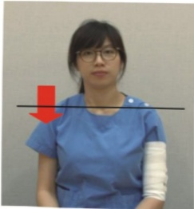

## 認識乳房切除手術後 第二階段復健運動

適應症：乳房切除術後第二週(拔除引流管後)～術後4-6週

影片

教學

目標：1. 執行『乳房切除術』者，『術後第4週』達到術前的活動度。

2. 執行『乳房重建術』者，『術後第6週』達到手術前的活動度。

## 運動：

1. 繼續抬高手術側的肢體。

2. 手術側遠端肢體的運動：

5秒後放鬆，

重覆10次，

一天至少5回

記得慢慢做運動

1. 交替握拳和打開

2. 交替做手腕運動

### 3. 交替做手肘運動

3. 逐渐增加手術側肩關節活動度到術前的程度：

熱身運動

5秒後放鬆，

重覆10次，

一天至少5回

1. 肇肩

### 2. 肩膀下壓

### 3. 往前轉

### 4. 往後轉

| 聯絡資訊 | 聯絡資訊 | 聯絡資訊 | 卫教单下载 |
|----------|----------|----------|------------|
| 義大醫院地址:高雄市燕巢區角宿里義大路1號電話:07-6150011#2330 | 義大癌治療醫院地址:高雄市燕巢區角宿里義大路21號電話:07-6150022#2340 | 義大大昌醫院地址:高雄市三民區大昌一路305號電話:07-5599123#7531 |  |