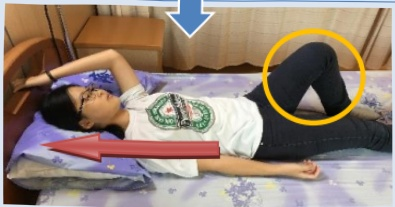
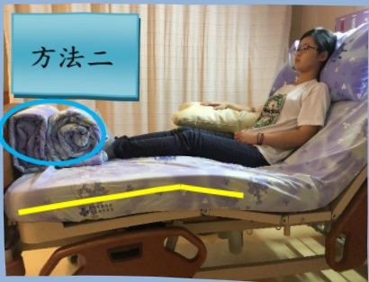

<table border=1 style='margin: auto; width: max-content;'><tr><td colspan="3">單側無力病人的擺位注意事項～躺姿～</td></tr><tr><td colspan="2">目的：1. 避免形成壓瘡、關節攣縮等不良姿勢。2. 維持舒適姿勢。</td><td style='text-align: center;'>以右側偏癱為例</td></tr><tr><td colspan="2">注意事項：1. 每兩個小時變換姿勢，並檢查受壓側的皮膚是否出現壓瘡。2. 若有水腦、或骨折處，需依醫師指示調整姿勢。3. 使用呼吸器、尿管者，請留意勿拉扯。</td><td style='text-align: center;'></td></tr><tr><td colspan="3">仰 躺</td></tr><tr><td rowspan="2">1. 頭頸部：用枕頭墊高2. 患側手：下方放置枕頭手肘伸直，手心向上/下3. 患側腳：放在正中位置    大腿外側放毛巾捲(避免過度外轉)    膝下方稍微墊高(避免膝過度伸直)    腳踝垂直，不歪斜</td><td style='text-align: center;'></td><td style='text-align: center;'></td></tr><tr><td style='text-align: center;'></td><td style='text-align: center;'></td></tr><tr><td colspan="3">側躺～患側在上～</td></tr><tr><td style='text-align: center;'>1. 頭頸部：用枕頭墊高2. 患側手：放在身體前方    下方用枕頭或棉被墊高    手肘微彎，手腕伸直，手心向下3. 患側腳：向前彎曲    髋、膝、踝下方放置棉被等支撐物</td><td style='text-align: center;'></td><td style='text-align: center;'></td></tr><tr><td colspan="3">側躺～患側在下～</td></tr><tr><td style='text-align: center;'>1. 頭頸部：用枕頭墊高2. 軀 幹：背、臀後方有支撐，身體微向後3. 患 側：手放在身體前方    肩胛骨稍微往前拉，手心向上    腳微彎4. 健側腳：向前彎曲    髋、膝、踝下方放置棉被等支撐物</td><td style='text-align: center;'></td><td style='text-align: center;'></td></tr></table>## 單側無力病人的擺位注意事項～床上坐姿～

坐姿的好處：1. 調節血壓 2. 減少壓瘡

3. 感覺刺激

4. 肺活量影響

善用健側肢體，

協助身體的移動！

好手抓床頭或欄杆，好腳踩床後，

手腳同時用力，將身體往上移動到頭碰到床頭板。

方法一

☐：患側手肘及前臂下方墊枕頭，手心朝下。

方法二

☐：雙腳和床尾板之間放棉被等

防止臀部往下滑!!

## 方法一：

☐：雙腳頂住床尾的棉被捲

雙膝保持伸直，床尾保持直線，可防止臀部往下滑。

方法二：

：雙腳頂住床尾的棉被捲，再調高床尾，以防止臀部往下滑。<table border=1 style='margin: auto; width: max-content;'><tr><td colspan="2">單側無力病人的擺位注意事項～輪椅上的坐姿～</td></tr><tr><td style='text-align: center;'></td><td style='text-align: center;'>個子較小的病人：可在下背部放置小枕頭，提供腰椅支撐，以維持直立姿勢。個子較高的病人：貼緊椅背，以維持直立姿勢。</td></tr><tr><td style='text-align: center;'></td><td style='text-align: center;'>在大腿放置枕頭，讓患側手肘及前臂有支撐，以免滑落。</td></tr><tr><td style='text-align: center;'></td><td style='text-align: center;'>雙腳放在踏板上。正確使用腳跟後方的固定帶，能避免足部滑落。</td></tr></table>

## 坐起時的注意事項：

1. 血壓是否穩定？

2. 是否會頭暈？

3. 是否有骨折？

4. 請和醫護人員、治療師討論，坐起的高度、時間、頻率。

電話:07-6150011#2330

